## Objective

Deploy the training environment and become familiar with the lab topology.

## Lab Architecture

The diagram below summarizes the FortiWeb training lab: Guacamole client access, FortiGate perimeter, FortiWeb WAF, and Docker application targets.

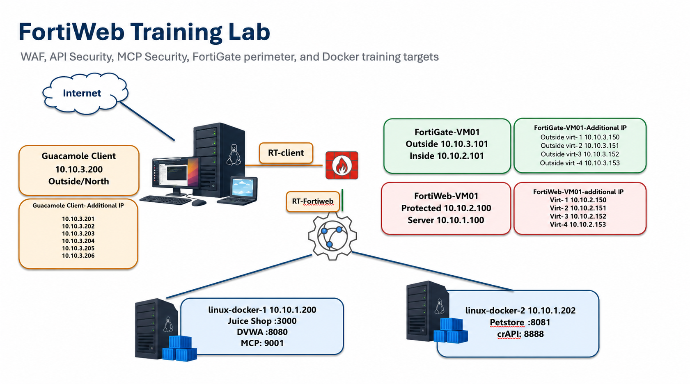

| Component | Role | Key addresses |
|-----------|------|----------------|
| Guacamole | Student jump host | `10.10.3.200` (+ source IPs `.201`–`.206`) |
| FortiGate-VM01 | Perimeter firewall | Outside `10.10.3.101`, Inside `10.10.2.101` |
| FortiWeb-VM01 | WAF / API / MCP protection | Protected `10.10.2.100`, Server `10.10.1.100` |
| linux-docker-1 | Juice Shop, DVWA, MCP | `10.10.1.200` |
| linux-docker-2 | Petstore, crAPI | `10.10.1.202` |

## Deploy the Lab Environment

Use the Azure credentials from your provisioning email to sign in, open **Azure Cloud Shell**, clone the lab repository, and run the initialization script. Your lab user is paired with a resource group named `<username>-mcp201-workshop` (for example `fweb11-mcp201-workshop`). The deploy script builds that name from `whoami`—you do not edit Terraform variable files by hand.

Allow about **25–40 minutes** for the full Terraform deploy after Cloud Shell is ready.

### Step 1 – Sign In to the Azure Portal

1. Open [https://portal.azure.com](https://portal.azure.com).
2. Enter the **UserName** from your provisioning email (for example `fweb11@fortinetcloud.onmicrosoft.com`).
3. Click **Next**.

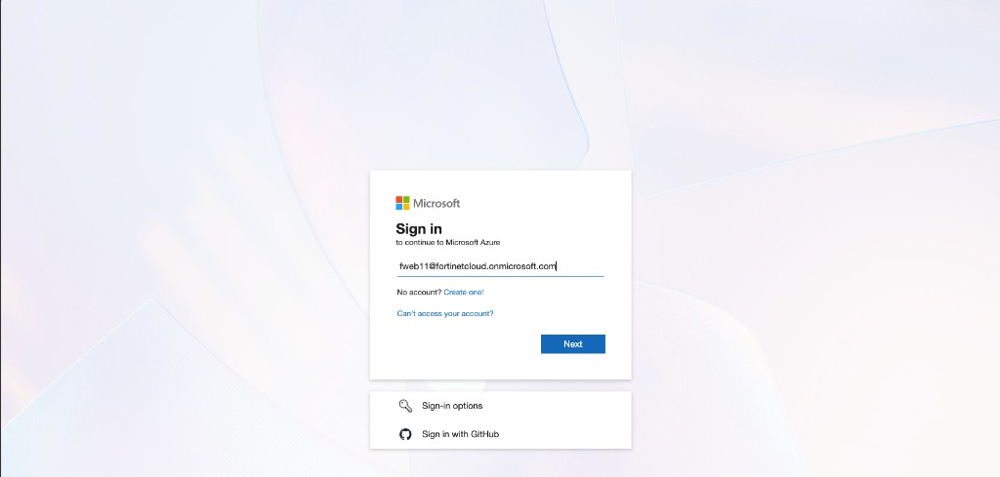

### Step 2 – Enter Your Temporary Access Pass or Password

When prompted, enter the **Temporary Access Pass** or **Password** from your provisioning email, then click **Sign in**.

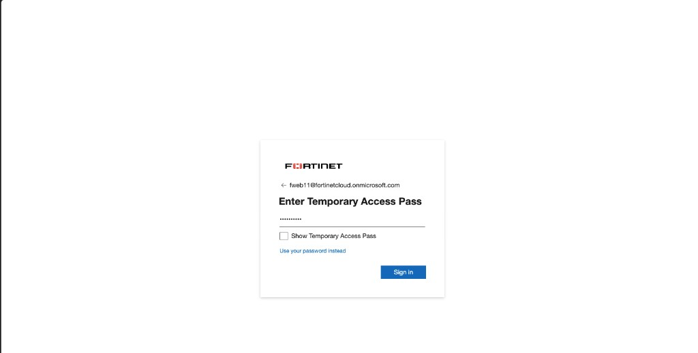

{}
If Azure offers **Use your password instead**, use the password value from the email. Do not reuse these lab credentials outside the training environment.
{}

### Step 3 – Stay Signed In

When asked **Stay signed in?**, click **Yes** so you are not prompted repeatedly during the lab.

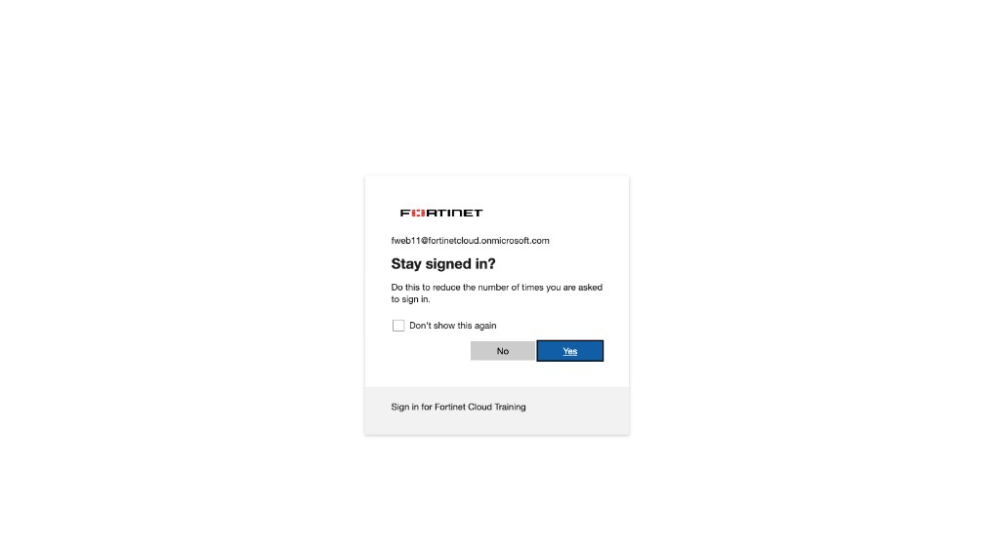

### Step 4 – Open Azure Cloud Shell

On the Azure portal home page, click the **Cloud Shell** icon (`>_`) in the top toolbar.

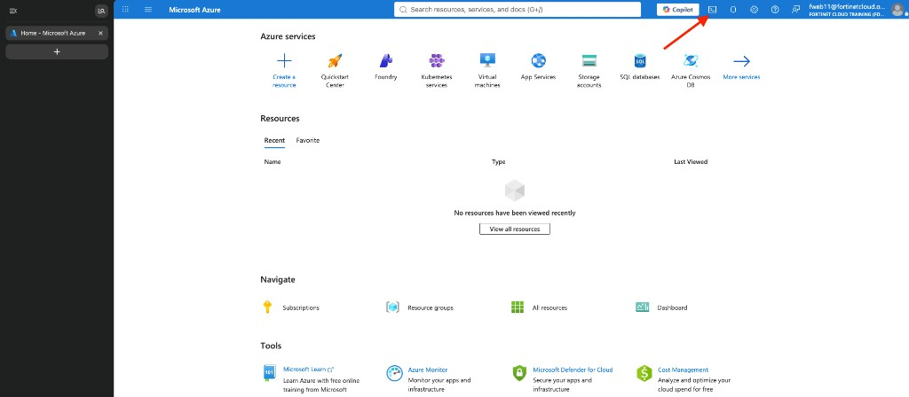

### Step 5 – Select Bash

When **Welcome to Azure Cloud Shell** appears, select **Bash** (not PowerShell).

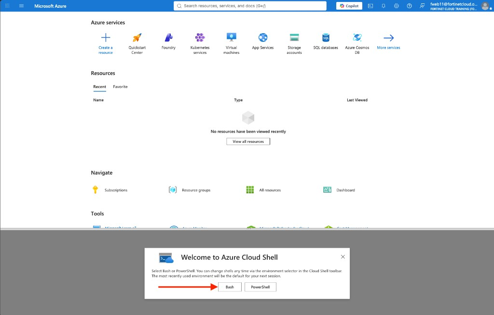

### Step 6 – Configure Cloud Shell Storage

On first use, Cloud Shell asks you to attach storage so files persist between sessions.

1. Select **Mount storage account**.
2. Choose the **Internal-Training** subscription (or the subscription shown for your workshop).
3. Click **Apply**.

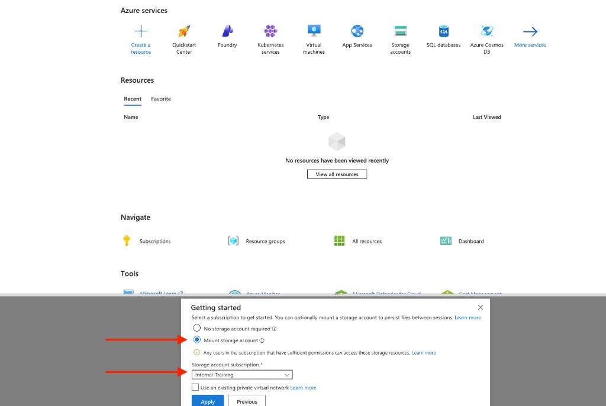

On the next screen, select **Select existing storage account**, then click **Next**.

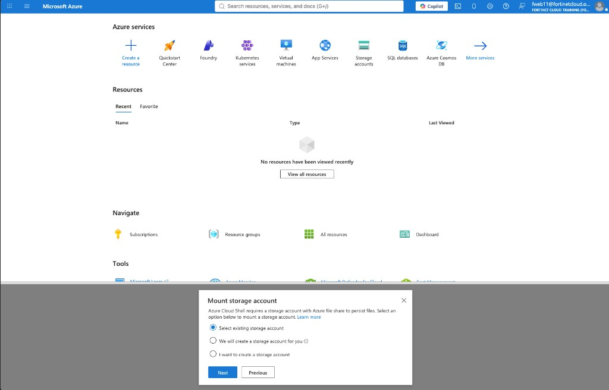

Complete the storage fields using the resource group assigned to your lab user:

| Field | What to select |
|-------|----------------|
| Subscription | `Internal-Training` (or your workshop subscription) |
| Resource group | Your unique student resource group (the only one listed) |
| Storage account name | The storage account in that resource group |
| File share | `cloudshellshare` (or the share name provided for your lab) |

Click **Select**.

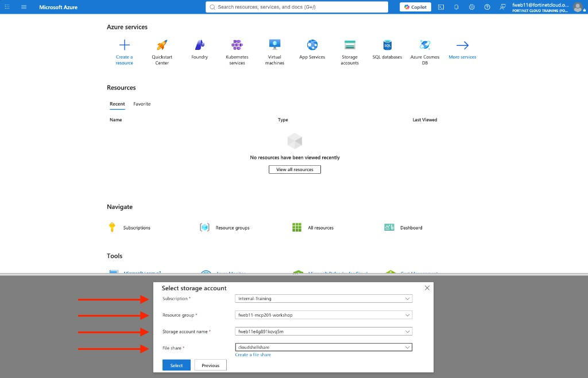

{}
Your resource group name will differ from the example in the screenshot. Choose the single resource group visible to your assigned lab user.
{}

### Step 7 – Clone the Lab Repository

When the Bash prompt appears, clone the workshop repository:

```bash
git clone https://github.com/FortinetCloudCSE/fortiweb-api-mcp-protection.git
```

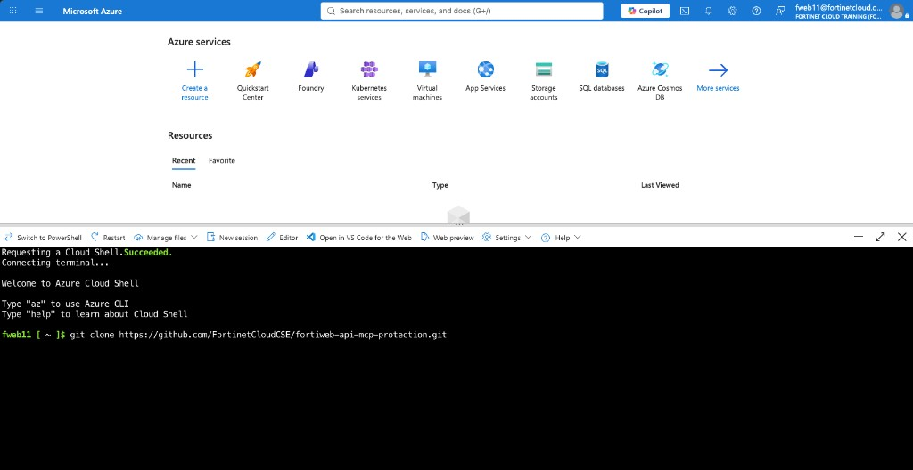

### Step 8 – Run the Lab Initialization Script

Change to the Terraform scripts directory and start the deploy:

```bash
cd fortiweb-api-mcp-protection/fortiweb-lab-terraform/
cd scripts
chmod +x deploy-lab.sh
./deploy-lab.sh
```

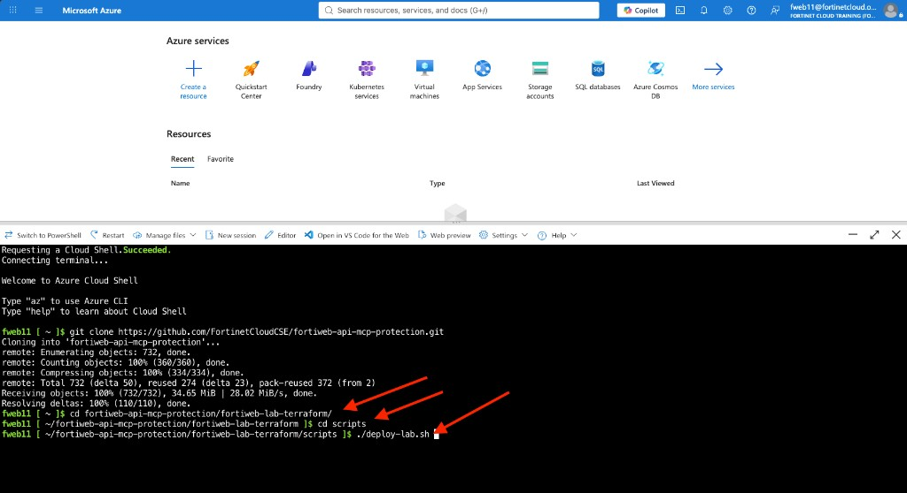

The script:

* Builds the resource group name as `<whoami>-mcp201-workshop`
* Updates each phase `terraform.tfvars` with that resource group and your public IP
* Runs the four Terraform phases (`00-foundation` through `03-routes`)

When the deploy finishes, note the `guacamole_access` output—you will use it in the next section to open Guacamole. The script runs without prompts (`terraform apply -auto-approve`).

{}
Do not close Cloud Shell while Terraform is applying. If the session disconnects, reopen Cloud Shell and re-run `./deploy-lab.sh` from the `scripts` directory.
{}

### Topics Covered

- Lab architecture overview
- Components deployed by Terraform
- Application topology
- FortiWeb deployment mode
- Signing in with your provisioned Azure lab user
- Deploying the lab from Azure Cloud Shell
- Accessing the environment through Guacamole
