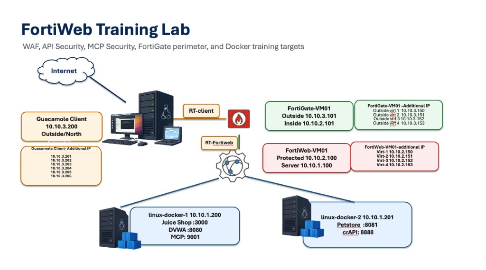

## Objective

Deploy the training environment and become familiar with the lab topology.

## Lab Architecture

The diagram below summarizes the FortiWeb training lab: Guacamole client access, FortiGate perimeter, FortiWeb WAF, and Docker application targets.

| Component | Role | Key addresses |
|-----------|------|----------------|
| Guacamole | Student jump host | `10.10.3.200` (+ source IPs `.201`–`.206`) |
| FortiGate-VM01 | Perimeter firewall | Outside `10.10.3.101`, Inside `10.10.2.101` |
| FortiWeb-VM01 | WAF / API / MCP protection | Protected `10.10.2.100`, Server `10.10.1.100` |
| linux-docker-1 | Juice Shop, DVWA, MCP | `10.10.1.200` |
| linux-docker-2 | Petstore, crAPI | `10.10.1.202` |

## Topics Covered

- Lab architecture overview
- Components deployed by Terraform
- Application topology
- FortiWeb deployment mode
- Accessing the environment through Guacamole
