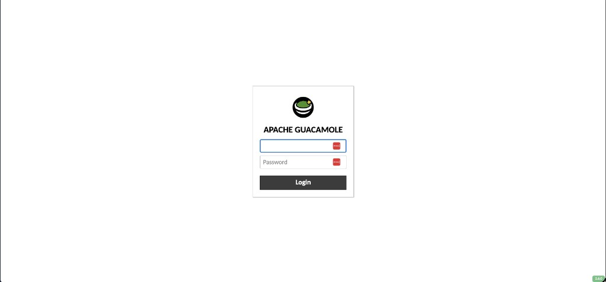
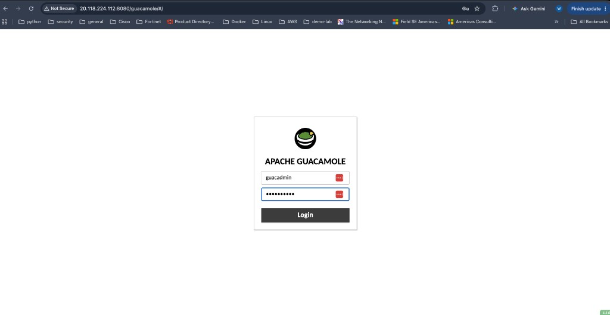
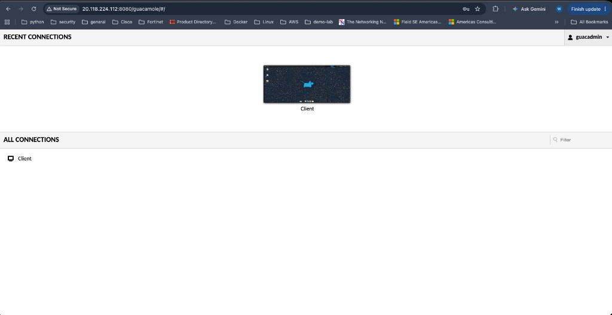
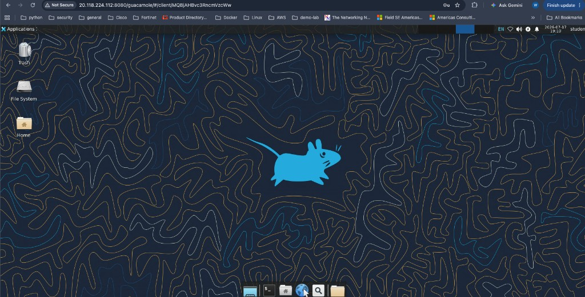
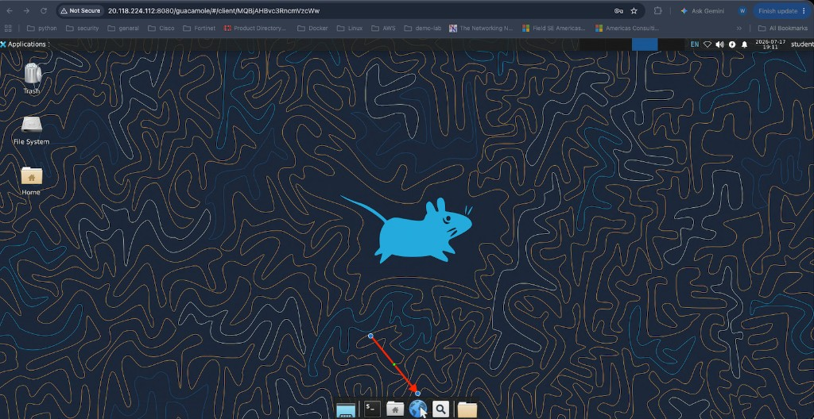
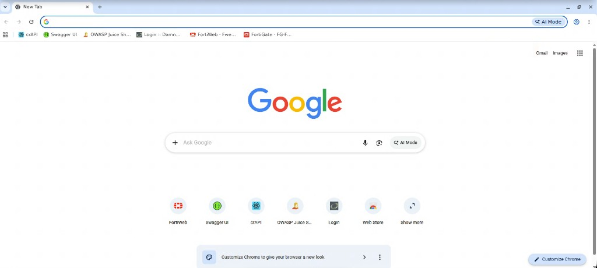

## Access the Lab Environment

After deployment completes, use Apache Guacamole to access the lab’s Linux desktop. From this desktop, you can open FortiWeb, FortiGate, the training applications, and the traffic-generation tools.

### Before You Begin

Locate the public IP address provided at the end of the deployment process in the previous section. You will use that address to reach Guacamole.

### Step 1 – Open the Guacamole Login Page

From your local desktop, open a web browser and enter:

```text
http://<provided-ip-address>:8080/guacamole/#/
```

Replace `<provided-ip-address>` with the public IP address from the deployment output.



{}
Guacamole uses HTTP in this isolated lab. Your browser may label the connection **Not Secure**. Do not reuse these lab credentials outside the training environment.
{}

### Step 2 – Sign In to Guacamole

Enter the following credentials:

| Field | Value |
|-------|-------|
| Username | `guacadmin` |
| Password | `Fortinet1!` |

Click **Login**.



### Step 3 – Open the Client Connection

After you sign in, the Guacamole home page displays the available connections.

Click the **Client** connection.



Guacamole opens the Linux working desktop in the browser.



### Step 4 – Open Google Chrome

On the Linux desktop, click the blue **Internet** globe icon on the bottom panel to open Google Chrome.



### Step 5 – Review the Browser Bookmarks

The applications and administrative interfaces used in the lab are already bookmarked in Chrome. The bookmarks include:

* FortiWeb
* FortiGate
* Swagger UI
* crAPI
* OWASP Juice Shop
* DVWA
* Other lab applications



Use the bookmarks rather than manually entering each application URL.

### Lab Credentials

| System | Username | Password |
|--------|----------|----------|
| Guacamole | `guacadmin` | `Fortinet1!` |
| FortiGate | `Fortilab` | `Fortinetlab1!` |
| FortiWeb | `Fortilab` | `Fortinetlab1!` |

{}
FortiGate and FortiWeb use lab certificates. Accept the self-signed certificate warning when prompted.
{}

### Review the Application Architecture

While connected to the jump host, identify the major components you will work with:

* **FortiWeb** — reverse proxy / WAF protecting lab applications
* **Backend web servers** — Juice Shop and DVWA
* **API servers** — PetStore and related API targets
* **MCP server** — AI / Model Context Protocol service
* **Traffic generation tools** — `fortiweb-lab-traffic` on the Guacamole system

Refer to the topology diagram in [The Lab Environment](../1_Lab%20Enviroment/) as needed.

### Key Takeaways

* Access Guacamole at `http://<provided-ip-address>:8080/guacamole/#/`
* Sign in with the dedicated Guacamole lab credentials
* Open the **Client** connection to reach the Linux desktop
* Use the Internet button to launch Chrome
* Use the preconfigured bookmarks to access FortiWeb and the lab applications
