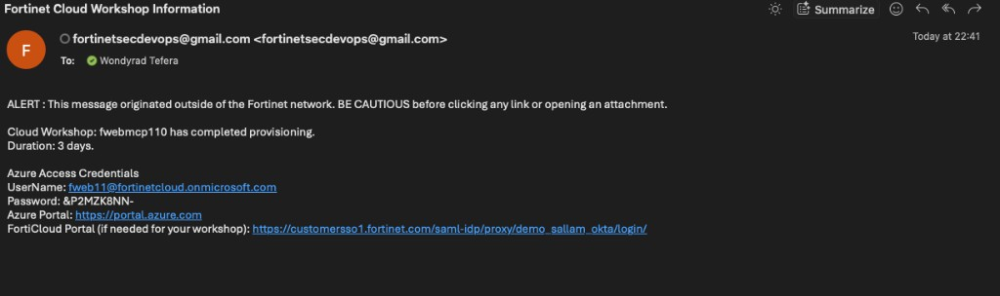

### ***Setting up your Lab Enviroment***

### Provisioning the Azure environment (40min)

Provision your Azure Environment, enter your Email address and click _Provision_


 Enter your email and click _Provision_ once. You'll see a live progress bar while your account is created — this typically takes a few minutes.

When it's done, your credentials (username and sign-in info) will appear directly on this page, and a copy is also sent to your email as a backup.

If you reload this page or come back later, your credentials will still be here — no need to re-submit. 

When provisioning finishes, one of the following happens on this page:

* **Success** — your credentials (username and sign-in info) appear directly above, and a copy is also emailed to you as a backup.
* **Failure** — a clear error message appears (for example, an unsupported email domain, or a technical issue), along with a **Retry Provisioning** button.

You'll also get a backup copy by email, shown below, with the same Azure portal credentials.

