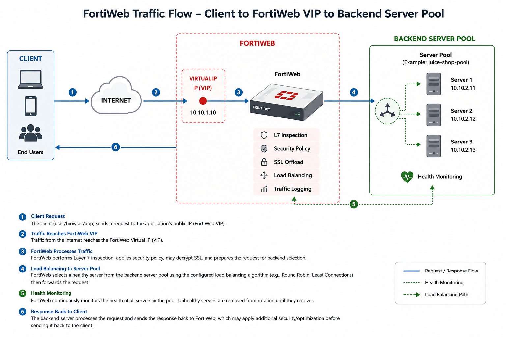
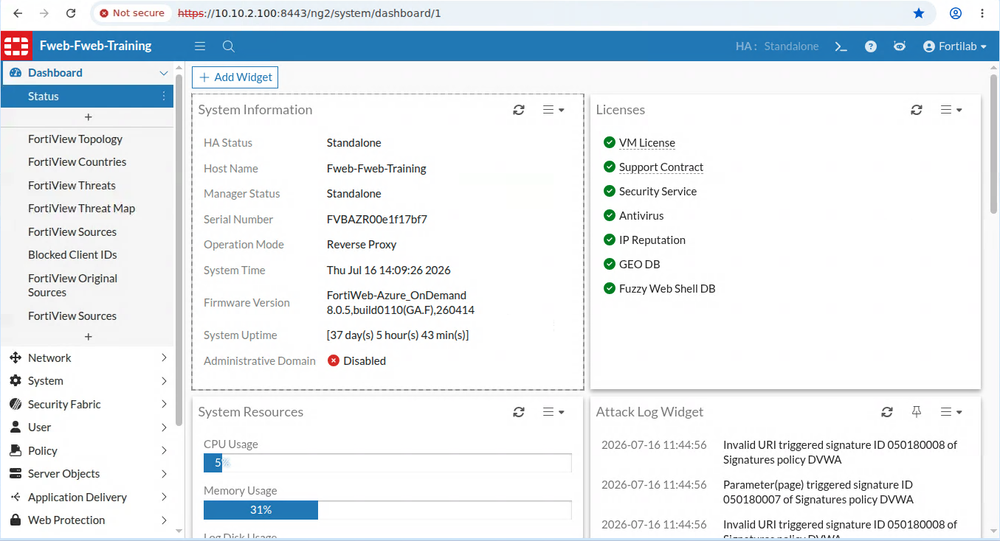
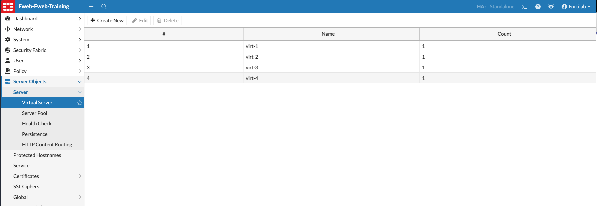
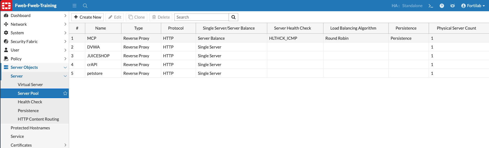
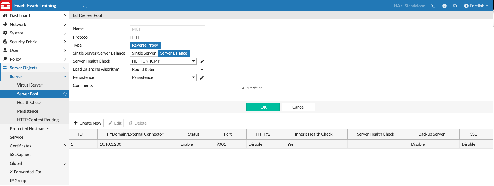
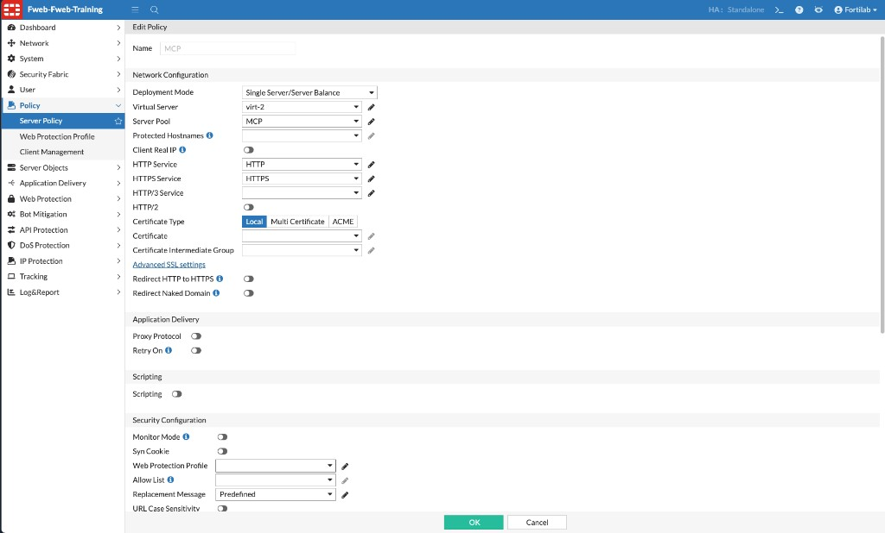
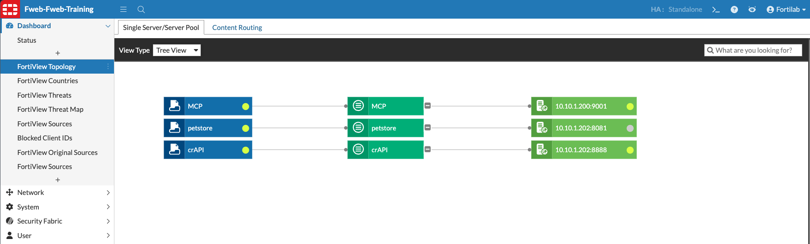

## Task 1 – Review Load Balancing

### Objective

Review how FortiWeb uses virtual servers, server pools, and health checks to publish the applications in this lab.

{}
This is a review-only exercise. The application-delivery configuration is already complete; do not change it unless directed by your instructor.
{}

### Load-Balancing Concepts

In Reverse Proxy mode, FortiWeb receives client connections on a **virtual server** and forwards approved requests to a backend member in a **server pool**.

| Component | Purpose |
|-----------|---------|
| Virtual server | Defines the IP address and interface on which FortiWeb accepts client traffic |
| Server pool | Groups one or more backend application servers |
| Load-balancing algorithm | Determines which healthy pool member receives a request |
| Health check | Tests whether a backend member is available |
| Persistence | Maintains session affinity by directing requests from the same client to the same healthy backend member |

A server pool may contain one server or several servers. With multiple members, FortiWeb can distribute requests using the configured load-balancing algorithm and avoid members that fail health checks.

**Persistence**, also called *session persistence* or *sticky sessions*, is useful when an application stores session state on an individual backend server. FortiWeb can identify a returning client by methods such as a cookie or source IP address and continue sending that client to the same pool member. If the selected member becomes unavailable, the session may be redirected to another healthy member, potentially requiring the user to establish a new application session.



### Step 1 – Access FortiWeb

1. Connect to the Guacamole desktop as described in Chapter 1.
2. Open a browser and navigate to:

   ```text
   https://10.10.2.100
   ```
   ```text
   Fortilab/Fortinetlab1!
   ```
3. Sign in with the lab FortiWeb credentials.
   



### Step 2 – Review the Virtual Server

Navigate to:

**Server Objects → Server → Virtual Server**

Open the virtual server used by the lab applications.

Review:

* Interface
* IP address
* Administrative status
* Whether the virtual server is referenced by an enabled Server Policy



The virtual server is the client-facing entry point. SSL/TLS settings and application routing are reviewed in the next tasks.

### Step 3 – Review the Server Pools

Navigate to:

**Server Objects → Server → Server Pool**

Review the pools used by applications such as **Juice Shop** and **DVWA**.



Open one pool and identify:

* Pool name
* Backend server address and port
* Server status
* Load-balancing algorithm
* Health-check configuration
* Persistence configuration, if enabled
* HTTPS or SSL settings, if enabled



### Step 4 – Associate the Virtual Server and Server Pool

A Virtual Server and Server Pool do not forward traffic by themselves. A **Server Policy** associates the client-facing Virtual Server with the backend Server Pool and defines the services and security settings FortiWeb applies to that traffic.

Navigate to:

**Policy → Server Policy**

Click **Create New**, then configure the principal settings:

| Setting | Purpose |
|---------|---------|
| Name | Identifies the Server Policy |
| Deployment Mode | Select `Single Server/Server Balance` to forward requests directly to one Server Pool |
| Virtual Server | Selects the interface and IP address where FortiWeb receives client traffic |
| Server Pool | Selects the backend server or balanced group that receives allowed traffic |
| HTTP/HTTPS Service | Defines the listening services and ports |
| Certificate | Selects the certificate FortiWeb presents when HTTPS is enabled |
| Web Protection Profile | Applies the required WAF and application-security controls |

The example below associates Virtual Server `virt-2` with Server Pool `MCP`. When a client connects to the Virtual Server and the request is allowed by the Server Policy, FortiWeb forwards it to a healthy member of the selected Server Pool.



To create the association:

1. Select **Single Server/Server Balance** as the Deployment Mode.
2. Select the required **Virtual Server**.
3. Select the required **Server Pool**.
4. Configure the HTTP and HTTPS services.
5. Select a certificate if FortiWeb terminates HTTPS.
6. Assign the appropriate Web Protection Profile.
7. Click **OK**, then confirm that the policy is enabled.

{}
When a Server Pool contains multiple members, FortiWeb uses its load-balancing, persistence, and health-check settings to choose the backend member. When a policy must route different host names or URL paths to different pools, use the **HTTP Content Routing** deployment mode reviewed in the next task.
{}

### Step 5 – Review Health Status

After saving and enabling the Server Policy, return to:

**Server Objects → Server → Server Pool**

Open the Server Pool associated with the policy and confirm that the backend member is shown as healthy or available.



If a member is unhealthy, FortiWeb can stop forwarding requests to it until the configured health check succeeds again. A failed health check may indicate a network, service, port, TLS, or application problem.

For additional information, see the FortiWeb 8.0.5 Administration Guide:

* [Configuring virtual servers on your FortiWeb](https://docs.fortinet.com/document/fortiweb/8.0.5/administration-guide/219671/configuring-virtual-servers-on-your-fortiweb)
* [Creating an HTTP server pool](https://docs.fortinet.com/document/fortiweb/8.0.5/administration-guide/399384/defining-your-web-servers)
* [Configuring an HTTP server policy](https://docs.fortinet.com/document/fortiweb/8.0.5/administration-guide/201872/configuring-an-http-server-policy)
* [Configuring basic policies](https://docs.fortinet.com/document/fortiweb/8.0.5/administration-guide/40821/configuring-basic-policies)

### Verification Checklist

Confirm that you can identify:

* The virtual server receiving client traffic
* At least one server pool and its backend member
* The load-balancing algorithm
* The health-check status
* The Server Policy that associates the Virtual Server with the Server Pool

### Key Takeaways

* Virtual servers provide the client-facing application address
* Server pools define the backend destinations
* Health checks prevent requests from being sent to unavailable members
* FortiWeb keeps application delivery and security enforcement in the same traffic path

### Next Task

Continue to **Content Routing** to see how FortiWeb selects the correct server pool when multiple applications share a virtual server.
