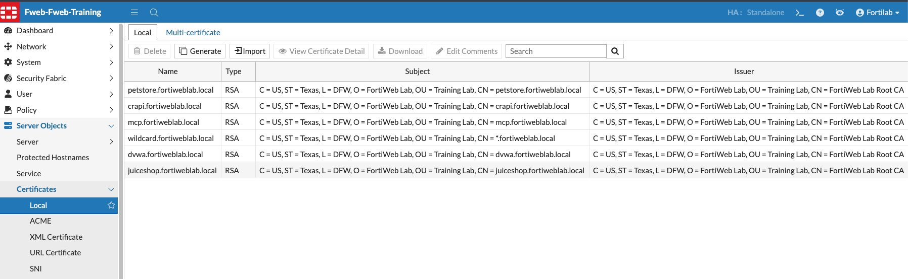

## Task 3 – SSL/TLS Offloading

## Review Certificates and SSL/TLS Offloading

When operating in **Reverse Proxy** mode, FortiWeb terminates client SSL/TLS connections before inspecting the traffic.

This process allows FortiWeb to decrypt HTTPS traffic, apply WAF, API Security, Bot Protection, and other security policies, and then establish a separate connection to the backend application server.

From the client's perspective, FortiWeb is the web server. From the backend server's perspective, FortiWeb acts as the client.

To perform SSL/TLS termination, FortiWeb must have access to the application's certificate and private key.

FortiWeb supports several certificate deployment methods, including:

* Local certificates
* Let's Encrypt certificates
* Imported certificates
* XML and URL-based certificates

It can also generate Certificate Signing Requests (CSRs) for use with public Certificate Authorities.

For this lab, a self-signed certificate is used.

Navigate to:

**Server Objects → Certificates → Local Certificates**

Review the certificate that has been assigned to the Virtual Server.

For additional information, refer to the [FortiWeb Administration Guide](https://docs.fortinet.com/product/fortiweb/8.0):

* Let's Encrypt Certificates
* Supported SSL/TLS Cipher Suites
