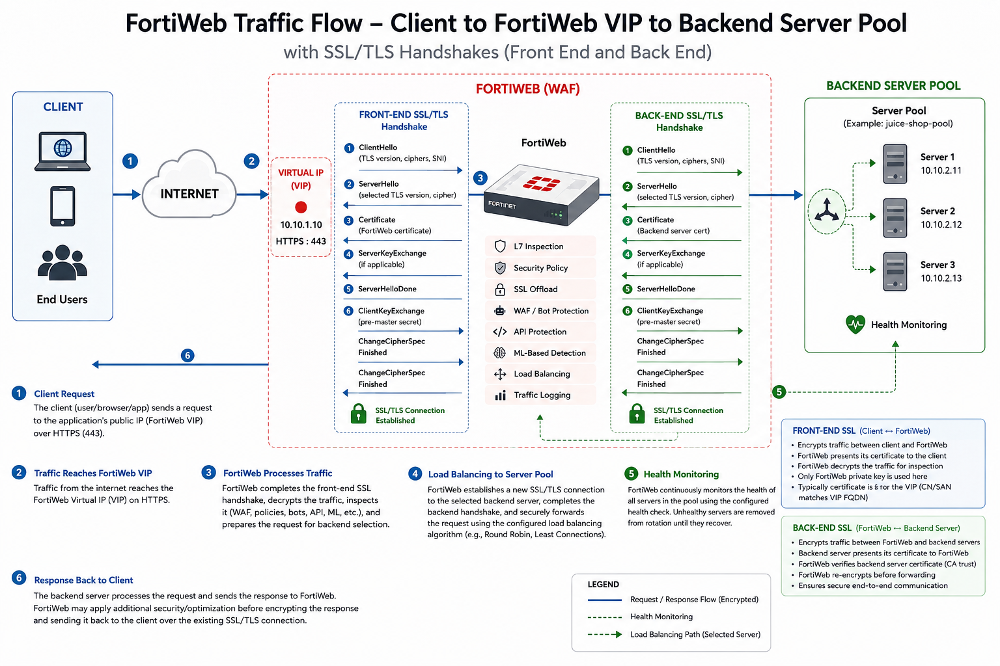
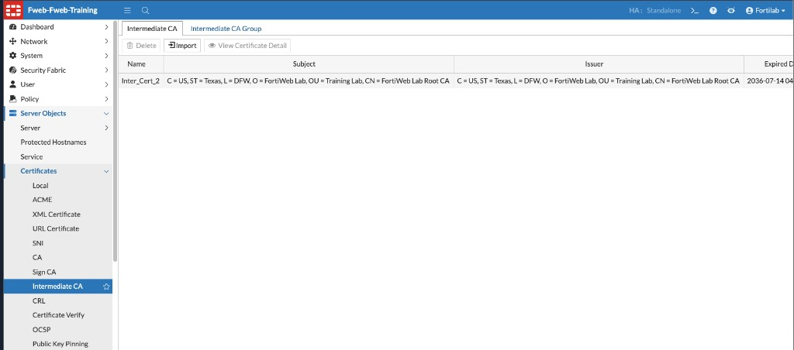
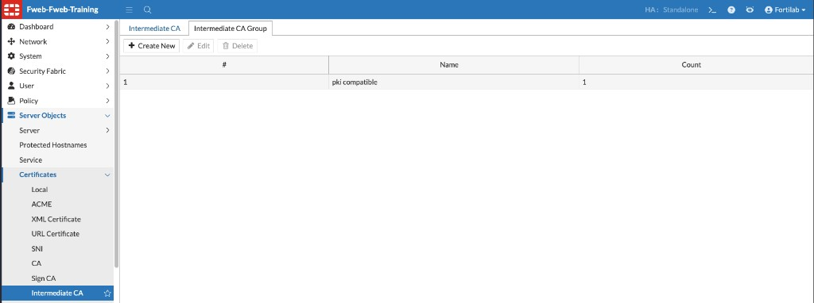
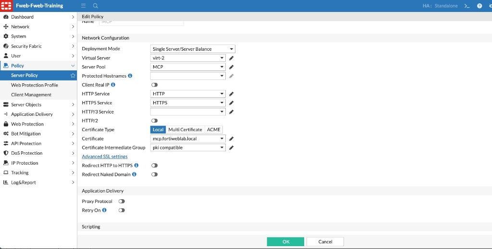
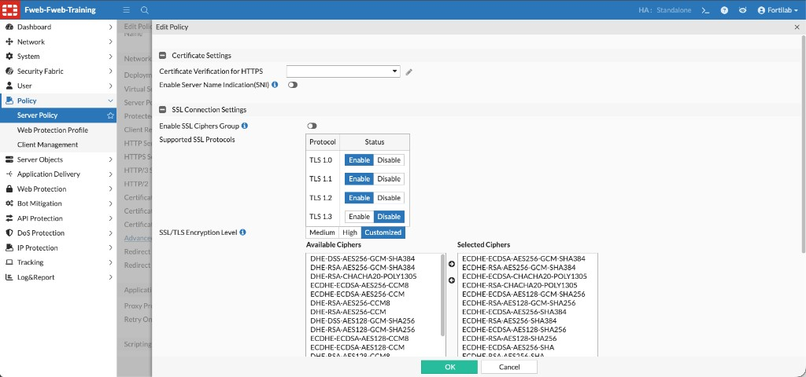

## Task 3 – Review SSL/TLS Offloading

### Objective

Review how FortiWeb terminates HTTPS connections, presents a complete certificate chain, and controls TLS protocol and cipher negotiation.

{}
This is a review-only exercise. The certificate and Server Policy configuration is already present in the lab.
{}

### How SSL/TLS Offloading Works

In **Reverse Proxy** mode, FortiWeb terminates the client’s SSL/TLS connection and presents the certificate configured in the Server Policy. FortiWeb can then decrypt and inspect the request before establishing a separate connection to the backend server.

This allows FortiWeb to apply WAF, API Security, Bot Mitigation, and other protections to HTTPS traffic.

From the client’s perspective, FortiWeb is the web server. From the backend server’s perspective, FortiWeb is the client.

### Certificate Types

FortiWeb supports several certificate sources, including:

* Local or imported certificates
* Certificates created from Certificate Signing Requests (CSRs)
* ACME-managed certificates
* XML and URL certificates

For a local certificate, FortiWeb must have both the server certificate and its corresponding private key.

Navigate to:

**Server Objects → Certificates → Local**

Review the certificate used by the lab application.

## Review the Intermediate Certificate Chain

A server certificate may be signed by an **intermediate certificate authority (CA)** rather than directly by a root CA. In that case, FortiWeb must present the intermediate certificate with the server certificate so clients can build a complete chain to a trusted root.

### Step 1 – Review the Intermediate CA Certificate

Navigate to:

**Server Objects → Certificates → Intermediate CA**

The lab contains the `Inter_Cert_2` intermediate certificate.

Verify the certificate’s subject, issuer, and expiration date. The issuer should correspond to the next CA in the signing chain.

### Step 2 – Review the Intermediate CA Group

Select the **Intermediate CA Group** tab.

The lab uses the `pki compatible` group, which contains the imported intermediate CA certificate.

An Intermediate CA Group can contain one or more intermediate certificates. Grouping them allows the same certificate chain to be reused by multiple Server Policies.

### Step 3 – Associate the Certificate Chain with the Server Policy

Navigate to:

**Policy → Server Policy**

Open the Server Policy used by the MCP application and review:

| Setting | Lab value |
|---------|-----------|
| HTTPS Service | `HTTPS` |
| Certificate Type | `Local` |
| Certificate | `mcp.fortiweblab.local` |
| Certificate Intermediate Group | `pki compatible` |

The **Certificate** field selects the server identity and private key FortiWeb presents during the TLS handshake. The **Certificate Intermediate Group** supplies the additional CA certificates required to complete the signing chain.

If the intermediate group is omitted and the client does not already possess the intermediate certificate, the client may display an incomplete-chain or untrusted-certificate warning.

## ACME Certificate Support

FortiWeb includes an integrated **Automatic Certificate Management Environment (ACME)** client based on RFC 8555. ACME automates certificate enrollment, domain validation, issuance, and renewal with supported certificate authorities.

After an ACME account is configured and a certificate is issued, FortiWeb monitors certificate validity and initiates renewal according to the configured renewal period. FortiWeb 8.0.5 can also use External Account Binding (EAB) credentials with ACME providers that require account verification.

{}
Automatic renewal depends on the selected ACME challenge method and deployment. For example, DNS-01 challenges may require manual DNS updates when the challenge value changes.
{}

ACME-managed certificates can be selected in a Server Policy by choosing **ACME** as the Certificate Type.

## Customize SSL/TLS Negotiation

Within the Server Policy, select **Advanced SSL settings**, then review **SSL Connection Settings**.

These settings control how clients negotiate TLS with FortiWeb:

| Setting | Purpose |
|---------|---------|
| Supported SSL Protocols | Enables or disables individual TLS protocol versions |
| SSL/TLS Encryption Level | Applies Medium, High, or Customized cipher selection |
| Enable SSL Ciphers Group | Applies a reusable cipher group created under **Server Objects → SSL Ciphers** |
| Available / Selected Ciphers | Determines the cipher suites accepted when Customized is selected |

Protocol and cipher choices should follow the organization’s security requirements and client-compatibility needs. Deprecated protocol versions or weak cipher suites should remain disabled unless a documented interoperability requirement exists.

{}
Changing protocol or cipher settings can prevent older clients from connecting. Validate changes against representative clients before enforcing them in production.
{}

### Verification Checklist

Confirm that you can identify:

* The local server certificate used by the policy
* The imported intermediate CA certificate
* The Intermediate CA Group containing that certificate
* The Server Policy fields that associate the certificate and certificate chain
* The enabled TLS versions and selected cipher policy

### Additional Information

Refer to the FortiWeb 8.0.5 Administration Guide:

* [Secure connections (SSL/TLS)](https://docs.fortinet.com/document/fortiweb/8.0.5/administration-guide/173192/secure-connections-ssl-tls)
* [Uploading a server certificate](https://docs.fortinet.com/document/fortiweb/8.0.5/administration-guide/991825/uploading-a-server-certificate)
* [ACME certificates](https://docs.fortinet.com/document/fortiweb/8.0.5/administration-guide/916136/acme-certificates)
* [Configuring an HTTP server policy](https://docs.fortinet.com/document/fortiweb/8.0.5/administration-guide/201872/configuring-an-http-server-policy)
* [Supported cipher suites and protocol versions](https://docs.fortinet.com/document/fortiweb/8.0.5/administration-guide/742465/supported-cipher-suites-protocol-versions)
