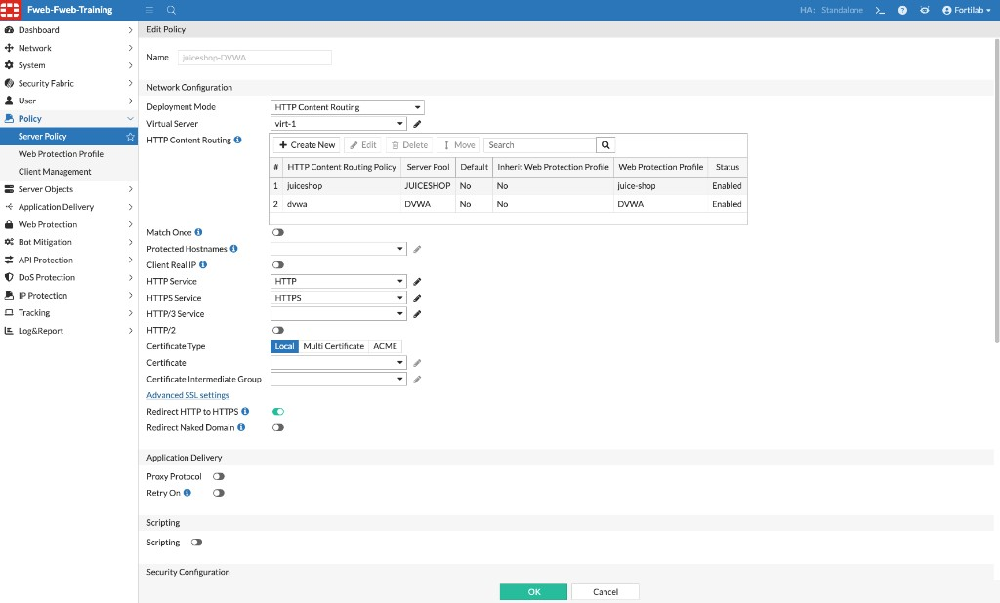

## Task 2 – Content Routing

## Review HTTP Content Routing

HTTP Content Routing allows FortiWeb to publish multiple web applications behind a single Virtual IP address.

Rather than requiring a dedicated IP address for every application, FortiWeb examines each incoming HTTP or HTTPS request and determines which backend Server Pool should receive the request.

Routing decisions can be based on several criteria, including:

* HTTP Host header
* URL path
* Request attributes

In this lab, both the **DVWA** and **Juice Shop** applications are published through the same Virtual Server.

FortiWeb examines the hostname requested by the client and forwards the request to the correct Server Pool.

Navigate to:

**Server Objects → Server → HTTP Content Routing**

Open the **dvwa** routing rule.

### What to Review

Notice how the routing rule:

* Matches requests based on the hostname
* Selects the appropriate Server Pool
* Allows multiple applications to share the same Virtual IP address

## Associate Content-Routing Rules with a Server Policy

After the content-routing rules are created, they must be referenced by a Server Policy. The Server Policy connects the client-facing Virtual Server to the routing rules, backend Server Pools, and Web Protection Profiles.

### Step 1 – Create the Server Policy

Navigate to:

**Policy → Server Policy**

Click **Create New**, then configure:

| Setting | Value |
|---------|-------|
| Name | A descriptive policy name, such as `juiceshop-DVWA` |
| Deployment Mode | `HTTP Content Routing` |
| Virtual Server | Select the Virtual Server that receives application traffic |

The Virtual Server defines the interface and IP address where FortiWeb accepts incoming requests. HTTP Content Routing is available when FortiWeb operates in Reverse Proxy mode.

### Step 2 – Add the Content-Routing Rules

In the **HTTP Content Routing** table, add the routing rules for the applications published through this Virtual Server.

For this lab, associate:

| Routing Policy | Server Pool | Web Protection Profile |
|----------------|-------------|------------------------|
| `juiceshop` | `JUICESHOP` | `juice-shop` |
| `dvwa` | `DVWA` | `DVWA` |

For each entry:

1. Select the existing HTTP Content Routing Policy.
2. Confirm that it references the correct Server Pool.
3. Choose whether the rule inherits the Server Policy’s Web Protection Profile or uses its own profile.
4. Enable the rule.

FortiWeb evaluates the routing rules and forwards a matching request to the associated Server Pool. In a production deployment, also configure appropriate handling for requests that do not match a specific rule, such as a default routing policy.

### Step 3 – Configure Services and Save

Select the required HTTP and HTTPS services. If HTTPS is enabled, select the certificate FortiWeb presents to clients. Review the remaining settings, then click **OK** to save the Server Policy.

### Verify the Policy

Confirm that:

* The Deployment Mode is **HTTP Content Routing**
* The correct Virtual Server is selected
* Both routing policies are enabled
* Each rule references the intended Server Pool and Web Protection Profile
* HTTP and HTTPS services are configured as required

For additional details, see the FortiWeb 8.0.5 Administration Guide:

* [Configuring an HTTP server policy](https://docs.fortinet.com/document/fortiweb/8.0.5/administration-guide/201872/configuring-an-http-server-policy)
* [Configuring virtual servers](https://docs.fortinet.com/document/fortiweb/8.0.5/administration-guide/219671/configuring-virtual-servers-on-your-fortiweb)
