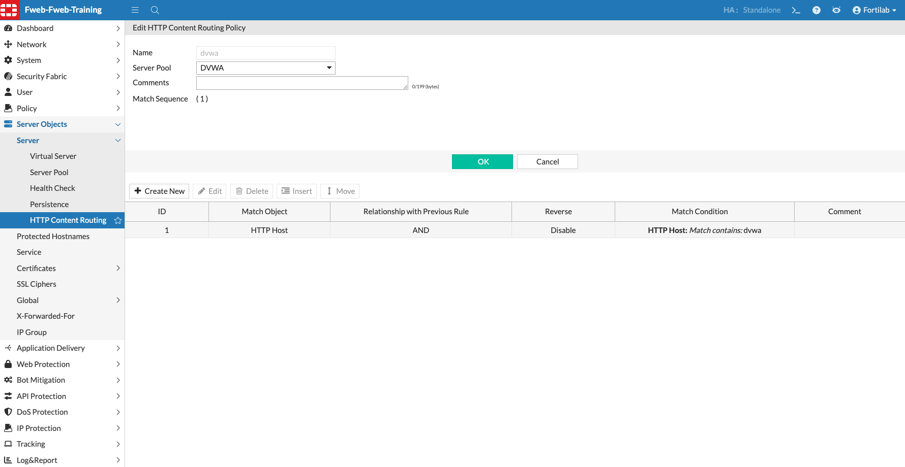

## Task 2 – Content Routing

## Review HTTP Content Routing

HTTP Content Routing allows FortiWeb to publish multiple web applications behind a single Virtual IP address.

Rather than requiring a dedicated IP address for every application, FortiWeb examines each incoming HTTP or HTTPS request and determines which backend Server Pool should receive the request.

Routing decisions can be based on several criteria, including:

* HTTP Host header
* URL path
* Request attributes

In this lab, both the **DVWA** and **Juice Shop** applications are published through the same Virtual Server.

FortiWeb examines the hostname requested by the client and forwards the request to the correct Server Pool.

Navigate to:

**Server Objects → Server → HTTP Content Routing**

Open the **dvwa** routing rule.

### What to Review

Notice how the routing rule:

* Matches requests based on the hostname
* Selects the appropriate Server Pool
* Allows multiple applications to share the same Virtual IP address
