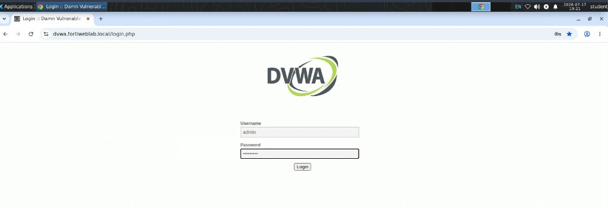
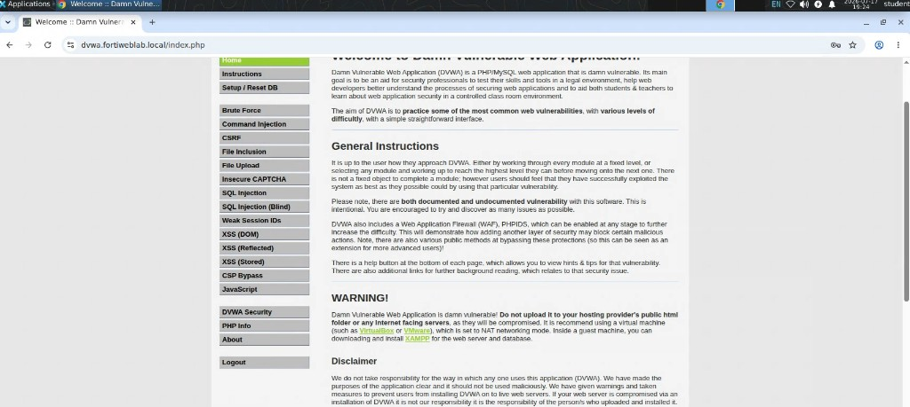
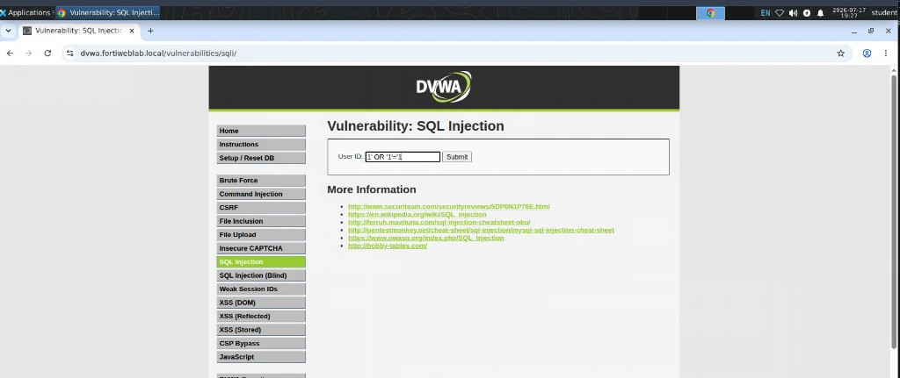
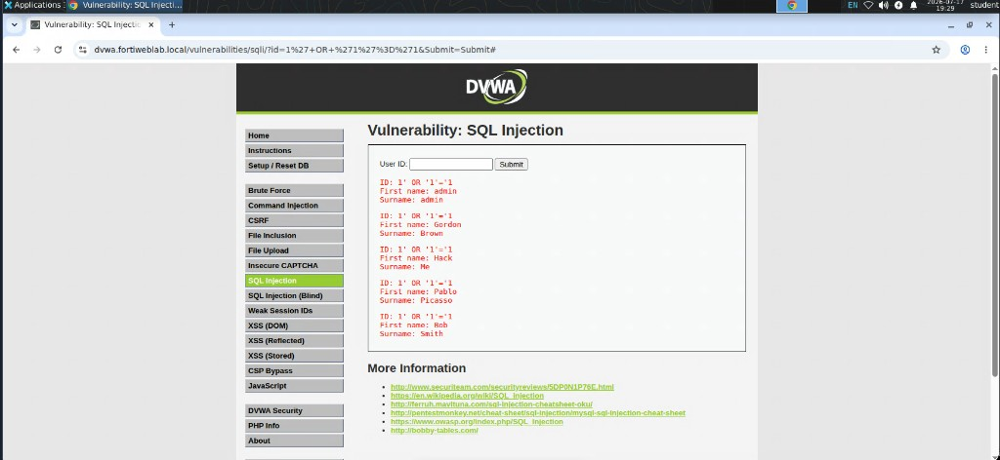
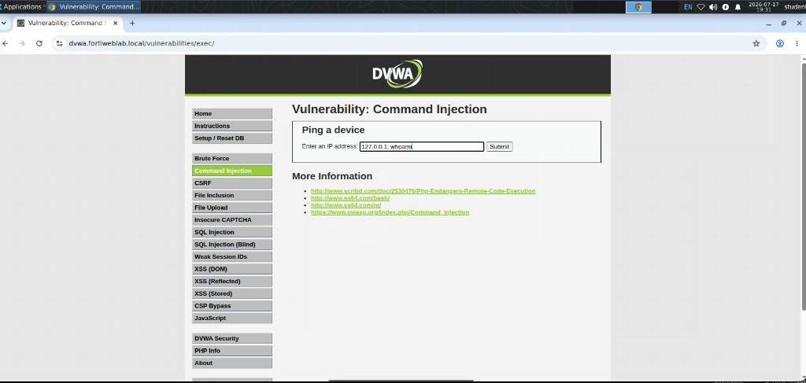
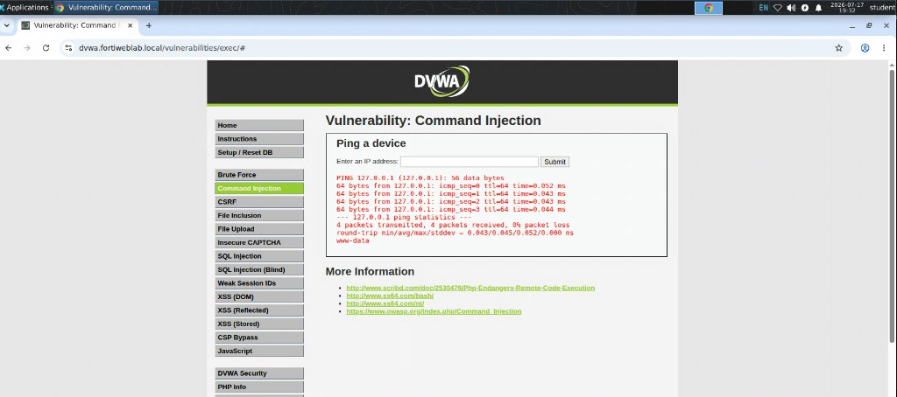
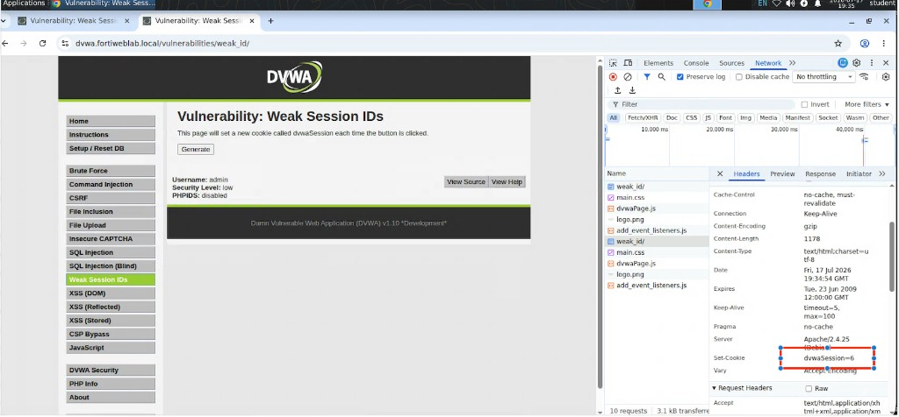

## Exercise 3.1 – Exploring Common Web Application Vulnerabilities with DVWA

### Objective

In this exercise, you access the Damn Vulnerable Web Application (DVWA) and manually perform several common web application attacks. The goal is to observe how a vulnerable application behaves **before** FortiWeb protection is applied.

In later exercises, you will create a Web Protection Profile, generate a broader attack campaign, and compare how FortiWeb detects and blocks the same class of threats.

### Learning Objectives

* Access the DVWA application from the Guacamole desktop
* Authenticate using one of the provided user accounts
* Perform common web application attacks against a vulnerable application
* Observe how the application responds when no Web Application Firewall is protecting it
* Establish a baseline for comparison with the protected application later in this chapter

{}
DVWA is an intentionally vulnerable web application designed for security education and testing. All attacks in this lab are performed in a controlled training environment. The objective is to understand common web application vulnerabilities and how a WAF such as FortiWeb protects against them.
{}

{}
To transfer text from your local computer into the Guacamole desktop, open the Guacamole side menu with **Ctrl + Shift + Command** on macOS or **Ctrl + Shift + Alt** on Windows. Paste the text into the Guacamole clipboard panel, then paste it into the application inside the remote desktop.
{}

---

### Step 1 – Access the Guacamole Desktop

1. Log in to the Guacamole remote desktop using the credentials provided by your instructor.
2. Once the desktop appears, launch the web browser.
3. From the browser’s shortcut/bookmarks bar, click the **DVWA** shortcut.

The DVWA login page should appear at `dvwa.fortiweblab.local`.



---

### Step 2 – Log In to DVWA

Use one of the following credential pairs:

| Username | Password |
|----------|----------|
| `admin`  | `password` |
| `pablo`  | `letmein` |

After successful authentication, the DVWA home page is displayed.



{}
If the application prompts you to create or reset the database, notify your instructor before proceeding.
{}

Before beginning the tests, confirm that DVWA displays **Security Level: low**. If it does not, select **DVWA Security**, change the level to **Low**, and save the setting. The payloads in this exercise are designed for DVWA’s Low security level.

---

### Exercise A – SQL Injection

#### What is SQL Injection?

SQL Injection occurs when an application inserts user-supplied input directly into a database query without properly validating or sanitizing the data. By carefully crafting input, an attacker can modify the SQL statement executed by the database.

#### Real-world impact

Successful SQL Injection attacks can allow an attacker to:

* Bypass authentication
* Retrieve confidential customer information
* Access usernames and passwords
* Modify or delete database records
* Gain administrative access to an application

Improperly validated database input remains one of the most common causes of major data breaches.

#### Perform the attack

1. From the DVWA navigation menu, select **SQL Injection**.
2. Locate the **User ID** field.
3. Enter the following payload:

   ```text
   1' OR '1'='1
   ```



4. Click **Submit**.



#### Observe

Notice that instead of returning a single user record, the application displays multiple records. This demonstrates that the application is treating your input as part of the SQL query instead of as simple data.

Record your observations before continuing.

---

### Exercise B – Command Injection

#### What is Command Injection?

Command Injection occurs when an application passes user input directly to the operating system. If input is not properly validated, an attacker can execute arbitrary operating system commands.

#### Real-world impact

Successful Command Injection attacks may allow an attacker to:

* Read sensitive system files
* Create new user accounts
* Install malware
* Download additional tools
* Execute programs remotely
* Completely compromise the web server

Because operating system commands execute with the privileges of the web application, the impact can be severe.

#### Perform the attack

1. Select **Command Injection** from the DVWA navigation menu.
2. Locate the **IP Address** field.
3. Enter the following payload:

   ```text
   127.0.0.1; whoami
   ```



4. Click **Submit**.



#### Observe

The application executes both the intended command and the injected operating system command. Depending on the operating system, you should see the account under which the web server is running.

This demonstrates that user input is being executed without proper validation. Record your observations before continuing.

---

### Exercise C – Weak Session IDs

#### What are Weak Session IDs?

After a user successfully logs in, most web applications generate a unique session identifier so the user can remain authenticated without re-entering credentials on every request.

If these identifiers are predictable or generated with weak algorithms, an attacker may be able to guess another user’s session ID.

#### Real-world impact

Predictable session identifiers can lead to:

* Session hijacking
* Unauthorized account access
* User impersonation
* Complete account takeover without knowing the user’s password

Strong session management is an important component of web application security.

#### Perform the exercise

1. From the DVWA navigation menu, select **Weak Session IDs**.
2. Open Chrome Developer Tools by pressing **F12** or **Ctrl + Shift + I**.
3. Select the **Network** tab.
4. Click **Generate** on the Weak Session IDs page.
5. In Developer Tools, select the `weak_id` request.
6. Open **Headers** and locate the `Set-Cookie` response header.
7. Record the value of the `dvwaSession` cookie.
8. Repeat the Generate action several times and record each new value.



#### Observe

Compare the recorded `dvwaSession` values. Notice whether they follow a predictable sequence or pattern. If an attacker can predict a valid session identifier, they may be able to impersonate another session.

Record your observations before continuing.

---

### Lab Summary

At this point, you have manually demonstrated several common web application vulnerabilities:

| Vulnerability | Potential Impact |
|---------------|------------------|
| SQL Injection | Database compromise, authentication bypass, data theft |
| Command Injection | Remote command execution and server compromise |
| Weak Session IDs | Session hijacking and unauthorized account access |

Notice that the application accepted every malicious request because it is intentionally vulnerable and currently has **no Web Application Firewall** protections applied to it in this baseline test.

---

### Reflection Questions

Before moving to the next exercise, answer the following:

1. **SQL Injection** — Did the SQL Injection attack successfully retrieve unexpected database records?
2. **Command Injection** — Did the injected operating system command execute successfully?
3. **Weak Session IDs** — Were the generated Session IDs predictable?
4. **Overall security** — At this point in the lab, were any of the attacks detected or blocked?
5. **Critical thinking** — Based on your observations, what risks would these vulnerabilities present if they existed in a production web application?

---

### Next Exercise

You have now observed how an unprotected web application behaves under common attacks.

In the next exercise, you will:

* Create a dedicated FortiWeb **Web Protection Profile** for DVWA
* Associate signature, protocol, header, cookie, and custom protections with that profile
* Apply the profile to the DVWA content routing rule

You will then generate a broader attack campaign and compare the results with the unprotected baseline from this exercise.
