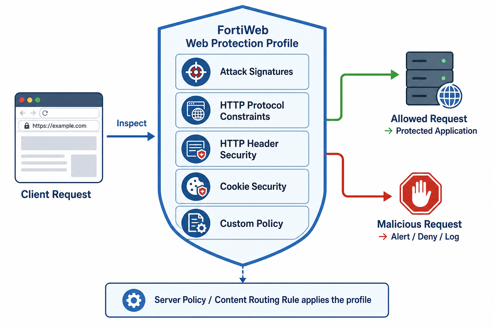
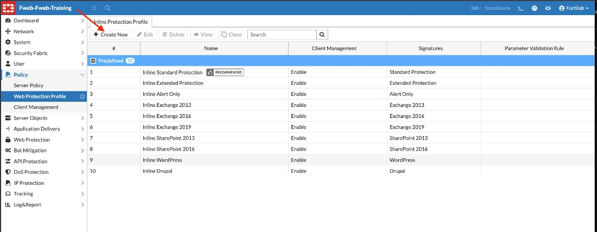
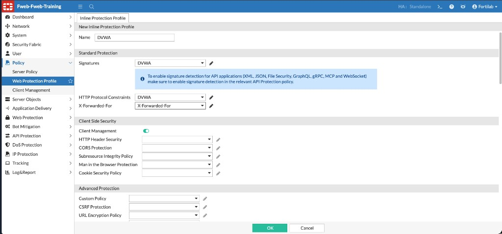
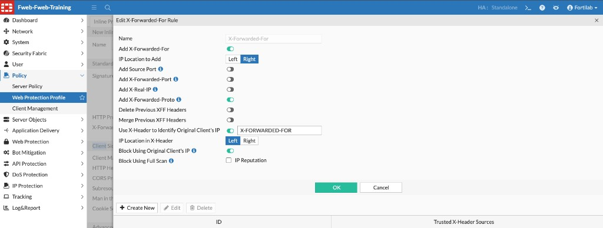
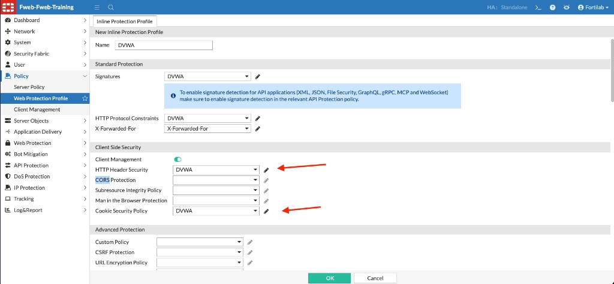
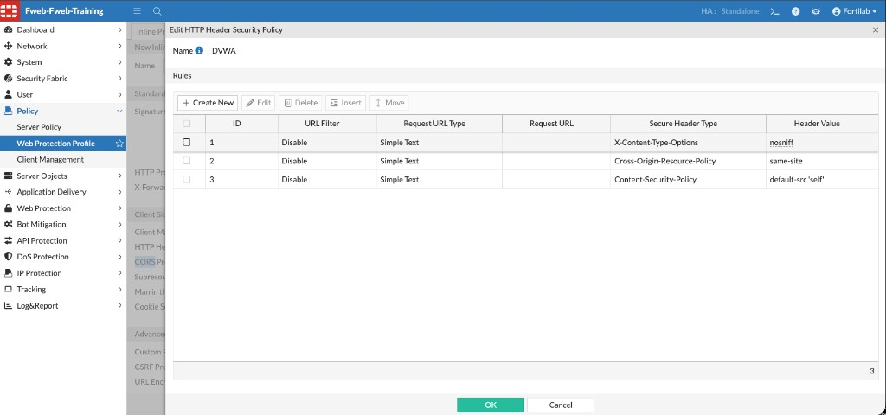
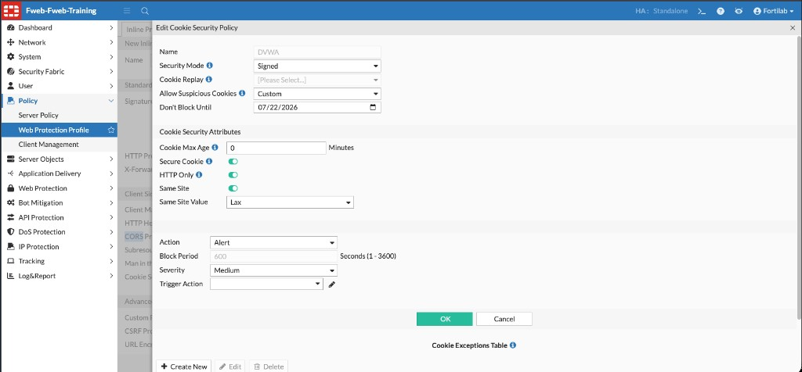
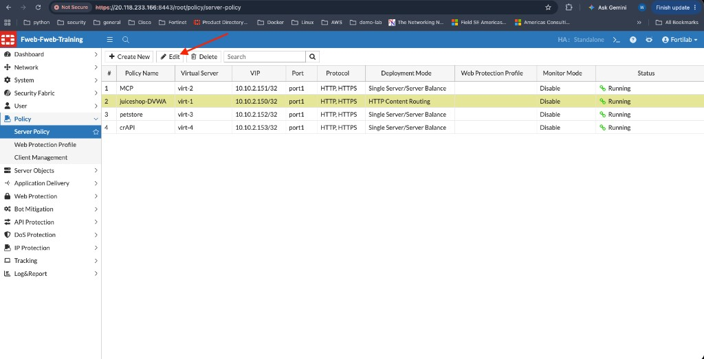
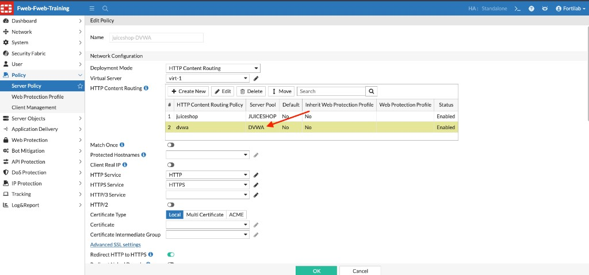
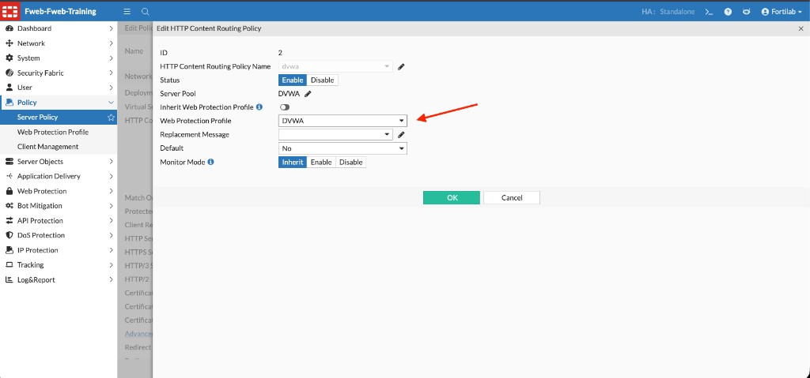

## Exercise 3.2 – Create a Web Protection Profile for DVWA

### Objective

In this exercise, you create a dedicated **Web Protection Profile** for the DVWA application. A Web Protection Profile is where FortiWeb brings together the security features that protect an application. Rather than enabling each protection independently on a server policy, FortiWeb references a single profile that contains the desired settings.

You will create a profile named **DVWA** and associate the prepared security policies for this application, including:

* Signature Protection
* HTTP Protocol Constraints
* X-Forwarded-For
* HTTP Header Security
* Cookie Security

Finally, you associate the completed profile with the **dvwa** HTTP Content Routing rule reviewed in Chapter 2.

### Understanding Web Protection Profiles

A Web Protection Profile is a centralized collection of security policies applied to a protected web application.

Instead of configuring each security feature independently for every application, FortiWeb allows multiple security components to be grouped into a single reusable profile. This simplifies policy management and helps keep protection consistent across applications.

In this lab, DVWA uses its own dedicated protection profile so you can observe WAF behavior without changing the Juice Shop configuration.

{}
To make the lab more efficient, the signature policy and HTTP Protocol Constraints policy used in this exercise were created by **cloning FortiWeb’s Standard Protection** policies and renaming the clones to **DVWA**. That lets you select application-specific policy names without building every signature and protocol setting from scratch. The lab also includes preconfigured **X-Forwarded-For**, **HTTP Header Security**, and **Cookie Security** policies named for DVWA.
{}

---

### Step 1 – Create the Web Protection Profile

1. From the FortiWeb navigation menu, select:

   **Policy → Web Protection Profile**

2. On the **Inline Protection Profile** tab, click **Create New**.

3. Configure the following setting:

| Setting | Value |
|---------|-------|
| Name | `DVWA` |

---

### Step 2 – Configure Standard Protection

Under the **Standard Protection** section, configure the following policies:

| Setting | Value |
|---------|-------|
| Signatures | `DVWA` |
| HTTP Protocol Constraints | `DVWA` |
| X-Forwarded-For | `X-Forwarded-For` |

* The **Signatures** policy enables FortiWeb’s attack signature engine. In this lab, `DVWA` is a clone of the Standard Protection signature policy, renamed for clarity.
* The **HTTP Protocol Constraints** policy enforces compliance with HTTP standards and acceptable request methods. The `DVWA` policy is likewise a clone of the Standard Protection HTTP Protocol Constraints policy.
* The **X-Forwarded-For** setting selects the preconfigured XFF rule used by the lab.

---

### Understanding X-Forwarded-For

When clients reach FortiWeb through an upstream load balancer, reverse proxy, or similar intermediary, the source IP address FortiWeb sees may belong to the intermediary rather than the original client. The **X-Forwarded-For (XFF)** HTTP header is commonly used to preserve the original client IP address as traffic passes through those devices.

FortiWeb’s X-Forwarded-For rule tells the appliance how to:

* Read the original client IP from the `X-Forwarded-For` header
* Optionally insert or update XFF-related headers when forwarding requests
* Use the original client IP for logging, geolocation, reputation checks, and blocking decisions

In this lab, the preconfigured **X-Forwarded-For** rule is already available for selection in the Web Protection Profile.

Key settings in the lab rule include:

| Setting | Lab value | Purpose |
|---------|-----------|---------|
| Add X-Forwarded-For | Enabled | Insert or maintain the XFF header as traffic is processed |
| Use X-Header to Identify Original Client's IP | Enabled (`X-FORWARDED-FOR`) | Use the header value as the true client address |
| IP Location in X-Header | Left | Use the leftmost address in the XFF list as the original client |
| Block Using Original Client's IP | Enabled | Apply blocking and related controls against the original client IP |
| IP Reputation | Enabled | Allow IP Reputation checks based on the original client IP |

Without an XFF rule, Attack Logs and IP-based protections may attribute activity to the load balancer or proxy instead of the real client. That can reduce the accuracy of threat analysis and mitigation.

---

### Step 3 – Configure Client-Side Security

Scroll to the **Client Side Security** section and configure:

| Setting | Value |
|---------|-------|
| Client Management | Enabled |
| HTTP Header Security | `DVWA` |
| Cookie Security Policy | `DVWA` |

Leave the remaining Client Side Security settings at their default values.

{}
The **HTTP Header Security** and **Cookie Security** policies named `DVWA` are preconfigured for this lab. Select them in the Web Protection Profile; you do not need to create the individual header or cookie rules from scratch.
{}

#### Why HTTP Header Security is needed

HTTP Header Security policies instruct the browser how to handle content safely. FortiWeb inserts these response headers so the client enforces security controls that the application alone may not provide.

Review the preconfigured `DVWA` HTTP Header Security policy:

In this lab, the policy includes headers such as:

| Header | Example value | Purpose |
|--------|---------------|---------|
| `X-Content-Type-Options` | `nosniff` | Prevents the browser from MIME-sniffing responses and treating them as a different content type |
| `Cross-Origin-Resource-Policy` | `same-site` | Restricts how other sites can load resources from the application |
| `Content-Security-Policy` | `default-src 'self'` | Limits the sources from which scripts and other content may load, reducing XSS and injection risk |

Without these headers, browsers may accept unsafe content handling defaults that make clickjacking, XSS, and content-injection attacks easier.

#### Why Cookie Security is needed

Session cookies often identify authenticated users. If cookies can be stolen, forged, or sent over insecure channels, attackers may hijack sessions or impersonate legitimate users.

Review the preconfigured `DVWA` Cookie Security policy:

Key settings in the lab policy include:

| Setting | Lab value | Purpose |
|---------|-----------|---------|
| Security Mode | Signed | Helps FortiWeb detect cookie tampering |
| Secure Cookie | Enabled | Restricts cookies to HTTPS connections |
| HTTP Only | Enabled | Prevents client-side scripts from reading the cookie, reducing XSS-based cookie theft |
| Same Site | `Lax` | Limits when cookies are sent on cross-site requests |
| Action | Alert | Logs violations during this lab without immediately denying all cookie-related traffic |

Cookie Security reduces the risk of session hijacking, session fixation, and cookie manipulation by enforcing safer cookie attributes and validating cookie integrity.

---

### Step 4 – Save the Profile

After verifying the configuration, click **OK** to create the Web Protection Profile.

At this point, the profile should reference the following policies:

| Protection Feature | Policy |
|--------------------|--------|
| Signature Detection | `DVWA` |
| HTTP Protocol Constraints | `DVWA` |
| X-Forwarded-For | `X-Forwarded-For` |
| HTTP Header Security | `DVWA` |
| Cookie Security | `DVWA` |

The Web Protection Profile is now ready to be assigned to the protected application.

---

### Step 5 – Associate the Profile with the Server Policy

Next, apply the newly created **DVWA** Web Protection Profile to the DVWA content-routing rule.

1. Navigate to:

   **Policy → Server Policy**

2. Select the **`juiceshop-DVWA`** policy.
3. Click **Edit**.

4. In the **HTTP Content Routing** table, select the **`dvwa`** routing rule.

Confirm that:

| Setting | Value |
|---------|-------|
| HTTP Content Routing Policy | `dvwa` |
| Server Pool | `DVWA` |
| Status | Enabled |
| Inherit Web Protection Profile | `No` |

Because **Inherit Web Protection Profile** is disabled, this routing rule can use its own dedicated protection profile instead of inheriting one from the Server Policy.

5. Click **Edit** for the selected **`dvwa`** content-routing entry.
6. In the **Edit HTTP Content Routing Policy** window, configure:

| Setting | Value |
|---------|-------|
| Status | Enable |
| Server Pool | `DVWA` |
| Inherit Web Protection Profile | Off |
| Web Protection Profile | `DVWA` |

7. Click **OK** to save the content-routing entry.
8. Click **OK** again to save the Server Policy.

At this point, requests that match the **dvwa** content-routing rule are inspected by the dedicated **DVWA** Web Protection Profile, while Juice Shop continues to use its existing protection settings.

---

### Verify the Configuration

After saving the Server Policy, confirm the following:

* The **dvwa** content routing rule references the **DVWA** server pool
* The **DVWA** Web Protection Profile is assigned to the **dvwa** routing rule
* The routing rule is **Enabled**
* The **juiceshop** application continues to inherit its existing protection profile

At this point, requests matching the DVWA host or URL path are inspected using the dedicated **DVWA** Web Protection Profile, while requests destined for Juice Shop continue using their existing configuration.

---

### What You Have Accomplished

You have successfully:

* Created a dedicated Web Protection Profile for DVWA
* Selected the cloned DVWA signature and HTTP Protocol Constraints policies
* Applied the preconfigured X-Forwarded-For rule
* Enabled HTTP Header Security and Cookie Security
* Applied the profile to the **dvwa** HTTP Content Routing rule

### Next Exercise

In the next exercise, you use the FortiWeb Lab Traffic Launcher to send multiple mapped attack types to DVWA. After the campaign completes, you will review FortiWeb Attack Logs and compare the results with the unprotected baseline from Exercise 3.1.
