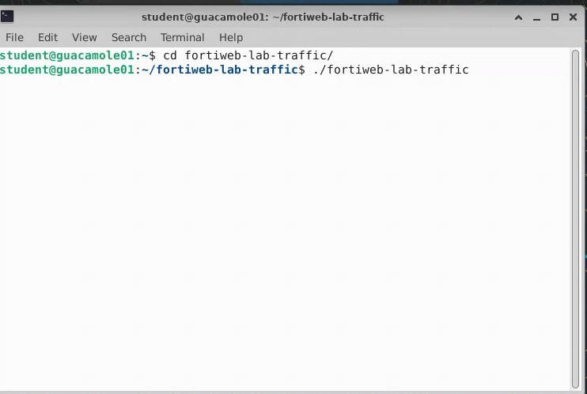
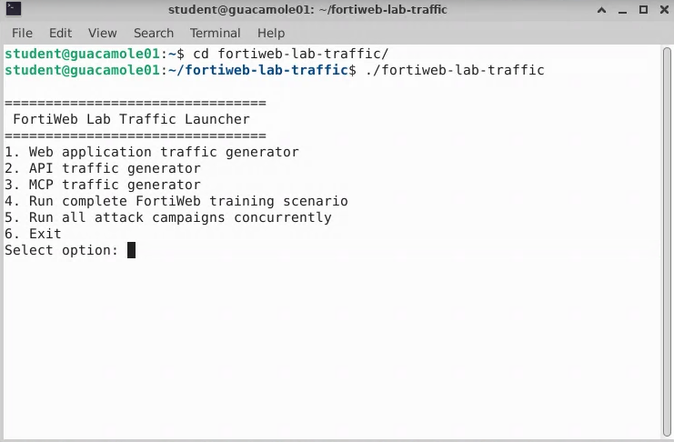
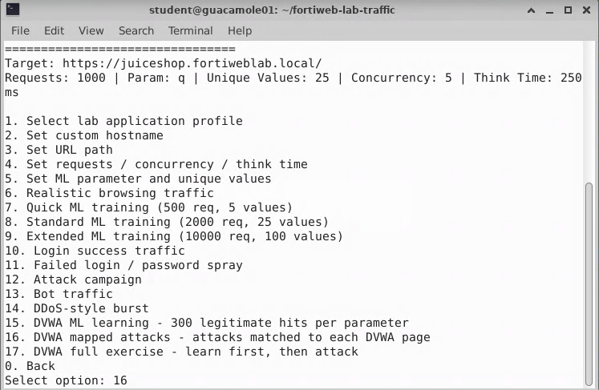
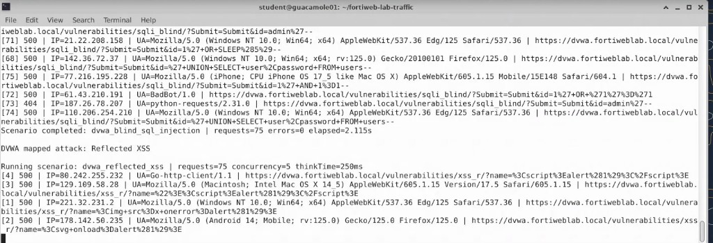
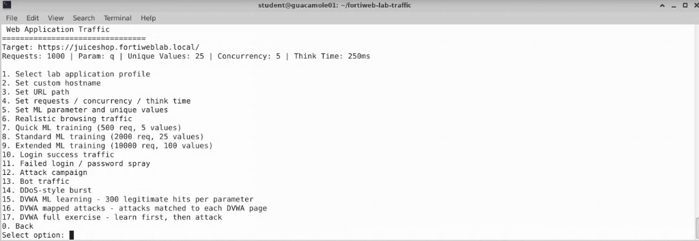

## Exercise 3.3 – Generate DVWA Attacks with the Lab Traffic Launcher

### Objective

In this exercise, you use the preconfigured **FortiWeb Lab Traffic Launcher** to send multiple attack types to the DVWA application.

The traffic generator maps each attack to the appropriate DVWA vulnerability page. That lets you generate a variety of realistic attacks efficiently, without entering each payload manually.

After the campaign completes, Exercise 3.4 focuses on reviewing FortiWeb Attack Logs and identifying the attack types detected by the Web Protection Profile.

{}
The traffic generator and DVWA application are part of a controlled training environment. Do not run these tests against systems outside the lab.
{}

---

### Step 1 – Open a Terminal

From the Guacamole desktop, open the terminal application.

The command prompt should display the student account on the Guacamole system.



---

### Step 2 – Navigate to the Traffic Generator Directory

At the terminal prompt, enter:

```bash
cd ~/fortiweb-lab-traffic
```

Confirm that the prompt shows the following directory:

```text
student@guacamole01:~/fortiweb-lab-traffic$
```

---

### Step 3 – Launch the FortiWeb Lab Traffic Tool

Run the following command:

```bash
./fortiweb-lab-traffic
```

The FortiWeb Lab Traffic Launcher menu appears:

```text
================================
  FortiWeb Lab Traffic Launcher
================================

1. Web application traffic generator
2. API traffic generator
3. MCP traffic generator
4. Run complete FortiWeb training scenario
5. Run all attack campaigns concurrently
6. Exit
```



---

### Step 4 – Select the Web Application Traffic Generator

At the `Select option:` prompt, enter:

```text
1
```

This opens the Web Application Traffic Generator menu.

The current target may display:

```text
Target: https://juiceshop.fortiweblab.local/
```

{}
The target shown at the top of the menu may initially reference Juice Shop. The DVWA mapped-attack option automatically sends each request to the appropriate DVWA host and vulnerability page.
{}



---

### Step 5 – Run the DVWA Mapped Attack Campaign

From the Web Application Traffic Generator menu, enter:

```text
16
```

Option **16** is:

```text
DVWA mapped attacks - attacks matched to each DVWA page
```

The script begins sending attack payloads to the DVWA application. Each attack is mapped to the corresponding vulnerable DVWA page. For example:

* SQL Injection payloads are sent to the SQL Injection page
* Cross-Site Scripting payloads are sent to the XSS page
* Command Injection payloads are sent to the Command Injection page
* Other supported attacks are sent to the appropriate DVWA vulnerability endpoint

Allow the script to run until the attack campaign is complete.



{}
Do not close the terminal while the script is running.
{}

---

### Step 6 – Confirm Campaign Completion

When the campaign finishes, review the terminal output for a completion message or summary of requests sent.



You do not need to re-enter each attack manually. The campaign produces a broader and more consistent set of events for log review in the next exercise.

---

### Verification Checklist

Confirm that you completed the following:

* Launched the `fortiweb-lab-traffic` tool
* Selected option **1** – Web application traffic generator
* Selected option **16** – DVWA mapped attacks
* Allowed the attack campaign to complete without closing the terminal

---

### Next Exercise

In Exercise 3.4, you open the FortiWeb Attack Log, locate SQL Injection and Cross-Site Scripting events, review additional detected attack categories, and examine individual log details.
