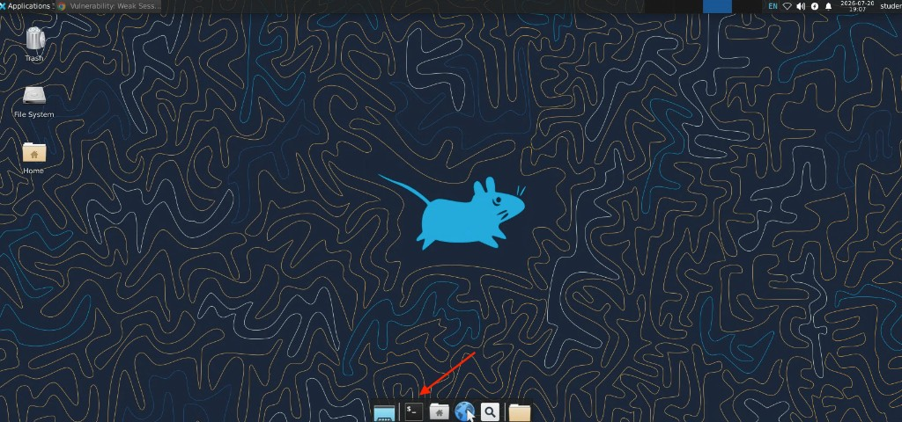

## Exercise 3.3 – Generate DVWA Attacks with the Lab Traffic Launcher

### Objective

In this exercise, you use the preconfigured **FortiWeb Lab Traffic Launcher** to send multiple attack types to the DVWA application.

The traffic generator maps each attack to the appropriate DVWA vulnerability page. That lets you generate a variety of realistic attacks efficiently, without entering each payload manually.

After the campaign completes, Exercise 3.4 focuses on reviewing FortiWeb Attack Logs and identifying the attack types detected by the Web Protection Profile.

{}
The traffic generator and DVWA application are part of a controlled training environment. Do not run these tests against systems outside the lab.
{}

---

### Step 1 – Open a Terminal on the Guacamole Desktop

From the Guacamole desktop, open a terminal.

You can launch Terminal from the **Applications** menu or from the dock at the bottom of the desktop. The Internet (globe) icon opens Chrome; use that later when you review FortiWeb logs in Exercise 3.4.



The command prompt should display the student account on the Guacamole system:

```text
student@guacamole01:~$
```

---

### Step 2 – Navigate to the Traffic Generator Directory and Launch the Tool

At the terminal prompt, enter:

```bash
cd ~/fortiweb-lab-traffic
./fortiweb-lab-traffic
```


The **FortiWeb Lab Traffic Launcher** main menu appears:


---

### Step 3 – Select the Web Application Traffic Generator

At the `Select option:` prompt, enter:

```text
1
```

This opens the **Web Application Traffic** menu.

The current target may display:

```text
Target: https://juiceshop.fortiweblab.local/
```

{}
The target shown at the top of the menu may initially reference Juice Shop. Option **16** (DVWA mapped attacks) automatically sends each request to `dvwa.fortiweblab.local` and the matching vulnerability page.
{}

---

### Step 4 – Run the DVWA Mapped Attack Campaign

From the Web Application Traffic menu, enter:

```text
16
```

Option **16** is:

```text
DVWA mapped attacks - attacks matched to each DVWA page
```


The script begins sending attack payloads to DVWA. Each attack type is mapped to the corresponding vulnerable page. For example:

* SQL Injection and Blind SQL Injection payloads are sent to the SQL Injection endpoints
* Cross-Site Scripting payloads are sent to the XSS pages
* Command Injection and other supported attacks are sent to their matching DVWA endpoints

While the campaign runs, the terminal displays request lines, status codes, simulated source IPs, and scenario summaries as each mapped attack finishes.


{}
Do not close the terminal while the script is running.
{}

Allow the script to run until every mapped attack scenario has completed.

---

### Step 5 – Confirm Campaign Completion

When the DVWA mapped-attack campaign finishes, the tool returns to the same **Web Application Traffic** menu you used to select option **16**.


You can leave the menu open, select **0** to go back to the main launcher, or exit the tool. You do not need to re-enter each attack manually—the campaign has already produced the events needed for log review in the next exercise.

---

### Verification Checklist

Confirm that you completed the following:

* Launched `./fortiweb-lab-traffic`
* Selected option **1** – Web application traffic generator
* Selected option **16** – DVWA mapped attacks
* Allowed the attack campaign to complete without closing the terminal
* Confirmed that the Web Application Traffic menu reappeared after completion

---

### Next Exercise

In Exercise 3.4, you open the FortiWeb Attack Log, locate SQL Injection and Cross-Site Scripting events, review additional detected attack categories, and examine individual log details.
