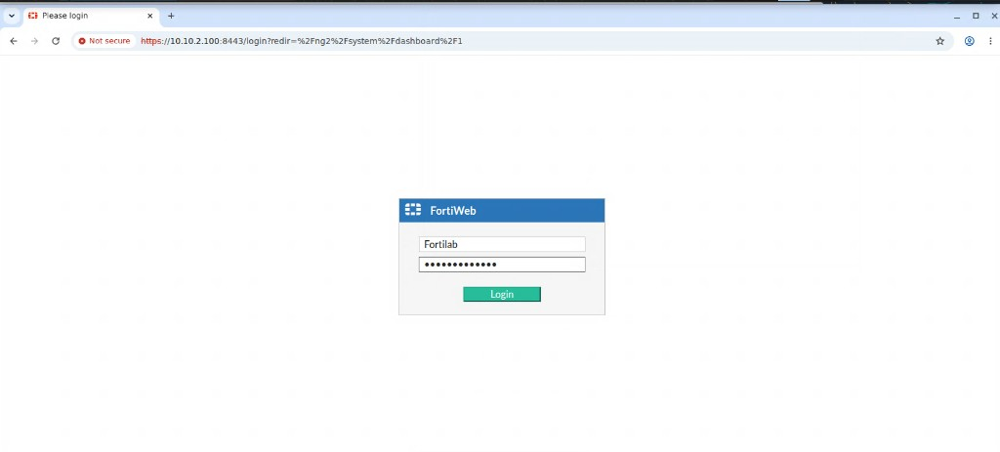
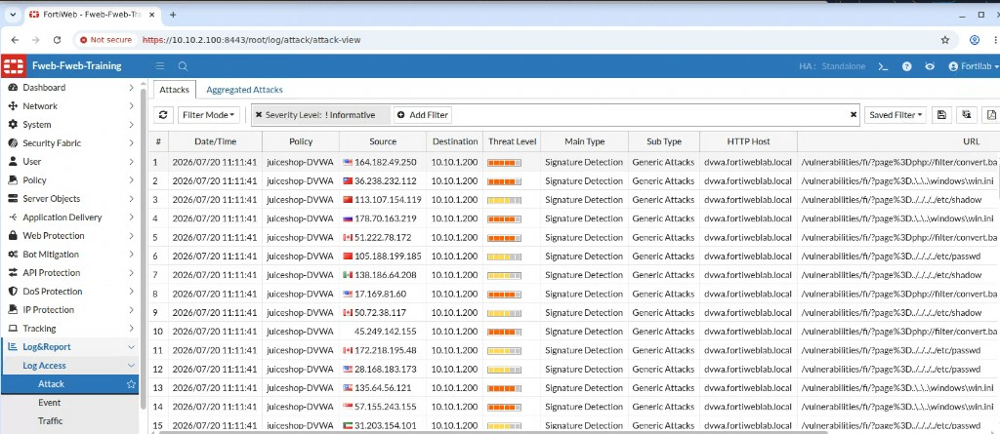
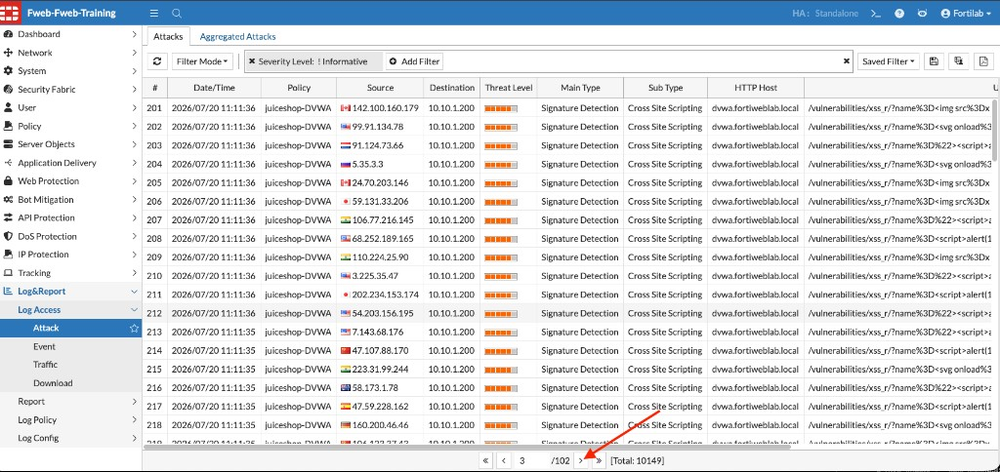
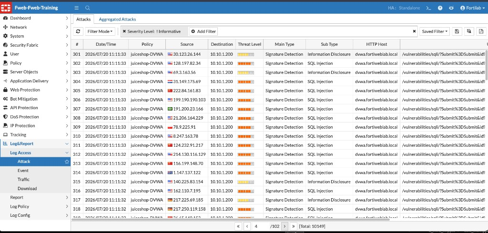
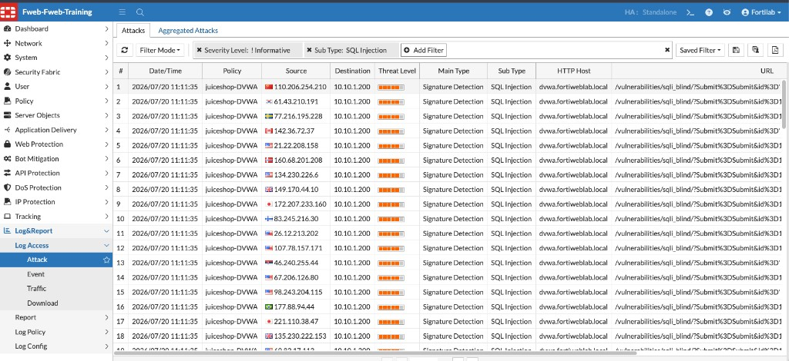
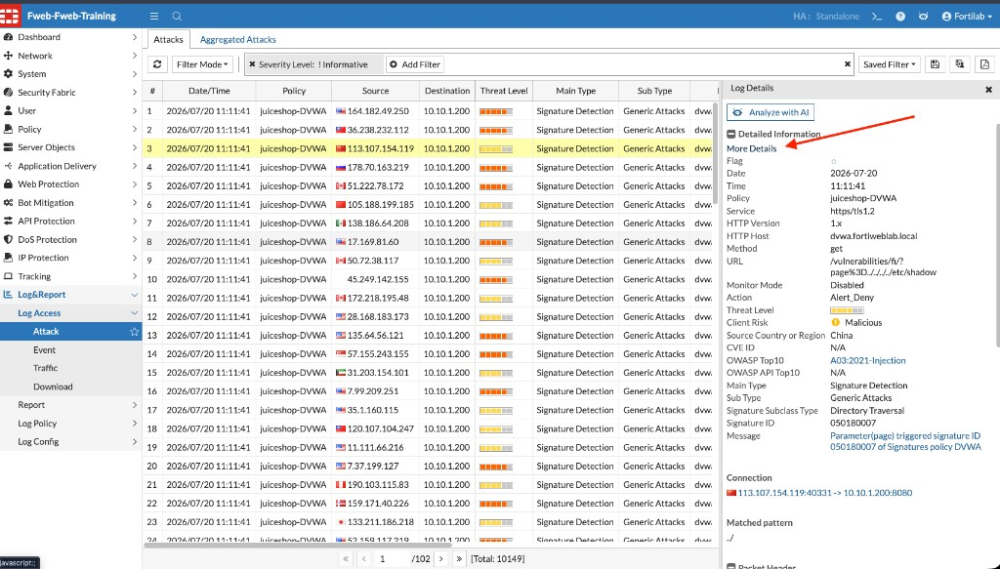
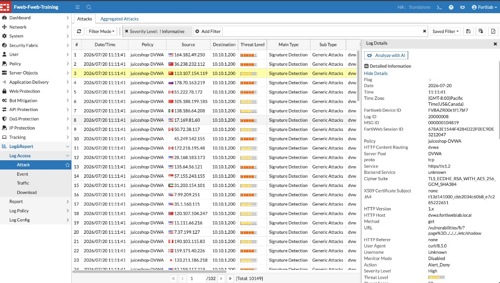

## Exercise 3.4 – Review FortiWeb Attack Logs and Blocking Actions

### Objective

In this exercise, you review the FortiWeb Attack Log after the DVWA mapped attack campaign from Exercise 3.3.

You identify different attack types detected by the Web Protection Profile, examine log details, browse multiple log pages, and compare this protected behavior with the unprotected baseline from Exercise 3.1.

---

### Step 1 – Log In to FortiWeb

1. From the Guacamole desktop, open Chrome (Internet icon).
2. Use the FortiWeb bookmark, or browse to:

   ```text
   https://10.10.2.100:8443
   ```

3. Sign in with the lab credentials:

| Field | Value |
|-------|-------|
| Username | `Fortilab` |
| Password | `Fortinetlab1!` |



{}
Accept the self-signed certificate warning if prompted.
{}

---

### Step 2 – Open the Attack Log

1. Navigate to:

   **Log & Report → Log Access → Attack**

2. If results do not appear immediately, click the **Refresh** icon.

The Attack Log lists malicious requests detected by FortiWeb. After the DVWA mapped campaign, you should see a large number of events for host `dvwa.fortiweblab.local` under policy `juiceshop-DVWA`.



{}
Use the pagination controls at the bottom of the Attack Log to move through additional pages. The DVWA mapped campaign generates many events across multiple pages—browsing beyond the first page helps you see additional attack subtypes, URLs, and source addresses.
{}



---

### Step 3 – Review Detected SQL Injection Attacks

Locate or filter entries where the following values are displayed:

| Log Field | Expected Value |
|-----------|----------------|
| Main Type | Signature Detection |
| Sub Type | SQL Injection |
| HTTP Host | `dvwa.fortiweblab.local` |
| Policy | `juiceshop-DVWA` |

To filter:

1. Click **Add Filter**.
2. Select **Sub Type**.
3. Search for and select **SQL Injection**.

Review the **URL** column. Requests should reference DVWA SQL Injection endpoints such as:

* `/vulnerabilities/sqli/`
* `/vulnerabilities/sqli_blind/`





#### Observe

FortiWeb identifies the request as SQL Injection because the payload matches one or more signatures in the **DVWA** signature policy. Depending on the configured action, FortiWeb may alert, deny, or block the request.

---

### Step 4 – Review Detected Cross-Site Scripting Attacks

Clear or change the filter to display Cross-Site Scripting events:

1. Click **Add Filter**.
2. Select **Sub Type**.
3. Search for and select **Cross Site Scripting**.

Expected values include:

| Log Field | Expected Value |
|-----------|----------------|
| Main Type | Signature Detection |
| Sub Type | Cross Site Scripting |
| HTTP Host | `dvwa.fortiweblab.local` |

The URL may reference a DVWA XSS endpoint such as `/vulnerabilities/xss_r/` and may contain encoded script elements such as `<script>`.

#### Observe

FortiWeb decodes and analyzes the request before comparing it against the configured attack signatures.

---

### Step 5 – Review Other Detected Attacks

Clear or modify the filter and browse additional log pages. Depending on the campaign and enabled signatures, you may also see categories such as:

* Generic Attacks
* Directory Traversal / Local File Inclusion
* Information Disclosure
* OS Command Injection
* Remote File Inclusion
* Protocol violations

{}
Not every category is guaranteed to appear on the first page. Use pagination and filters to explore the full set of detections generated by the mapped attack campaign.
{}

---

### Step 6 – Open an Individual Attack Log

1. Select one attack log entry.
2. Review the **Log Details** pane on the right.
3. Expand **Detailed Information** and click **More Details** if available.

Review fields such as:

* Date and time
* Server policy (`juiceshop-DVWA`)
* Source IP address and country
* Destination IP address
* Threat level / severity
* Main type and subtype
* HTTP host and URL
* Matched signature ID and message
* Action taken (for example, `Alert_Deny`)
* Matched pattern



#### Consider

Why does the Attack Log provide more useful information than simply observing a blocked page in the browser?

The log identifies **what** happened, **when** it happened, **where** the request originated, **which** application was targeted, and **why** FortiWeb classified the request as malicious.

---

### Note – Analyze with AI (FortiAI)

When you open an individual attack log, the Log Details pane includes an **Analyze with AI** button.



**Analyze with AI** sends the selected attack log to the FortiAI Assistant for context-aware analysis. FortiAI can summarize the event, assess potential risk and impact, and suggest mitigation or configuration changes—without requiring you to copy log data manually.

{}
This lab does **not** require you to use **Analyze with AI**. The button is shown here for awareness only. For details, see [Analyze Individual Attack Logs with FortiAI](https://docs.fortinet.com/document/fortiweb/8.0.5/administration-guide/570355/analyze-individual-attack-logs-with-fortiai-8-0-1) in the FortiWeb 8.0.5 Administration Guide.
{}

---

### Step 7 – Compare Source IP Addresses

Review the **Source** column in the Attack Log.

The traffic generator uses different simulated source IP addresses and displays corresponding country flags. This creates a more realistic campaign and shows how FortiWeb records multi-source activity.

{}
These are simulated client addresses supplied by the lab traffic generator. They do not indicate that real external systems are attacking the lab.
{}

---

### Verification Checklist

Confirm that you completed the following:

* Logged in to FortiWeb
* Opened **Log & Report → Log Access → Attack**
* Browsed more than one page of Attack Log results
* Located SQL Injection events
* Filtered for Cross-Site Scripting events
* Reviewed at least one detailed attack log entry
* Confirmed that the target host was `dvwa.fortiweblab.local`
* Noted the **Analyze with AI** option (not required for this lab)

---

### Reflection Questions

1. Which attack types did FortiWeb detect?
2. What value appeared in the **Main Type** field for SQL Injection and Cross-Site Scripting attacks?
3. Which DVWA URL paths appeared most frequently in the logs?
4. Were the attacks only logged, or were they blocked?
5. Which log field identifies the signature or protection mechanism responsible for detecting the request?
6. Why should you browse multiple Attack Log pages after a mapped campaign?
7. How does this protected behavior differ from the baseline results in Exercise 3.1?

---

### Exercise Summary

In this chapter, you:

1. Manually demonstrated common vulnerabilities against unprotected DVWA
2. Created and applied a dedicated Web Protection Profile
3. Generated a mapped multi-attack campaign with the FortiWeb Lab Traffic Launcher
4. Used the Attack Log to identify:

   * The targeted application
   * The attack category and subtype
   * The affected URL
   * The apparent source address
   * The FortiWeb policy that processed the request
   * The action FortiWeb took

This flow demonstrates both the protection FortiWeb provides and the visibility it gives security administrators during an attack campaign.
