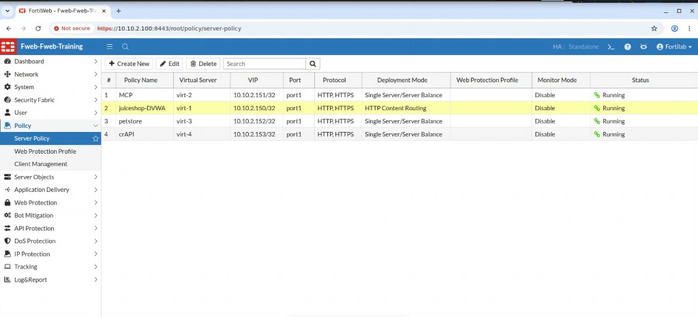

## Exercise 4.1 – Configure Machine Learning

### Objective

Enable **Machine Learning-Based Anomaly Detection** for the Juice Shop application so FortiWeb can begin learning normal application behavior.

In this exercise, you place Machine Learning into **Learning** mode. Later exercises generate legitimate traffic, verify the behavioral model, switch to **Enforcement** mode, and test anomalous requests.

---

### Step 1 – Open the FortiWeb Management Interface

1. From the Guacamole desktop, open a browser and log in to the FortiWeb administrative interface using the credentials provided for the lab.

---

### Step 2 – Edit the Juice Shop Server Policy

1. Navigate to:

   **Policy → Server Policy**

2. Open the server policy used for Juice Shop (the same multi-application policy reviewed in Chapter 2 that hosts HTTP Content Routing).

3. In the HTTP Content Routing table, locate the **juiceshop** routing rule (or the Web Protection Profile associated with Juice Shop).

{}
In Chapter 3 you applied a dedicated **DVWA** Web Protection Profile. Juice Shop should continue using its own protection settings. Machine Learning is enabled for Juice Shop in this chapter so behavioral learning does not interfere with the DVWA signature exercises.
{}

---

### Step 3 – Enable Machine Learning-Based Anomaly Detection

1. Open the Machine Learning / Anomaly Detection settings for the Juice Shop policy (or the Juice Shop Web Protection Profile, depending on how the lab template is built).

2. Configure the following:

| Setting | Value |
|---------|-------|
| Machine Learning-Based Anomaly Detection | Enabled |
| Operating mode | Learning |

3. Leave other Machine Learning options at the lab defaults unless your instructor provides specific values.
4. Save the configuration.

---

### Step 4 – Verify the Configuration

Confirm that:

* Machine Learning-Based Anomaly Detection is **Enabled**
* The operating mode is set to **Learning**
* The Juice Shop application / content routing rule is associated with the updated policy or profile
* The DVWA routing rule still references its dedicated **DVWA** Web Protection Profile from Chapter 3

At this point, FortiWeb is ready to begin learning Juice Shop’s normal behavior. No enforcement of Machine Learning anomalies occurs until you switch to Enforcement Mode later in this chapter.

---

### What You Have Accomplished

* Enabled Machine Learning-Based Anomaly Detection for Juice Shop
* Set the operating mode to **Learning**
* Confirmed that Juice Shop and DVWA continue to use separate protection settings

### Next Exercise

In Exercise 4.2, you use the FortiWeb Lab Traffic Launcher to generate legitimate Juice Shop traffic so FortiWeb can collect samples and build the behavioral model.
