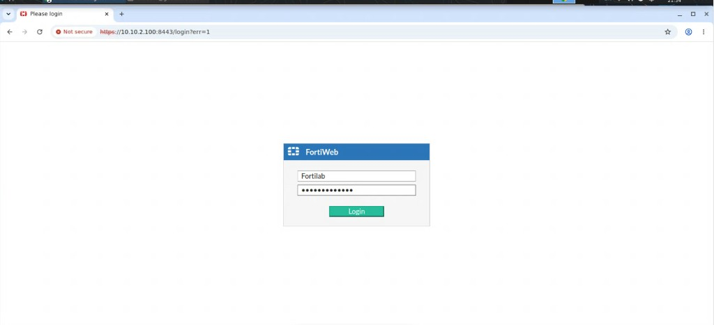
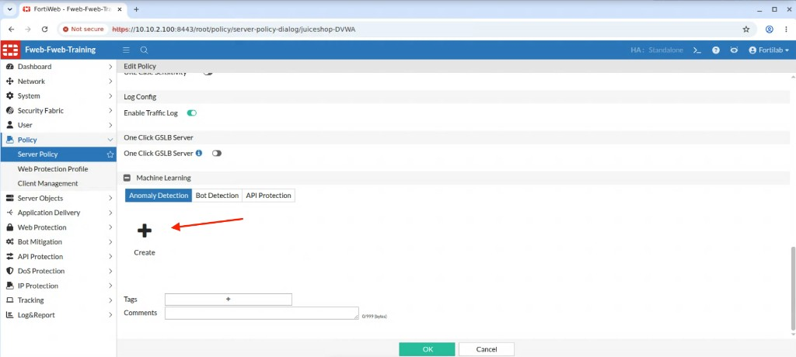
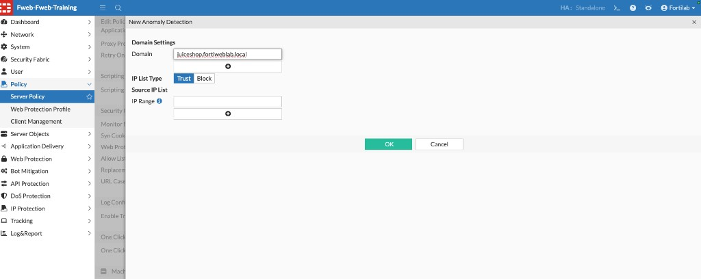
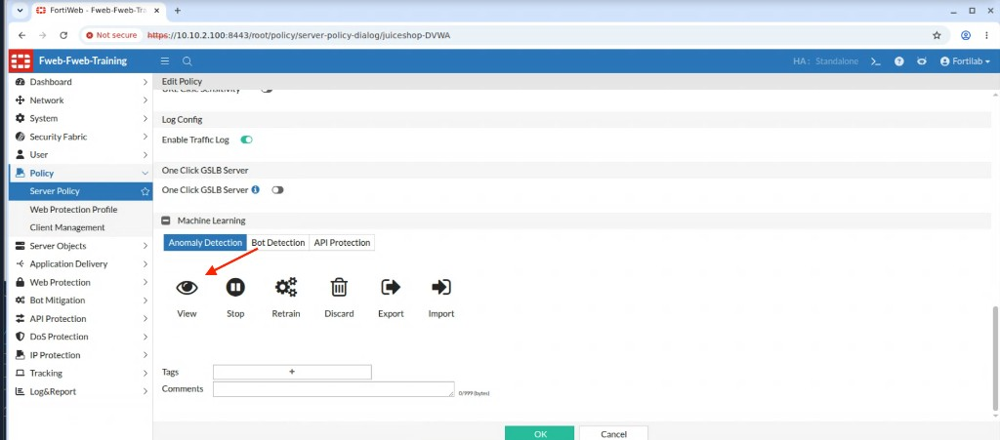
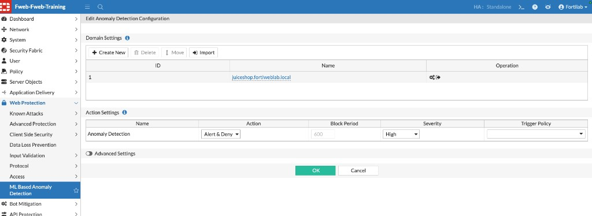
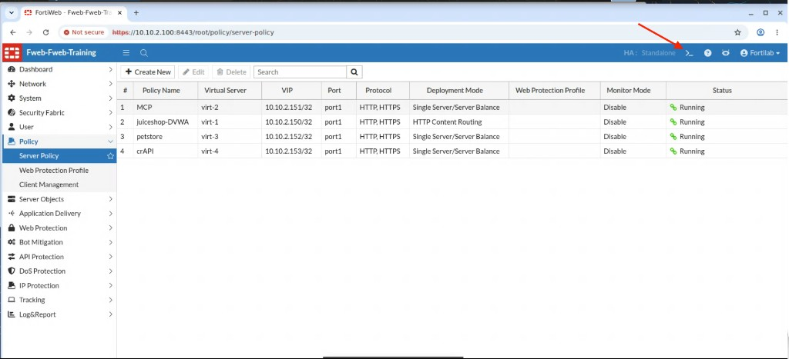
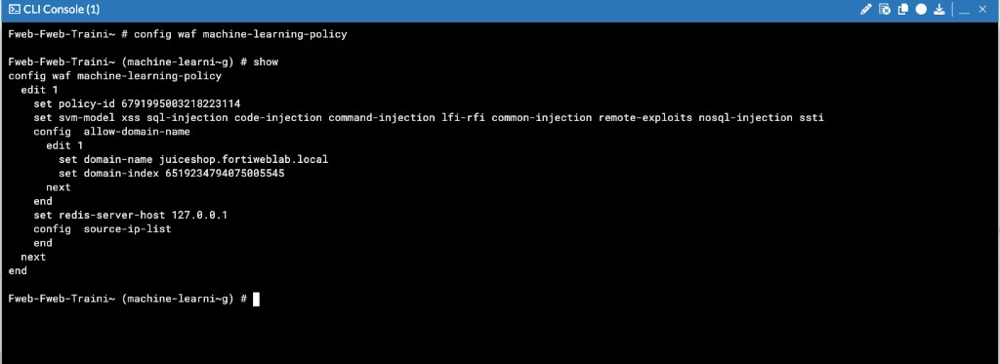
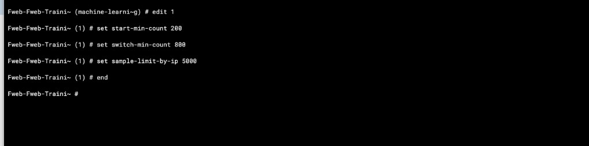
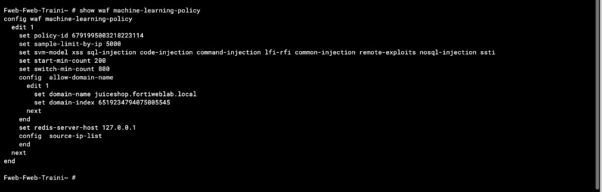

## Exercise 4.1 – Configure Machine Learning

### Objective

Enable **Machine Learning-Based Anomaly Detection** for the Juice Shop application so FortiWeb can begin learning normal application behavior.

In this exercise you:

* Create an Anomaly Detection policy for the Juice Shop domain on the `juiceshop-DVWA` server policy
* Review and confirm the anomaly detection action settings
* Use the FortiWeb CLI to lower sample thresholds so models can be generated efficiently in the classroom lab

Later exercises generate legitimate traffic, verify the behavioral model, and test anomalous requests.

---

### Step 1 – Open the FortiWeb Management Interface

1. From the Guacamole desktop, open a browser and go to:

   ```text
   https://10.10.2.100:8443
   ```

2. Log in with the FortiWeb lab credentials:

| Setting | Value |
|---------|-------|
| Username | `Fortilab` |
| Password | `Fortinetlab1!` |



---

### Step 2 – Edit the Juice Shop Server Policy

1. Navigate to:

   **Policy → Server Policy**

2. Select the **juiceshop-DVWA** policy, then click **Edit**.


{}
The `juiceshop-DVWA` policy uses **HTTP Content Routing** and hosts both Juice Shop and DVWA. Machine Learning in this chapter is configured for the Juice Shop domain only, so behavioral learning does not interfere with the DVWA signature exercises from Chapter 3.
{}

---

### Step 3 – Create Anomaly Detection for Juice Shop

1. In the **Edit Policy** dialog, scroll to the **Machine Learning** section.
2. Select the **Anomaly Detection** tab.
3. Click the **+ Create** icon.



4. In the **New Anomaly Detection** dialog, configure:

| Setting | Value |
|---------|-------|
| Domain | `juiceshop.fortiweblab.local` |
| IP List Type | Trust |

Leave the **Source IP List** empty so FortiWeb can collect samples from any source IP used in the lab.



5. Click **OK**.

After the policy is created, the Anomaly Detection tab shows management actions such as **View**, **Stop**, **Retrain**, **Discard**, **Export**, and **Import**.

---

### Step 4 – Review Anomaly Detection Settings

1. On the Anomaly Detection tab, click **View**.



2. Confirm the **Edit Anomaly Detection Configuration** page includes the Juice Shop domain and configure the action settings as follows:

| Setting | Value |
|---------|-------|
| Domain | `juiceshop.fortiweblab.local` |
| Action | `Alert & Deny` |
| Severity | `High` |

Leave Advanced Settings at the lab defaults unless your instructor provides specific values. Threat models such as Cross-site Scripting, SQL Injection, Code Injection, Command Injection, and Local File Inclusion remain enabled by default.



3. Click **OK** to save the anomaly detection settings.
4. Click **OK** again to save the server policy if the Edit Policy dialog is still open.

FortiWeb is now ready to collect samples for Juice Shop. In a production environment this learning phase can take a long time. The next step adjusts CLI thresholds so the classroom lab can build models more quickly.

---

### Step 5 – Open the FortiWeb CLI Console

FortiWeb exposes several Machine Learning sample-count settings only in the CLI. In the lab, you lower those thresholds so Exercise 4.2 can generate a usable model within a class session.

1. From **Policy → Server Policy** (or any FortiWeb GUI page), click the **CLI Console** icon (`>_`) in the top-right header.



2. When the console opens, enter configuration mode for the Machine Learning policy and display the current settings:

```text
config waf machine-learning-policy
show
```



Confirm that policy `1` includes the domain `juiceshop.fortiweblab.local` and the FortiGuard SVM threat models.

---

### Step 6 – Tune Sample Counts for the Lab

Still inside `config waf machine-learning-policy`, edit the Juice Shop policy and set the lab-optimized sample thresholds:

```text
edit 1
set start-min-count 200
set switch-min-count 800
set sample-limit-by-ip 5000
end
```

| Setting | Lab value | Purpose |
|---------|-----------|---------|
| `start-min-count` | `200` | Minimum samples before FortiWeb builds the initial model (lower than production defaults so learning starts sooner) |
| `switch-min-count` | `800` | Minimum samples before FortiWeb can move from the initial model toward a more stable standard model |
| `sample-limit-by-ip` | `5000` | Caps how many samples are collected from a single source IP so one client cannot dominate the model |



{}
These reduced sample counts are for the training lab only. Production deployments normally use higher defaults so models reflect a broader range of legitimate traffic before enforcement.
{}

---

### Step 7 – Verify the Final CLI Configuration

From the root CLI prompt, confirm the saved settings:

```text
show waf machine-learning-policy
```

Your output should resemble:

```text
config waf machine-learning-policy
    edit 1
        set policy-id <id>
        set sample-limit-by-ip 5000
        set svm-model xss sql-injection code-injection command-injection lfi-rfi common-injection remote-exploits nosql-injection ssti
        set start-min-count 200
        set switch-min-count 800
        config allow-domain-name
            edit 1
                set domain-name juiceshop.fortiweblab.local
                set domain-index <id>
            next
        end
        set redis-server-host 127.0.0.1
        config source-ip-list
        end
    next
end
```



Confirm that:

* Anomaly Detection is configured for `juiceshop.fortiweblab.local`
* Action is **Alert & Deny** with severity **High**
* CLI sample thresholds are `200` / `800` / `5000`

FortiWeb is ready to collect Juice Shop traffic and build behavioral models using the lab-tuned sample counts.

---

### What You Have Accomplished

* Created Machine Learning-Based Anomaly Detection for Juice Shop on the `juiceshop-DVWA` server policy
* Configured anomaly detection action and strictness settings
* Tuned CLI sample thresholds so models can be generated efficiently in the lab
* Verified the final Machine Learning policy configuration

### Next Exercise

In Exercise 4.2, you use the FortiWeb Lab Traffic Launcher to generate legitimate Juice Shop traffic so FortiWeb can collect samples and build the behavioral model.
