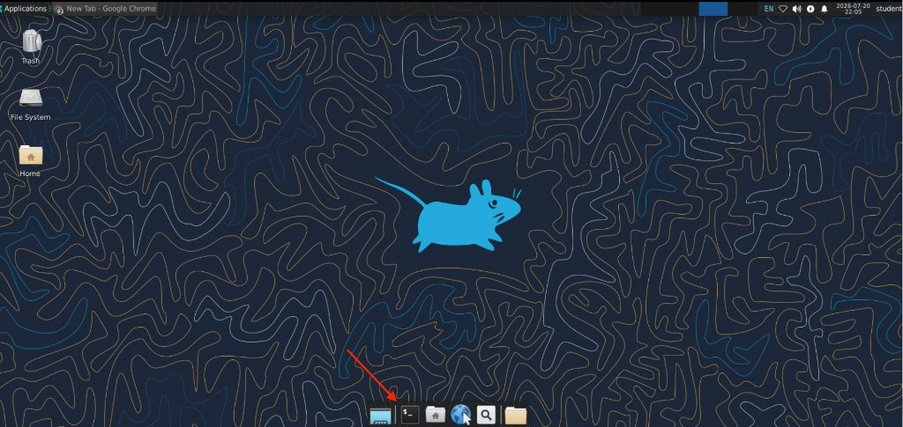
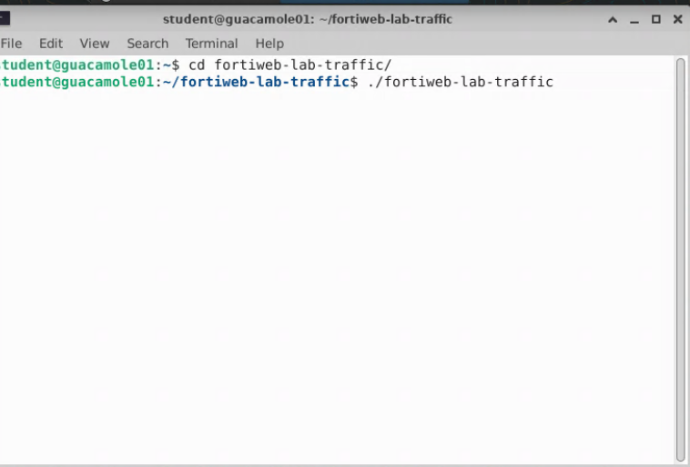
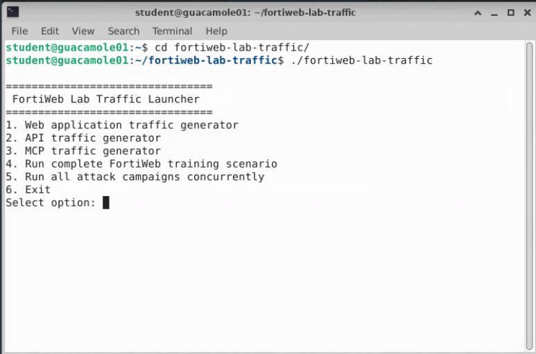
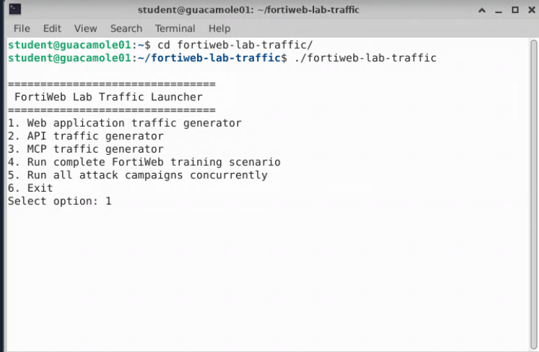
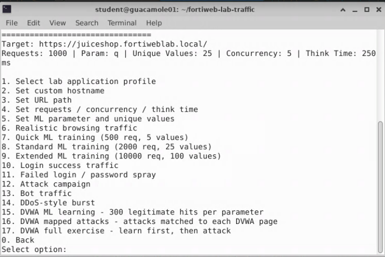
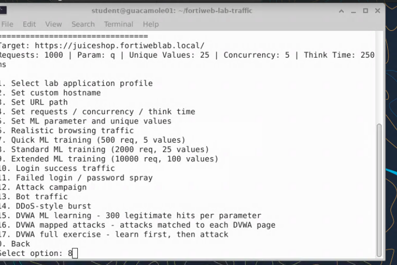
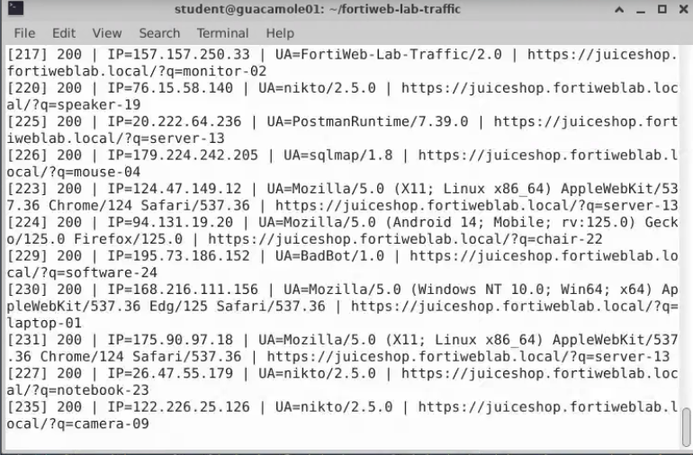
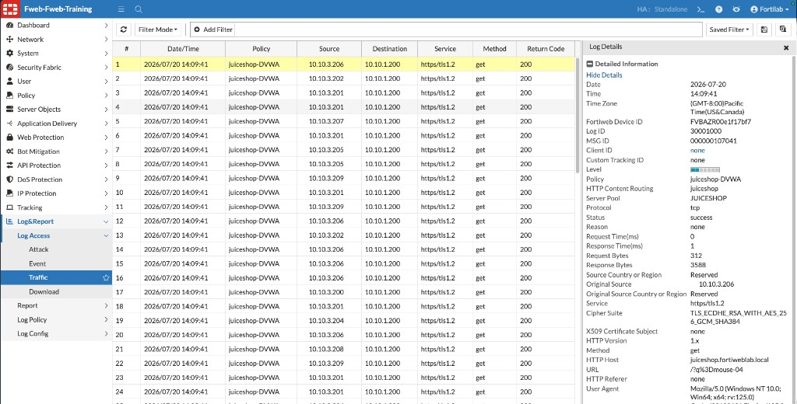
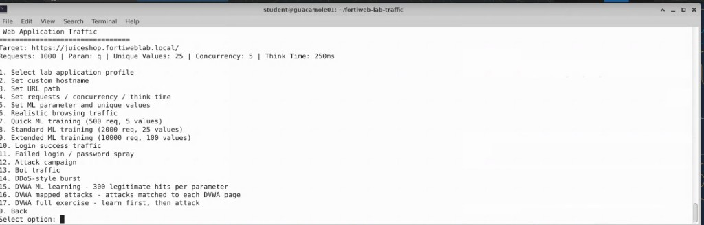

## Exercise 4.2 – Generate Legitimate Application Traffic

### Objective

Machine Learning requires representative samples of legitimate application traffic before it can build an accurate behavioral model.

Instead of manually browsing Juice Shop for an extended period, you use the **FortiWeb Lab Traffic Launcher** to simulate realistic user activity and accelerate model creation for the classroom.

{}
The traffic generator is part of a controlled training environment. Do not run these tests against systems outside the lab.
{}

---

### Step 1 – Open a Terminal

From the Guacamole desktop, open the **Terminal** application from the dock at the bottom of the screen.



The command prompt should display the student account on the Guacamole system:

```text
student@guacamole01:~$
```

---

### Step 2 – Launch the FortiWeb Lab Traffic Tool

At the terminal prompt, enter:

```bash
cd fortiweb-lab-traffic/
./fortiweb-lab-traffic
```



Confirm that the prompt shows:

```text
student@guacamole01:~/fortiweb-lab-traffic$
```

---

### Step 3 – Open the Web Application Traffic Generator

The FortiWeb Lab Traffic Launcher menu appears:

```text
================================
  FortiWeb Lab Traffic Launcher
================================

1. Web application traffic generator
2. API traffic generator
3. MCP traffic generator
4. Run complete FortiWeb training scenario
5. Run all attack campaigns concurrently
6. Exit
```



At the `Select option:` prompt, enter:

```text
1
```



This opens the **Web Application Traffic** menu.

Confirm that the target references Juice Shop:

```text
Target: https://juiceshop.fortiweblab.local/
```



{}
If the target does not show Juice Shop, use option **1** (Select lab application profile) to choose Juice Shop before generating ML training traffic.
{}

---

### Step 4 – Run Standard ML Training

From the Web Application Traffic menu, enter:

```text
8
```

Option **8** is:

```text
Standard ML training (2000 req, 25 values)
```



The Standard ML training option generates approximately **2,000** legitimate HTTP requests using multiple unique parameter values. The generated traffic simulates realistic Juice Shop user behavior and provides FortiWeb with diverse samples for behavioral modeling.

As the campaign runs, the terminal displays request progress similar to:

```text
[217] 200 | IP=... | UA=... | https://juiceshop.fortiweblab.local/?q=...
```



Allow the traffic generator to complete before proceeding.

{}
Do not close the terminal while the script is running.
{}

Optional lab variants (if available in your menu and approved by your instructor):

| Option | Description |
|--------|-------------|
| `7` | Quick ML training (500 req, 5 values) — faster, less diverse |
| `8` | Standard ML training (2000 req, 25 values) — recommended |
| `9` | Extended ML training (10000 req, 100 values) — more complete model |

For this lab, use **option 8** unless your instructor directs otherwise.

---

### Step 5 – Verify Traffic in FortiWeb Logs

While the script is running—or after it has generated a meaningful volume of requests—you can confirm that traffic is reaching FortiWeb.

1. In the FortiWeb GUI, navigate to:

   **Log&Report → Log Access → Traffic**

2. Confirm that recent entries appear for the **juiceshop-DVWA** policy with successful return codes (such as `200`).

3. Select an individual log entry to open **Log Details** and review what was sent, including:

   * HTTP Host (`juiceshop.fortiweblab.local`)
   * URL and query parameters (for example, `/?q=mouse-04`)
   * HTTP Content Routing (`juiceshop`)
   * Server Pool (`JUICESHOP`)
   * User Agent



{}
Checking Traffic logs is useful if model learning appears slow later. If no Juice Shop entries appear, verify the traffic tool target, DNS/hosts resolution, and that the `juiceshop-DVWA` server policy is running.
{}

---

### Step 6 – Return to the Web Application Traffic Menu

When the Standard ML training script finishes, control returns to the **Web Application Traffic** menu automatically. You do not need to relaunch the tool unless you closed the terminal.



From this menu you can run additional legitimate traffic options if your instructor requests them, or enter `0` to go back to the main FortiWeb Lab Traffic Launcher menu.

---

### Verification Checklist

Confirm that you completed the following:

* Opened a terminal from the Guacamole desktop
* Navigated to `~/fortiweb-lab-traffic` and launched `./fortiweb-lab-traffic`
* Selected option **1** – Web application traffic generator
* Confirmed the Juice Shop target (`https://juiceshop.fortiweblab.local/`)
* Selected option **8** – Standard ML training
* Verified that Traffic logs show Juice Shop requests reaching FortiWeb
* Confirmed that the tool returned to the Web Application Traffic menu after completion

---

### Next Exercise

In Exercise 4.3, you return to FortiWeb and verify that the behavioral model has reached the **Running** state.
