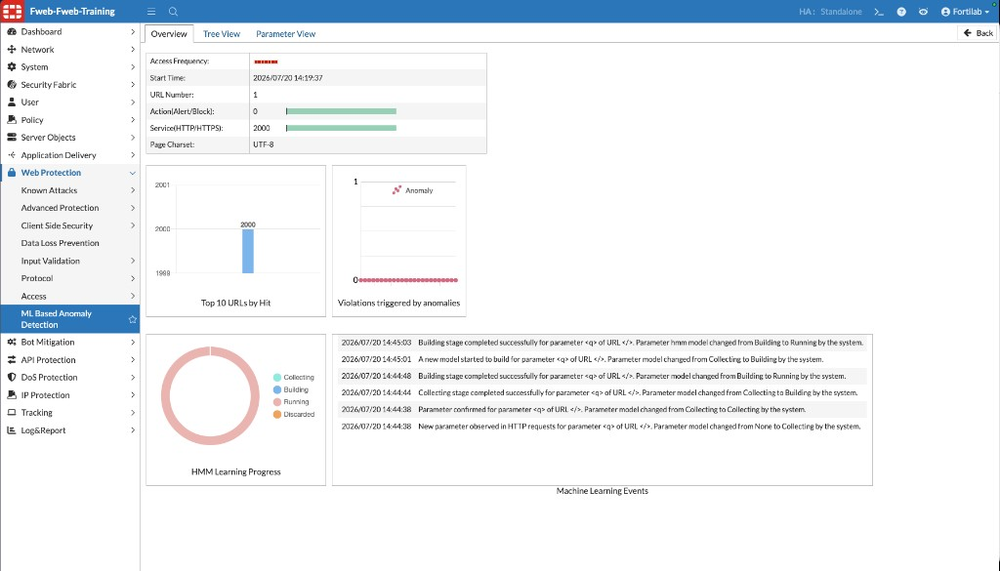
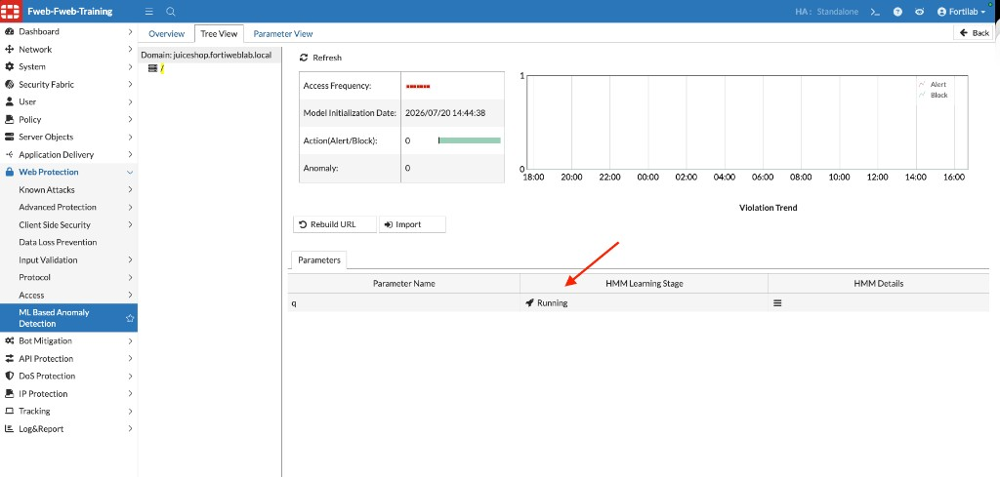
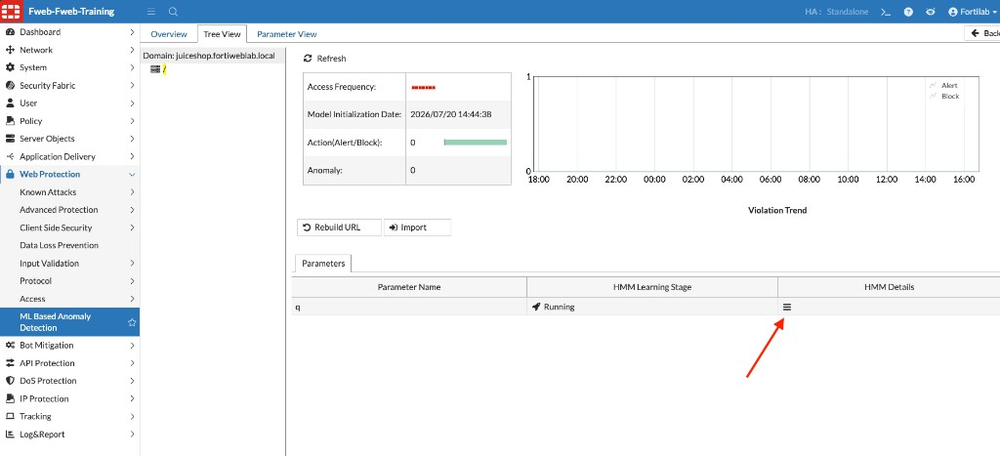
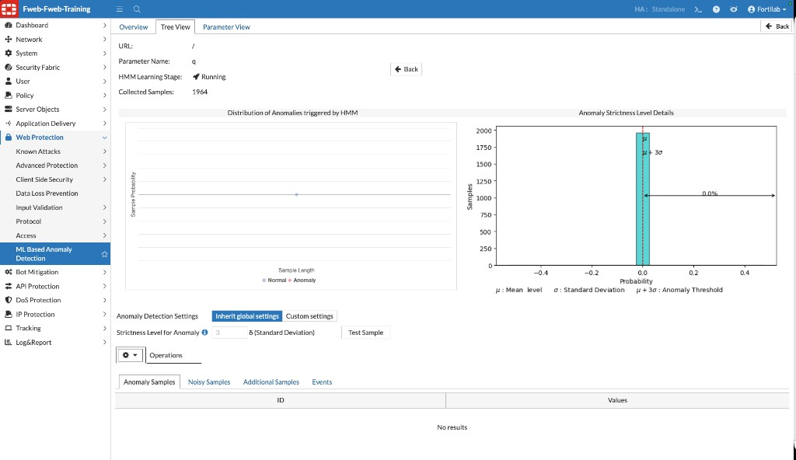

## Exercise 4.3 – Verify the Behavioral Model

### Objective

Confirm that FortiWeb successfully learned Juice Shop behavior from the legitimate traffic generated in Exercise 4.2.

In this exercise you review the Machine Learning Overview, Tree View, and Parameter View to verify that the Hidden Markov Model (HMM) reached the **Running** stage. Once a parameter is in Running, FortiWeb evaluates new samples against the learned model. Anomalies are passed to the second layer (FortiGuard SVM threat models), and the action configured in Exercise 4.1—**Alert & Deny**—is applied when an attack is confirmed.

{}
FortiWeb Machine Learning-Based Anomaly Detection does not use a separate Learning / Enforcement mode toggle. Learning progresses through HMM stages (**Collecting → Building → Running**). Protection for Running parameters follows the Action settings you already configured.
{}

---

### Step 1 – Open the Machine Learning Overview

1. Return to the FortiWeb management interface.
2. Navigate to:

   **Web Protection → ML Based Anomaly Detection**

3. Open the anomaly detection policy associated with Juice Shop (or select the `juiceshop.fortiweblab.local` domain if prompted).
4. Select the **Overview** tab.

On the Overview page, confirm results such as:

* Service (HTTP/HTTPS) request counts reflecting the Standard ML training traffic (approximately 2,000)
* Top URLs by hit (for example, `/`)
* **HMM Learning Progress** showing models in the **Running** stage
* **Machine Learning Events** documenting the lifecycle for learned parameters

In the Events list, you should see parameter `<q>` on URL `/` progress through stages similar to:

| Event | Meaning |
|-------|---------|
| None → Collecting | FortiWeb began gathering samples for the parameter |
| Collecting → Building | Enough samples were collected; the mathematical model is being built |
| Building → Running | Testing completed successfully; the model evaluates new samples |

| Lifecycle stage | What it means |
|-----------------|---------------|
| Collecting | FortiWeb is still gathering legitimate samples |
| Building | Sample collection is complete; mathematical models are being created |
| Running | The model is ready; new samples are evaluated for anomalies |
| Discarded | FortiWeb could not build a reliable model for that parameter |

{}
If HMM Learning Progress still shows Collecting or Building, wait a few minutes and click **Refresh**, or ask your instructor whether another Standard ML training run is needed.
{}

---

### Step 2 – Confirm Running Status in Tree View and Parameter View

1. Select the **Tree View** tab.
2. Confirm the domain is `juiceshop.fortiweblab.local`.
3. In the **Parameters** table, locate parameter `q` and verify that **HMM Learning Stage** shows **Running**.

4. Select the **Parameter View** tab.
5. Confirm parameter `q` again shows **Running**.
6. Click the **HMM Details** menu icon for parameter `q`.

7. Review the parameter detail page. You should see information similar to:

| Field | Expected lab result |
|-------|---------------------|
| URL | `/` |
| Parameter Name | `q` |
| HMM Learning Stage | Running |
| Collected Samples | Near the Standard ML training volume (for example, ~1964) |
| Anomaly Detection Settings | Inherit global settings (Strictness Level `3` in this lab) |
| Anomaly Samples | No results yet (no attack traffic has been generated) |

The **Distribution of Anomalies triggered by HMM** and **Anomaly Strictness Level Details** charts show how collected samples relate to the anomaly threshold (`μ + 3σ` when strictness is 3). With only legitimate training traffic, you should see normal samples and no anomaly results yet.

{}
Tree View and Parameter View both report HMM Learning Stage. Use Overview for overall progress and events, Tree View for a quick per-URL/parameter status check, and Parameter View (HMM Details) for sample counts and anomaly distribution.
{}

When parameters are in **Running**, FortiWeb is ready to evaluate unexpected or malicious Juice Shop requests in the next exercise.

---

### Verification Checklist

Confirm that you completed the following:

* Opened **Web Protection → ML Based Anomaly Detection** for `juiceshop.fortiweblab.local`
* Reviewed Overview: HMM Learning Progress and Machine Learning Events show Collecting → Building → Running
* Confirmed parameter `q` is **Running** in Tree View
* Opened Parameter View / HMM Details and verified sample collection and Running status

---

### What You Have Accomplished

* Verified that FortiWeb built a behavioral model from legitimate Juice Shop traffic
* Confirmed the model reached the **Running** state
* Reviewed Overview, Tree View, and Parameter View evidence that learning completed successfully

### Next Exercise

In Exercise 4.4, you generate an attack campaign against Juice Shop and review Machine Learning detections in the FortiWeb Attack Log.
