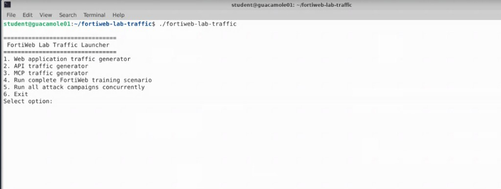
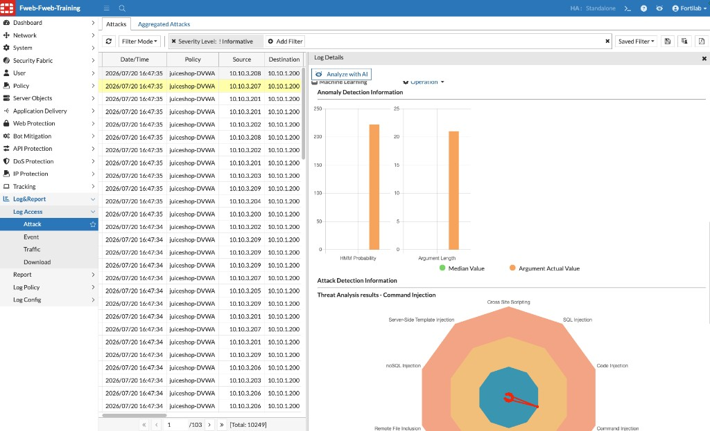

## Exercise 4.4 – Generate Attack Traffic and Review Machine Learning Detections

### Objective

Generate attack and unexpected traffic against Juice Shop now that Machine Learning is in **Enforcement** mode, then review FortiWeb Attack Logs to see how behavioral modeling detects requests that violate the learned application baseline.

Unlike Exercises 4.2–4.3, these requests intentionally deviate from normal Juice Shop behavior.

---

### Step 1 – Launch the Traffic Generator

From the Guacamole desktop, open a terminal and run:

```bash
cd ~/fortiweb-lab-traffic
./fortiweb-lab-traffic
```



---

### Step 2 – Open the Web Application Traffic Generator

At the main menu, enter:

```text
1
```

Confirm the target is Juice Shop:

```text
Target: https://juiceshop.fortiweblab.local/
```


---

### Step 3 – Run the Attack Campaign

From the Web Application Traffic Generator menu, enter:

```text
12
```

Option **12** is:

```text
Attack Campaign
```

The attack campaign generates multiple categories of malicious and unexpected requests, which may include:

* SQL Injection
* Cross-Site Scripting (XSS)
* Command Injection
* Directory Traversal
* Parameter tampering
* Unexpected URLs
* Malformed requests


Allow the attack campaign to complete.

{}
Do not close the terminal while the script is running.
{}


---

### Step 4 – Open the FortiWeb Attack Log

1. Return to the FortiWeb management interface.
2. Navigate to:

   **Log & Report → Log Access → Attack**

3. Refresh the view if events do not appear immediately.


---

### Step 5 – Identify Machine Learning Detections

Locate events related to Machine Learning / anomaly detection for Juice Shop.

Look for fields that indicate:

* The HTTP host is `juiceshop.fortiweblab.local` (or the Juice Shop virtual host used in your lab)
* The detection is associated with Machine Learning / anomaly detection rather than only signature matching
* An action such as alert, deny, or block was applied


{}
You may also see signature-based detections if Attack Signatures are enabled for Juice Shop. Focus on entries that explicitly reference Machine Learning / anomaly detection so you can compare behavioral findings with the Chapter 3 signature-focused DVWA exercises.
{}

---

### Step 6 – Open Individual Log Details

Open several Machine Learning-related log entries and review:

* Source IP address
* Requested URL
* Detection reason
* Machine Learning rule / anomaly details
* Action taken
* Date and time
* Server policy / protection profile



#### Consider

Notice that FortiWeb can identify suspicious requests based on **behavioral analysis**, not only by matching known attack signatures. This is what makes Machine Learning-Based Anomaly Detection valuable against previously unseen or application-specific abuse.

---

### Step 7 – Compare With Chapter 3 (Optional Reflection)

If time permits, briefly compare:

| Chapter 3 (DVWA) | Chapter 4 (Juice Shop ML) |
|------------------|---------------------------|
| Signature-focused detections | Behavioral anomaly detections |
| Dedicated DVWA Web Protection Profile | Juice Shop Machine Learning enforcement |
| Mapped attacks to known vuln pages | Unexpected / anomalous requests vs learned baseline |

---

### Verification Checklist

Confirm that you completed the following:

* Ran the Web Application Traffic Generator against Juice Shop
* Selected option **12** – Attack Campaign
* Allowed the campaign to complete
* Opened **Log & Report → Log Access → Attack**
* Located Machine Learning / anomaly detections for Juice Shop
* Reviewed at least one detailed log entry

---

### Reflection Questions

1. Did the Machine Learning Overview show the model in the **Running** state before you enabled Enforcement?
2. Which attack or anomaly categories did FortiWeb detect during the campaign?
3. Which log fields helped you confirm that Machine Learning—not only signatures—was involved?
4. Why might an unexpected URL or unknown parameter be treated as anomalous even if it does not match a classic exploit payload?
5. How does Layer 2 threat classification help reduce false positives after Layer 1 finds an anomaly?

---

### Chapter Summary

In this chapter, you configured **Machine Learning-Based Anomaly Detection** to protect OWASP Juice Shop.

Using the FortiWeb Lab Traffic Launcher, you generated legitimate application traffic so FortiWeb could build a behavioral model of normal user activity. After verifying that learning reached the **Running** state and switching the policy into **Enforcement Mode**, you generated malicious and unexpected traffic and observed FortiWeb detecting requests that violated the learned baseline.

Machine Learning-Based Anomaly Detection complements traditional signature-based protection by identifying suspicious requests from application behavior—improving protection against unknown threats, application abuse, and evolving attack techniques while using threat classification to help reduce false positives.
