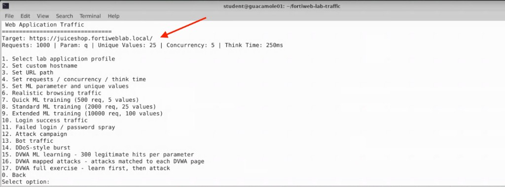
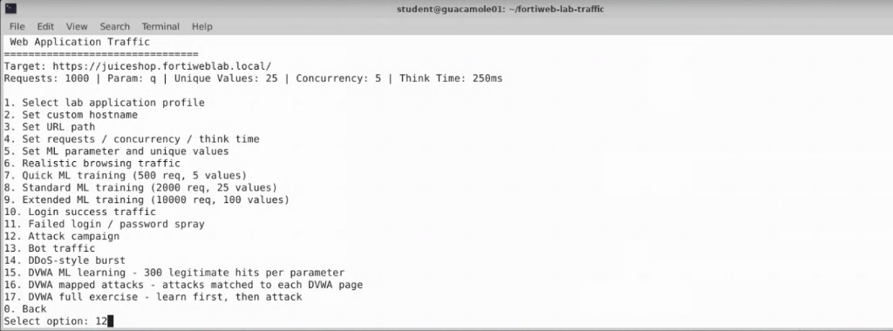
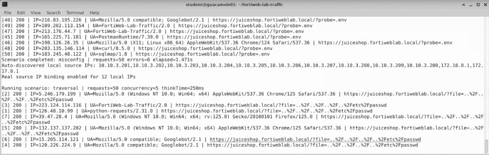
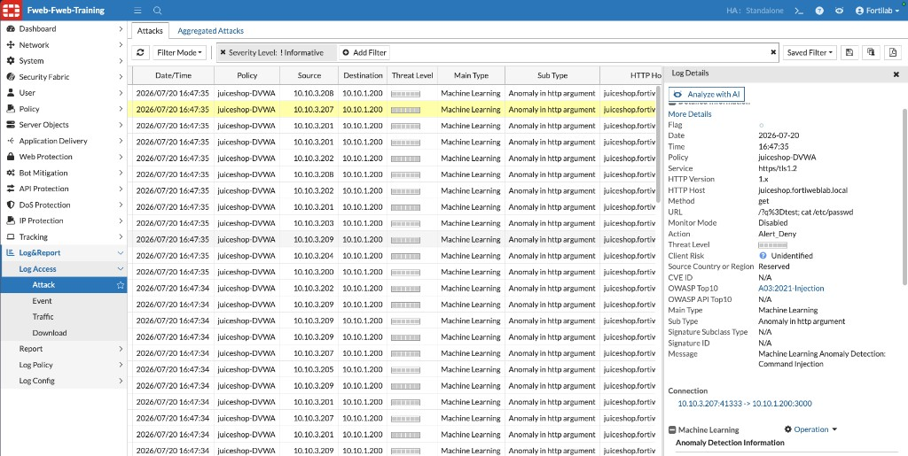

## Exercise 4.4 – Generate Attack Traffic and Review Machine Learning Detections

### Objective

Generate attack and unexpected traffic against Juice Shop now that the behavioral model is in the **Running** state and Action is set to **Alert & Deny**, then review FortiWeb Attack Logs to see how behavioral modeling detects requests that violate the learned application baseline.

Unlike Exercises 4.2–4.3, these requests intentionally deviate from normal Juice Shop behavior.

---

### Step 1 – Launch the Traffic Generator

From the Guacamole desktop, open a terminal and run:

```bash
cd ~/fortiweb-lab-traffic
./fortiweb-lab-traffic
```


---

### Step 2 – Open the Web Application Traffic Generator

At the main menu, enter:

```text
1
```

Confirm the target is Juice Shop:

```text
Target: https://juiceshop.fortiweblab.local/
```



{}
If the target does not show Juice Shop, use option **1** (Select lab application profile) before running the attack campaign.
{}

---

### Step 3 – Run the Attack Campaign

From the Web Application Traffic menu, enter:

```text
12
```

Option **12** is:

```text
Attack campaign
```



The attack campaign generates multiple categories of malicious and unexpected requests, which may include:

* SQL Injection
* Cross-Site Scripting (XSS)
* Command Injection
* Directory Traversal
* Parameter tampering
* Unexpected URLs
* Malformed or misconfiguration probes (for example, `/?probe=.env`)

As scenarios run, the terminal displays request progress similar to:

```text
Running scenario: traversal | requests=50 concurrency=5 thinkTime=250ms
[1] 200 | IP=... | UA=... | https://juiceshop.fortiweblab.local/?file=..%2F..%2Fetc%2Fpasswd
```



Allow the attack campaign to complete. When it finishes, control returns to the Web Application Traffic menu.

{}
Do not close the terminal while the script is running.
{}

---

### Step 4 – Open the FortiWeb Attack Log

1. Return to the FortiWeb management interface.
2. Navigate to:

   **Log&Report → Log Access → Attack**

3. Refresh the view if events do not appear immediately.
4. Optionally filter out Informative events (for example, **Severity Level: ! Informative**) so Machine Learning detections are easier to find.

---

### Step 5 – Identify Machine Learning Detections

Locate Attack Log entries related to Machine Learning / anomaly detection for Juice Shop.

Look for fields such as:

| Field | Expected lab result |
|-------|---------------------|
| Policy | `juiceshop-DVWA` |
| Main Type | `Machine Learning` |
| Sub Type | `Anomaly in http argument` |
| HTTP Host | `juiceshop.fortiweblab.local` |
| Action | `Alert_Deny` |



In the example above, FortiWeb detected a command-injection style payload in the `q` parameter:

```text
URL: /?q=test; cat /etc/passwd
Message: Machine Learning Anomaly Detection: Command Injection
OWASP Top 10: A03:2021-Injection
```

{}
You may also see signature-based detections if Attack Signatures are enabled for Juice Shop. Focus on entries where **Main Type** is **Machine Learning** so you can compare behavioral findings with the Chapter 3 signature-focused DVWA exercises.
{}

---

### Step 6 – Review Machine Learning Log Details

Select a Machine Learning Attack Log entry and review the **Log Details** panel, including the anomaly and threat analysis sections.

Look for:

* **Anomaly Detection Information** — HMM Probability and Argument Length charts comparing the median (learned baseline) with the actual argument value
* **Attack Detection Information** — threat analysis results such as **Command Injection**, with a radar view across SVM threat categories (SQL Injection, XSS, Code Injection, and others)


#### Consider

Notice the two-layer behavior from earlier in this chapter:

1. **Layer 1 (HMM)** marks the request as anomalous because the argument does not match learned normal patterns for parameter `q`.
2. **Layer 2 (FortiGuard SVM threat models)** classifies the anomaly as a real attack type—here, **Command Injection**—and FortiWeb applies **Alert & Deny**.

This is what makes Machine Learning-Based Anomaly Detection valuable against previously unseen or application-specific abuse, while still reducing false positives for benign anomalies.

---

### Step 7 – Compare With Chapter 3 (Optional Reflection)

If time permits, briefly compare:

| Chapter 3 (DVWA) | Chapter 4 (Juice Shop ML) |
|------------------|---------------------------|
| Signature-focused detections | Behavioral anomaly detections |
| Dedicated DVWA Web Protection Profile | Juice Shop Machine Learning with Alert & Deny |
| Mapped attacks to known vuln pages | Unexpected / anomalous requests vs learned baseline |

---

### Verification Checklist

Confirm that you completed the following:

* Ran the Web Application Traffic Generator against Juice Shop
* Selected option **12** – Attack campaign
* Allowed the campaign to complete
* Opened **Log&Report → Log Access → Attack**
* Located Machine Learning detections (`Main Type: Machine Learning`)
* Reviewed at least one detailed log entry showing anomaly and threat classification

---

### Reflection Questions

1. Did the Machine Learning Overview show the model in the **Running** state before you generated attack traffic?
2. Which attack or anomaly categories did FortiWeb detect during the campaign?
3. Which log fields helped you confirm that Machine Learning—not only signatures—was involved?
4. Why might an unexpected URL or unknown parameter be treated as anomalous even if it does not match a classic exploit payload?
5. How does Layer 2 threat classification help reduce false positives after Layer 1 finds an anomaly?

---

### Chapter Summary

In this chapter, you configured **Machine Learning-Based Anomaly Detection** to protect OWASP Juice Shop.

Using the FortiWeb Lab Traffic Launcher, you generated legitimate application traffic so FortiWeb could build a behavioral model of normal user activity. After verifying that learning reached the **Running** state, you generated malicious and unexpected traffic and observed FortiWeb detecting requests that violated the learned baseline—including Machine Learning anomaly detections such as Command Injection with **Alert_Deny**.

Machine Learning-Based Anomaly Detection complements traditional signature-based protection by identifying suspicious requests from application behavior—improving protection against unknown threats, application abuse, and evolving attack techniques while using threat classification to help reduce false positives.
