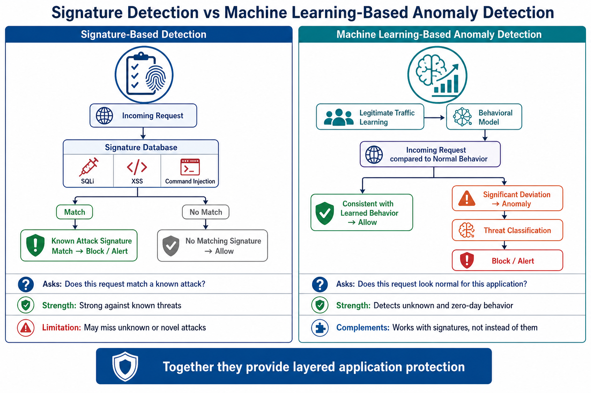
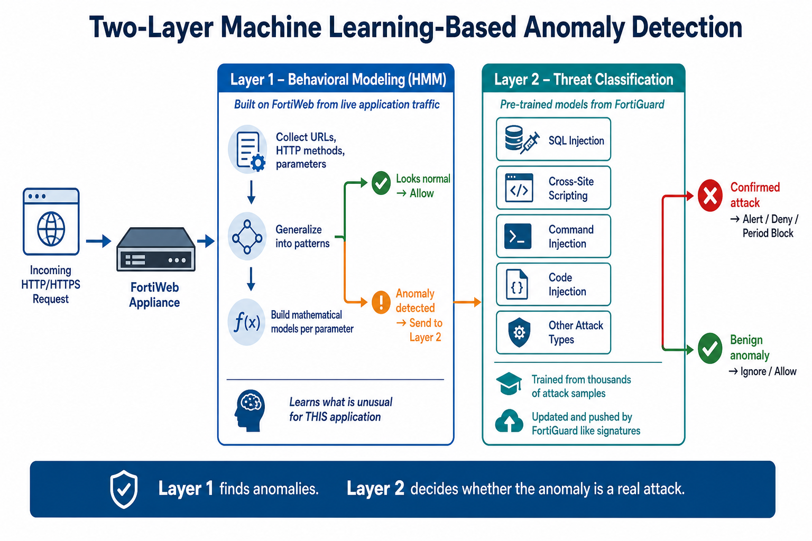
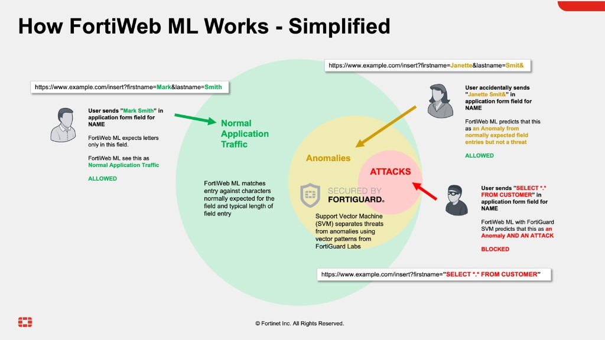
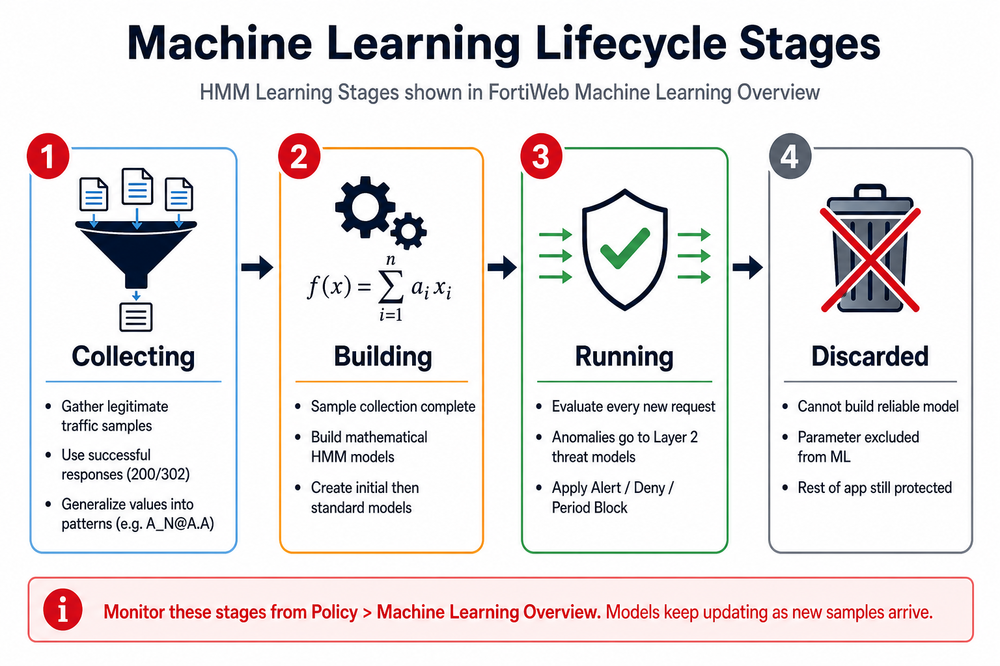

## **Objective**

Configure FortiWeb’s **Machine Learning-Based Anomaly Detection** to automatically learn the normal behavior of the OWASP Juice Shop application.

Using legitimate application traffic, FortiWeb builds a behavioral model of the application. Once learning reaches the **Running** state, you verify the model and then generate attack traffic to confirm that FortiWeb detects and blocks requests that deviate from learned behavior.

Unlike traditional signature-based protection alone, Machine Learning enables FortiWeb to detect abnormal application behavior—providing an additional layer of protection against previously unseen attacks.

### **Learning Objectives**

After completing this chapter, you will be able to:

* Explain the difference between signature-based protection and Machine Learning-Based Anomaly Detection
* Describe how FortiWeb learns application behavior
* Configure Machine Learning for a FortiWeb policy
* Generate legitimate application traffic to build a behavioral model
* Verify that Machine Learning has completed the learning process
* Generate anomalous application traffic
* Review Machine Learning detections in FortiWeb logs

---

### Understanding Machine Learning-Based Anomaly Detection

Traditional Web Application Firewalls (WAFs) primarily rely on **signature-based detection**. A signature identifies known attack techniques such as SQL Injection, Cross-Site Scripting (XSS), Command Injection, Directory Traversal, and many other common web application attacks.

Signature-based protection is highly effective against attacks that are already known. However, attackers continuously develop new techniques that may not yet have corresponding signatures.

To address this challenge, FortiWeb incorporates **Machine Learning-Based Anomaly Detection**.

Rather than asking only:

> “Does this request match a known attack signature?”

FortiWeb also asks:

> “Does this request look like normal behavior for this application?”

Instead of relying exclusively on known attack patterns, FortiWeb observes how legitimate users interact with an application and automatically builds a behavioral model describing what normal application traffic looks like.

Once this baseline has been established, every new request is compared against the learned model. Requests that significantly deviate from normal behavior are classified as anomalous and can be logged, alerted upon, or blocked according to the configured policy.

This approach helps FortiWeb identify suspicious requests even when no signature exists—providing an additional layer of protection against zero-day attacks, application abuse, and other unknown threats.

---

### How Machine Learning-Based Anomaly Detection Works

FortiWeb continuously analyzes legitimate HTTP and HTTPS traffic to understand how a protected application normally behaves. Rather than relying solely on predefined attack signatures, it builds mathematical models that describe the expected structure and behavior of application requests.

During learning, FortiWeb observes characteristics such as:

* Requested URLs
* HTTP methods (`GET`, `POST`, `PUT`, `DELETE`, and others)
* URL and form parameters
* Relationships between URLs and parameters
* Parameter value patterns

Instead of memorizing every value submitted by users, FortiWeb generalizes collected information into mathematical patterns. For example, two different email addresses are recognized as having the same structure even though the values themselves differ. Numeric identifiers, usernames, and other inputs are modeled by expected characteristics rather than exact values.

Once sufficient samples have been collected, FortiWeb creates mathematical models describing normal application behavior. Every subsequent request is compared against these models.

FortiWeb performs this analysis using **two complementary layers** of Machine Learning, improving detection accuracy while reducing false positives.

#### Layer 1 – Behavioral Modeling

The first layer learns how the protected application behaves from traffic that passes through FortiWeb.

FortiWeb uses a Hidden Markov Model (HMM) to monitor URLs, HTTP methods, and parameters. It collects samples, generalizes them into patterns, and builds mathematical models for those parameters and methods. After learning completes, every request is compared against the model to determine whether it is an **anomaly**.

Examples of anomalies detected during this stage include:

* Requests to URLs that have never been observed
* Unexpected HTTP methods for a URL
* Unknown parameters
* Parameter values that do not match previously learned patterns
* Request patterns that differ significantly from normal application behavior

The purpose of this layer is **not** to determine whether a request is malicious. Its purpose is to determine whether the request appears **unusual** for the protected application.

#### Layer 2 – Threat Classification

Not every unusual request is an attack. Applications evolve, users behave unpredictably, and developers introduce new functionality.

When Layer 1 marks a request as anomalous, FortiWeb evaluates it with a second Machine Learning layer of **pre-trained threat models**. Each model represents an attack category—such as SQL Injection, Cross-Site Scripting (XSS), or command/code injection—and is trained from analysis of thousands of attack samples.

These threat models are created and maintained by FortiGuard and pushed to FortiWeb appliances through the FortiWeb Security Service, similar to signature updates. When new attack techniques appear, FortiGuard re-trains the relevant model and distributes the update.

Layer 2 helps FortiWeb decide whether an anomaly is a real attack or a benign deviation that should be ignored, which reduces false positives.

By combining local behavioral anomaly detection with FortiGuard threat classification, FortiWeb can protect against both known and previously unseen techniques while minimizing unnecessary blocking of legitimate users.

#### Example – Normal Traffic, Anomalies, and Attacks

The following example shows how the two layers work together in practice. FortiWeb first checks whether a parameter value matches normally expected characters and length. Unusual values are treated as anomalies. FortiGuard Support Vector Machine (SVM) threat models then separate benign anomalies from real attacks.

| Scenario | Example input | Classification | Action |
| --- | --- | --- | --- |
| Normal traffic | `firstname=Mark&lastname=Smith` | Matches expected letters and length | Allowed |
| Benign anomaly | `firstname=Janette&lastname=Smit&` | Unusual character, but not a threat | Allowed |
| Attack | `firstname="SELECT * FROM CUSTOMER"` | Anomaly **and** confirmed attack | Blocked |

For additional detail, see [ML-based anomaly detection](https://docs.fortinet.com/document/fortiweb/8.0.5/administration-guide/94907/ml-based-anomaly-detection) in the FortiWeb 8.0.5 Administration Guide.

---

### Machine Learning Lifecycle

Machine Learning-Based Anomaly Detection progresses through several HMM learning stages as FortiWeb learns and protects an application. These stages can be monitored from the **Machine Learning Overview** page in the FortiWeb management interface.

#### Stage 1 – Collecting

During the **Collecting** stage, FortiWeb gathers representative samples of legitimate application traffic.

Only requests that meet FortiWeb’s sampling criteria are used—typically successful responses (`200` or `302`) with text/HTML content and parameters in the URL or body. Collected values are generalized into patterns (for example, email addresses become something like `A_N@A.A`) rather than stored as raw strings. The quality of the model depends heavily on the quality and diversity of the collected traffic—so the learning phase should include realistic user activity rather than repetitive or artificial requests alone.

#### Stage 2 – Building

Once sample collection for a parameter is complete, FortiWeb enters the **Building** stage and generates the mathematical HMM models used for anomaly detection.

FortiWeb first builds an **initial model** after enough samples are collected, then continues refining until patterns stabilize into a more accurate **standard model**. Relationships between URLs, HTTP methods, parameters, and parameter value patterns are analyzed to represent normal application activity. The time required depends on the amount and diversity of collected traffic.

#### Stage 3 – Running

After model testing completes successfully, FortiWeb transitions into the **Running** state.

Every incoming request is evaluated against the learned behavioral model. Requests that match learned behavior are processed normally. Requests identified as anomalous are passed to the second Machine Learning layer (FortiGuard SVM threat models) for threat classification before the configured policy action—Alert, Alert & Deny, or Period Block—is applied. FortiWeb continues collecting new samples so models stay current as the application evolves.

#### Stage 4 – Discarded

Not every application parameter can be modeled successfully.

If FortiWeb determines that it cannot build a reliable mathematical model for a parameter, that parameter is placed into the **Discarded** state. Discarded parameters are excluded from anomaly detection while the remainder of the application continues to benefit from Machine Learning protection.

---

### Why This Lab Uses a Traffic Generator

In production, FortiWeb typically learns application behavior over several days or weeks while legitimate users interact with the application. Waiting that long is impractical in a classroom environment.

To accelerate learning, this lab includes a custom **FortiWeb Lab Traffic Launcher** that simulates realistic user activity against OWASP Juice Shop, including:

* Browsing products
* Viewing product details
* Searching for products
* Shopping cart operations
* User navigation and normal application workflows

This traffic allows FortiWeb to build an accurate behavioral model within minutes. After learning completes, the same tool generates attack traffic so you can observe how FortiWeb detects requests that violate the learned application behavior.

---

### **Topics Covered**

#### **Machine Learning Concepts**

* Signature-based vs behavioral detection
* Traffic baselining and behavioral analysis
* Two-layer anomaly detection and threat classification
* Model lifecycle: Collecting → Building → Running → Discarded

#### **Hands-On Configuration**

* Creating Anomaly Detection for the Juice Shop domain
* Tuning CLI sample thresholds for efficient lab model generation
* Generating legitimate Juice Shop traffic
* Verifying the behavioral model reached the Running state
* Testing unexpected and malicious requests

### **Hands-On Tasks**

* [Exercise 4.1 – Configure Machine Learning](4.1_Configure_Machine_Learning/)
* [Exercise 4.2 – Generate Legitimate Traffic](4.2_Generate_Legitimate_Traffic/)
* [Exercise 4.3 – Verify the Behavioral Model](4.3_Verify_Behavioral_Model/)
* [Exercise 4.4 – Test Unexpected Requests](4.4_Test_Unexpected_Requests/)

### **Key Takeaways**

* Understand how behavioral modeling complements traditional WAF signatures
* See how FortiWeb learns, enforces, and logs anomalous application behavior
