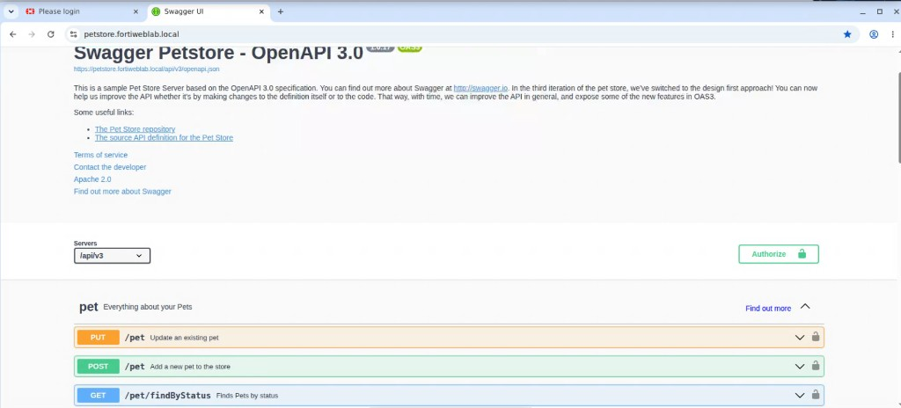
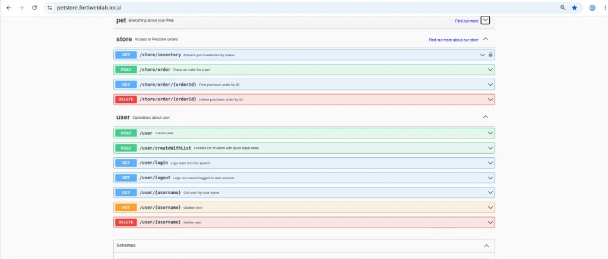
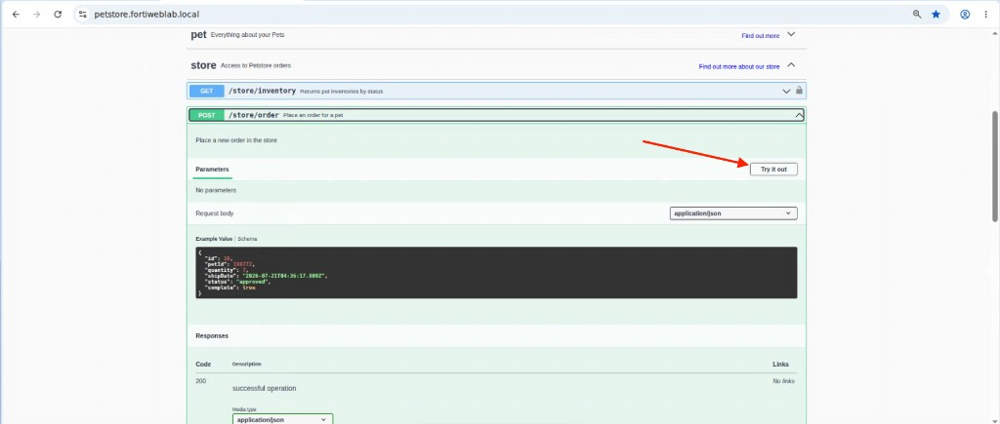
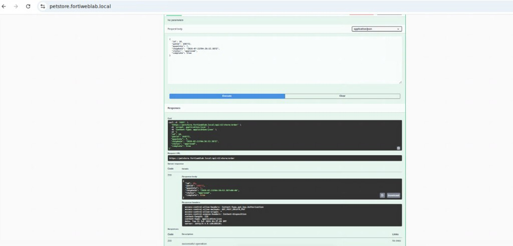
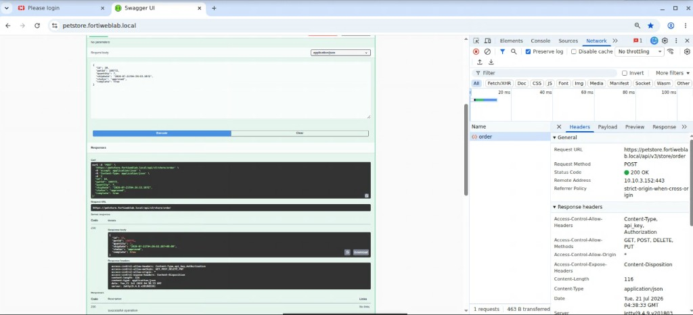

## Exercise 5.1 – Explore the PetStore API

### Objective

Become familiar with the **PetStore** REST API and observe how clients communicate with the application before automated traffic generation or attacks are performed.

This legitimate traffic helps you understand the API surface that FortiWeb will later discover and learn from.

---

### Step 1 – Open Swagger UI from Guacamole

1. Log in to the Guacamole remote desktop.
2. Launch the web browser.
3. From the bookmarks bar, click **Swagger UI**.


The PetStore OpenAPI documentation opens at:

```text
https://petstore.fortiweblab.local
```



{}
**Do you need to click Authorize first?**  
No—not for this lab exercise. Some endpoints show a padlock icon because the OpenAPI schema *declares* a security scheme, but the lab PetStore backend accepts many requests without credentials. You can use **Try it out** and successfully receive `200` responses without authorizing. Leave the **Authorize** button unused unless your instructor asks you to explore authentication later.
{}

---

### Step 2 – Review Available API Areas

PetStore organizes APIs into areas such as:

| Area | Example operations |
|------|--------------------|
| Pet | Find pets by status, get pet by ID, add or update a pet |
| Store | View inventory, place an order, get an order by ID |
| User | Create a user, log in, log out, update user details |

Expand the **store** and **user** sections and note a few paths and HTTP methods (for example, `GET /store/inventory` or `POST /store/order`).



A padlock next to an operation means the OpenAPI definition lists a security requirement. In this lab build, that does not always mean the server enforces authentication on that call.

---

### Step 3 – Perform a Legitimate API Operation

1. Expand **store → POST /store/order**.
2. Click **Try it out**.



3. Leave the example JSON body (or make a small harmless change), then click **Execute**.
4. Confirm the response code is **200** and that the response body returns JSON for the created order.



Optionally, expand **pet** or **user** and try one additional legitimate call (for example, find pets by status or look up a user) so you see more than one endpoint in action.

While using Swagger, observe that each action generates structured API requests with JSON payloads—not traditional HTML page loads.

---

### Step 4 – Observe Request and Response Characteristics

For the successful `POST /store/order` operation, note:

* Request URL: `https://petstore.fortiweblab.local/api/v3/store/order`
* HTTP method: `POST`
* Request body: JSON (for example, `id`, `petId`, `quantity`, `status`)
* Response: JSON with status `200`
* No `Authorization` or `api_key` header is required for this lab call

Optionally open browser **Developer Tools → Network**, select the `order` request, and compare the Request URL, method, status code, and headers with what Swagger shows.



{}
You do not need to exercise every endpoint manually. Exercise 5.2 uses the FortiWeb Lab Traffic Launcher to generate broader legitimate coverage so FortiWeb can discover and learn the API model more completely.
{}

---

### What You Have Accomplished

* Opened PetStore through Swagger UI
* Reviewed major API areas (Pet, Store, User)
* Executed a legitimate `POST /store/order` without authorizing
* Observed structured JSON request/response traffic

### Next Exercise

In Exercise 5.2, you use the FortiWeb Lab Traffic Launcher to generate legitimate PetStore traffic so FortiWeb can discover endpoints and build a Machine Learning–based API model.
