## Exercise 5.2 – Build the Machine Learning API Model

### Objective

FortiWeb needs sufficient legitimate API traffic before it can accurately distinguish normal requests from malicious ones.

In this exercise you first enable **Machine Learning → API Protection** on the PetStore server policy, set Schema Protection and Threat Detection actions to **Alert & Deny**, assign a Web Protection Profile for signature-based layered protection, then use the **FortiWeb Lab Traffic Launcher** to generate legitimate PetStore traffic and verify that FortiWeb has discovered API endpoints and learned schema information.

{}
The traffic generator and PetStore application are part of a controlled training environment. Do not run these tests against systems outside the lab.
{}

---

### Step 1 – Edit the PetStore Server Policy

1. Log in to the FortiWeb management interface.
2. Navigate to:

   **Policy → Server Policy**

3. Select the **petstore** policy, then click **Edit**.

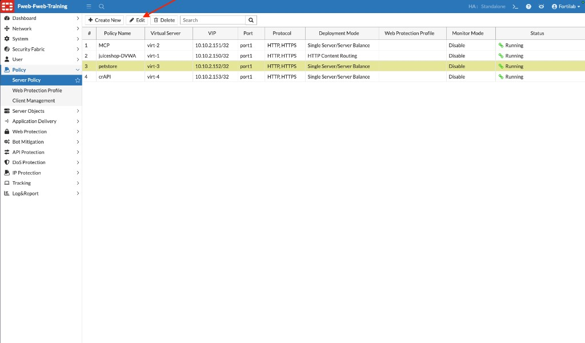

---

### Step 2 – Enable Machine Learning API Protection

1. In the **Edit Policy** dialog, scroll to the **Machine Learning** section.
2. Select the **API Protection** tab.
3. Click the **+** (Create) icon.

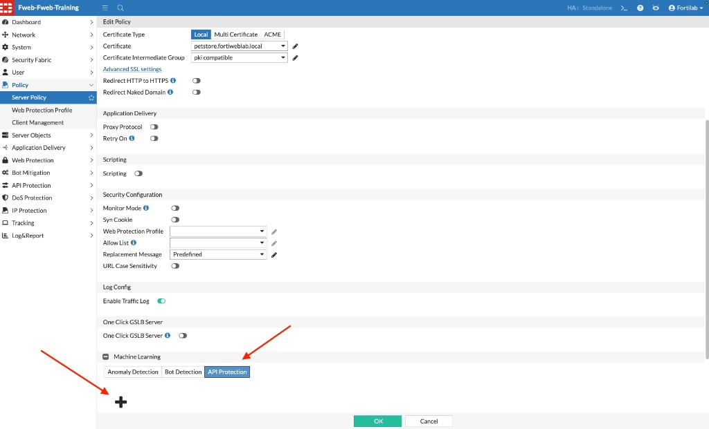

4. In the **New API Protection** dialog, configure:

| Setting | Value |
|---------|-------|
| Domain | `petstore.fortiweblab.local` |
| IP List Type | Trust |

Leave the **Source IP List** empty so FortiWeb can collect samples from any source IP used in the lab.

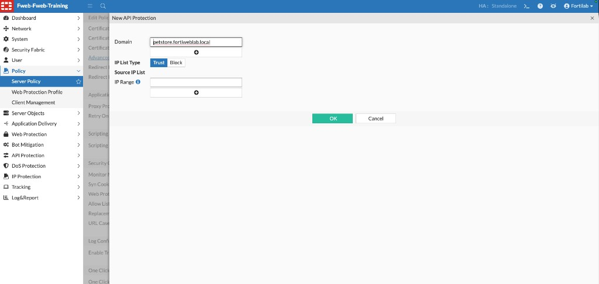

5. Click **OK** to create the API Protection policy.

After creation, the API Protection tab shows management actions such as **View**, **Stop**, **Retrain**, **Discard**, **Export**, and **Import**.

6. Click **OK** at the bottom of the Edit Policy page to save the server policy.

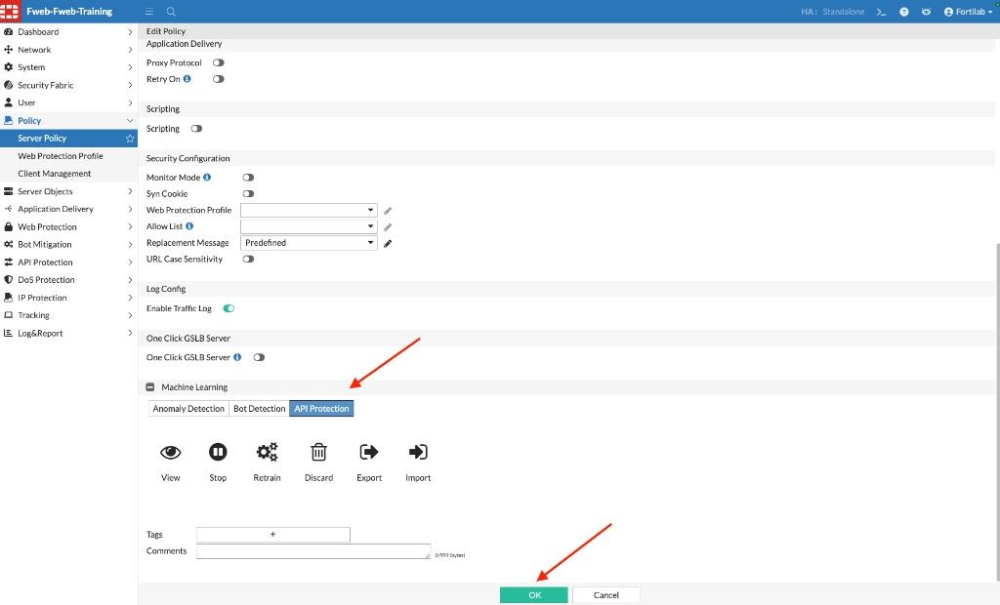

{}
Confirm **Enable Traffic Log** remains on for the petstore policy. Traffic logs help you verify that learning traffic is reaching FortiWeb while the model builds.
{}

---

### Step 3 – Set Schema Protection and Threat Detection to Alert & Deny

After the API Protection policy is created, configure the actions FortiWeb takes when schema violations or threats are detected.

1. Navigate to:

   **API Protection → ML Based API Protection → API Protection Policy**

2. Select the **petstore** policy, then click **Edit**.

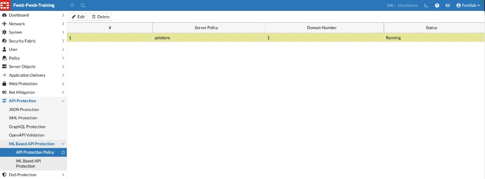

3. In **Edit API Protection Configuration**, under **Action Settings**, set both rows as follows:

| Name | Action | Severity |
|------|--------|----------|
| Schema Protection | `Alert & Deny` | `Low` (lab default) |
| Threat Detection | `Alert & Deny` | `Low` (lab default) |

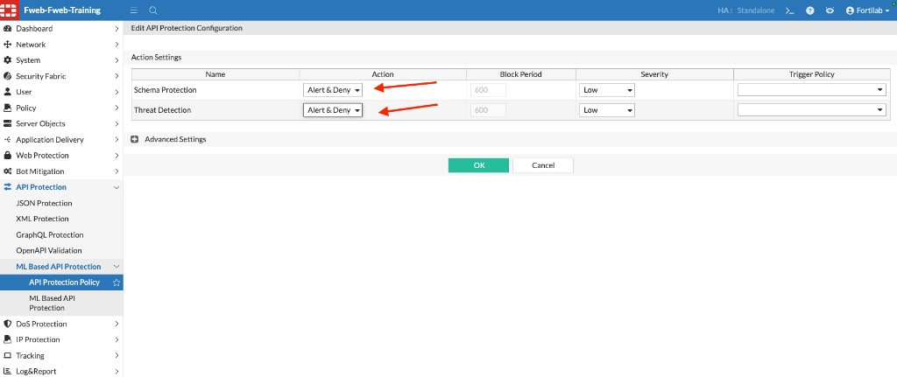

4. Click **OK** to save the API Protection configuration.

With **Alert & Deny** enabled, FortiWeb logs violating requests and denies them when Schema Protection or Threat Detection triggers.

---

### Step 4 – Assign a Web Protection Profile for Layered Protection

Machine Learning API Protection detects schema violations and behavioral anomalies. To add traditional signature-based protection as well, assign a **Web Protection Profile** to the same petstore server policy.

1. Navigate to:

   **Policy → Server Policy**

2. Select the **petstore** policy, then click **Edit**.
3. In the **Security Configuration** section, set **Web Protection Profile** to:

| Setting | Value |
|---------|-------|
| Web Protection Profile | `Inline Standard Protection` |

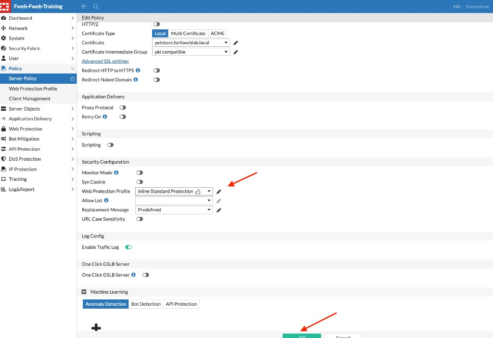

4. Click **OK** to save the policy.

`Inline Standard Protection` is a built-in profile that includes signature protection and related standard WAF controls. Combined with Machine Learning API Protection, FortiWeb can provide **layered defense**: signatures catch known attack patterns, while ML learns PetStore API structure and flags anomalous or schema-violating requests.

{}
**Optional alternative:** Instead of selecting `Inline Standard Protection`, you can create a dedicated Web Protection Profile (similar to the DVWA profile in Chapter 3), enable the signature and related policies you want, and assign that custom profile here. For this lab, the built-in profile is sufficient and faster.
{}

FortiWeb is now ready to discover PetStore API endpoints and learn schema information from legitimate traffic.

---

### Step 5 – Launch the FortiWeb Lab Traffic Tool

From the Guacamole desktop, open the terminal application and run:

```bash
cd fortiweb-lab-traffic/
./fortiweb-lab-traffic
```

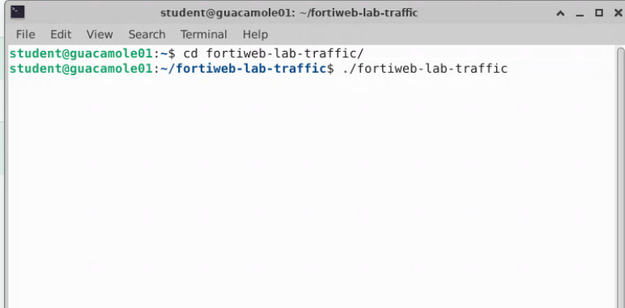

Confirm that the prompt shows:

```text
student@guacamole01:~/fortiweb-lab-traffic$
```

The FortiWeb Lab Traffic Launcher menu appears. At the `Select option:` prompt, enter:

```text
2
```


This opens the **API JSON Traffic** menu.

---

### Step 6 – Run PetStore ML Learning Traffic

From the API JSON Traffic menu, enter:

```text
13
```

Option **13** is:

```text
PetStore ML Learning - legitimate endpoint coverage
```

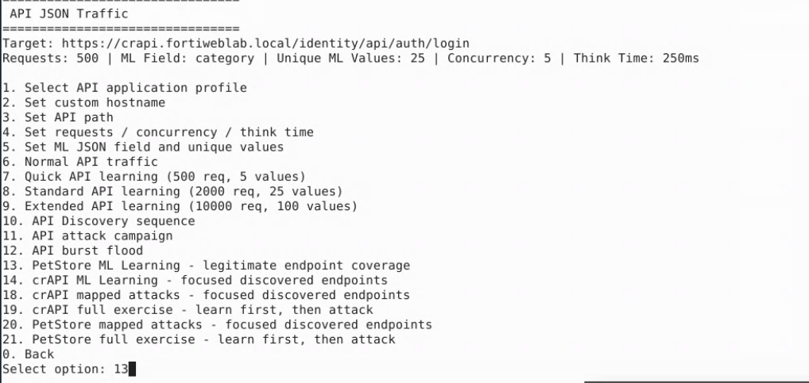

This scenario generates a large volume of legitimate API requests covering major PetStore endpoints (for example, inventory, findByStatus, store orders, and pet operations) using realistic data and normal request patterns.

During this process, FortiWeb can learn:

* API endpoints
* HTTP methods
* Request frequency
* JSON schema structure
* Parameter names and types
* Normal parameter values

As the campaign runs, the terminal displays request progress similar to:

```text
[187] 200 | IP=... | UA=FortiWeb-Lab-Traffic-API-ML/2.0 | https://petstore.fortiweblab.local/api/v3/...
```

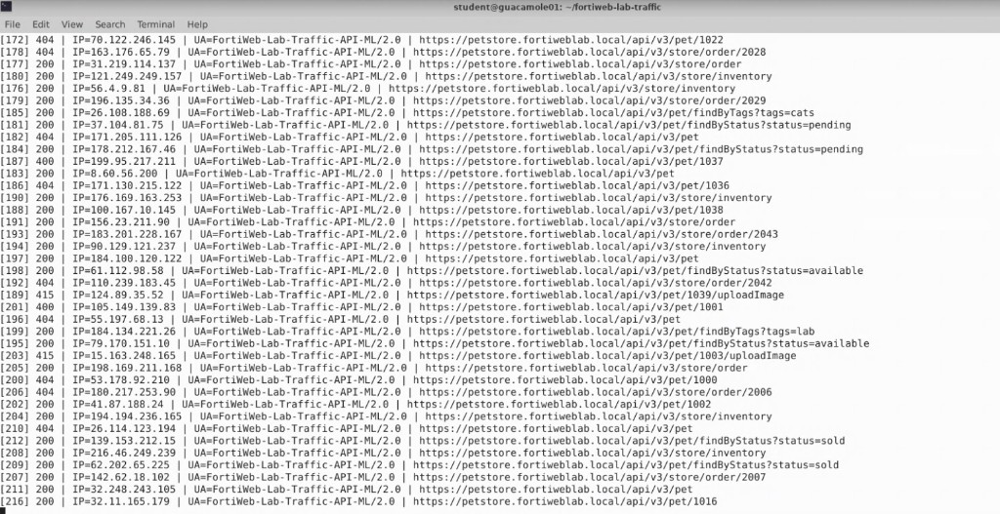

Allow the script to complete before proceeding.

{}
Do not close the terminal while the script is running.
{}

---

### Step 7 – Verify Traffic in FortiWeb Logs

While the script is running—or shortly after it has generated a meaningful volume of requests—you can confirm that traffic is reaching FortiWeb.

1. In the FortiWeb GUI, navigate to:

   **Log&Report → Log Access → Traffic**

2. Confirm that recent entries appear for the **petstore** policy, including a mix of HTTP methods (`GET`, `POST`, `PUT`, `DELETE`) to PetStore API paths.

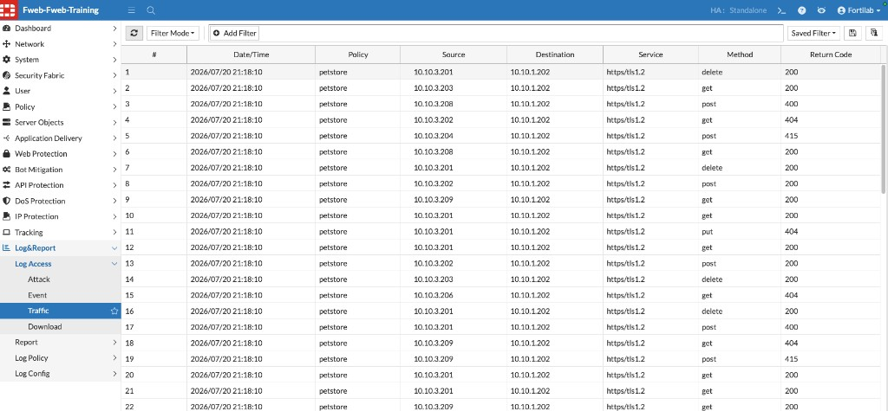

{}
You may see occasional **400**, **404**, or **415** return codes in the Traffic log (and in the terminal output). The lab script intentionally includes some random characters and edge-case requests while covering endpoints. These responses are expected and can safely be ignored for this lab—and similarly would not by themselves indicate a failed ML learning run in a production-style learning scenario. Focus on the overall volume of successful (`200`) PetStore traffic reaching FortiWeb.
{}

---

### Step 8 – Confirm Campaign Completion

When learning finishes, the terminal shows a completion message similar to:

```text
Scenario completed: petstore_ml_schema_learning | requests=2800 errors=0 elapsed=...
```

Control then returns automatically to the **API JSON Traffic** menu. You do not need to relaunch the tool unless you closed the terminal.


From this menu you can run additional options if your instructor requests them, or enter `0` to go back to the main FortiWeb Lab Traffic Launcher menu.

---

### Step 9 – Verify API Discovery in FortiWeb

1. Return to the FortiWeb management interface.
2. Navigate to:

   **API Protection → ML Based API Protection**

3. Open the PetStore API Protection policy (associated with the **petstore** server policy).
4. Select the **API View** tab.

Confirm that FortiWeb discovered PetStore endpoints for `petstore.fortiweblab.local`, such as:

* `POST /api/v3/pet`
* `GET /api/v3/pet/findByStatus`
* `GET /api/v3/pet/findByTags`
* `DELETE /api/v3/pet/{INT_NUM}`
* `GET /api/v3/store/inventory`
* `POST /api/v3/store/order`

The left pane shows the learned OpenAPI-style schema (paths, methods, and parameter constraints). The right pane lists the discovered API operations.

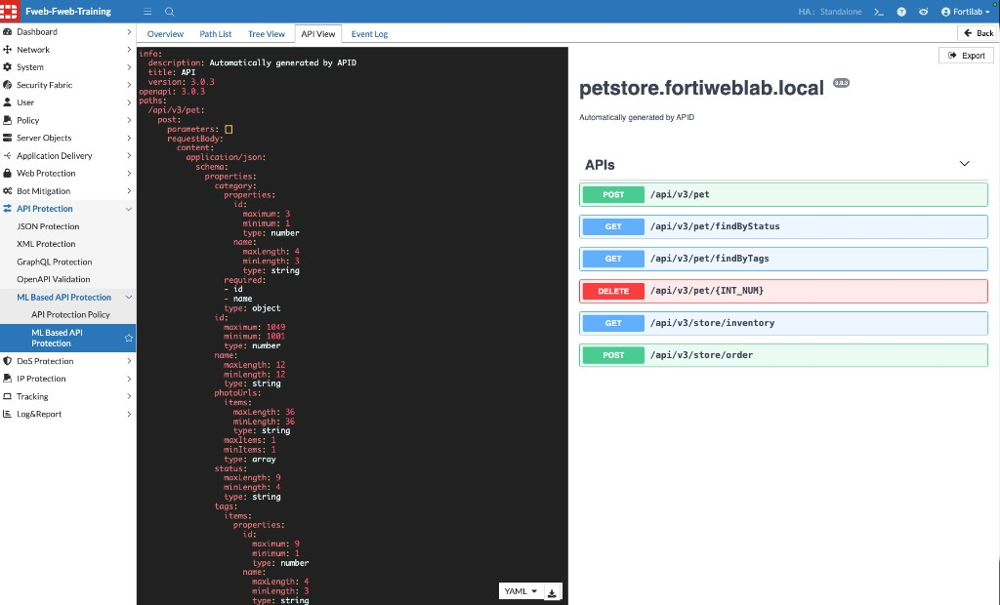

5. Select the **Event Log** tab and review Machine Learning lifecycle messages.

You should see endpoints progress through stages similar to:

| Stage transition | Meaning |
|------------------|---------|
| sample collecting → model building | Enough samples were collected; FortiWeb is building the API model |
| model building → model running | The model is ready and evaluates new API requests |

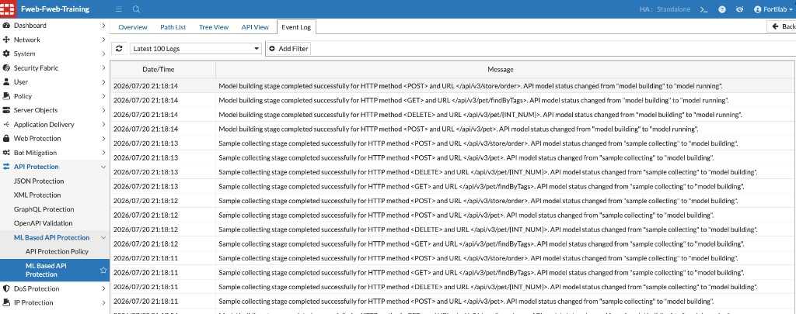

Notice that FortiWeb can build an inventory and schema of the application’s APIs from observed traffic, without requiring you to manually import an OpenAPI specification in this exercise.

{}
If API View is sparse or Event Log still shows sample collecting, wait a short time and click **Refresh**, or ask your instructor whether another PetStore ML Learning run is needed.
{}

---

### Verification Checklist

Confirm that you completed the following:

* Edited the **petstore** server policy
* Created Machine Learning **API Protection** for `petstore.fortiweblab.local`
* Set **Schema Protection** and **Threat Detection** actions to **Alert & Deny**
* Assigned **Inline Standard Protection** (or a custom Web Protection Profile) for signature-based layered protection
* Saved the policy
* Launched `./fortiweb-lab-traffic`
* Selected option **2** – API traffic generator
* Selected option **13** – PetStore ML Learning
* Verified PetStore traffic in FortiWeb Traffic logs (ignoring occasional 400/404/415 responses)
* Confirmed the scenario completed and returned to the API JSON Traffic menu
* Reviewed **API View** discovered endpoints and **Event Log** model running status

---

### Next Exercise

In Exercise 5.3, you launch mapped API attacks against the same PetStore endpoints so FortiWeb can detect schema violations, abnormal parameter values, and traditional attack payloads delivered through the API.
