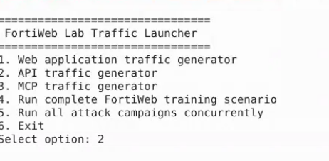
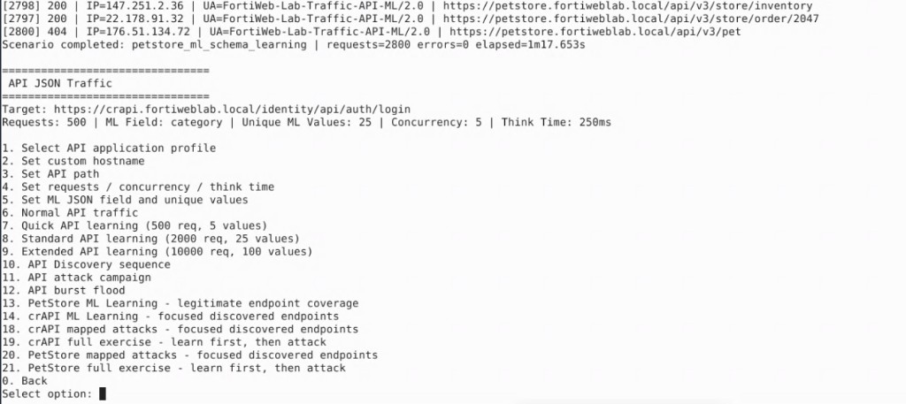
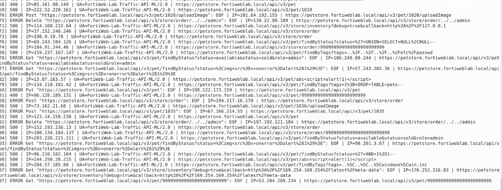
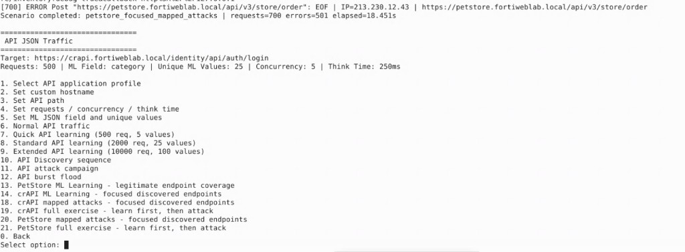
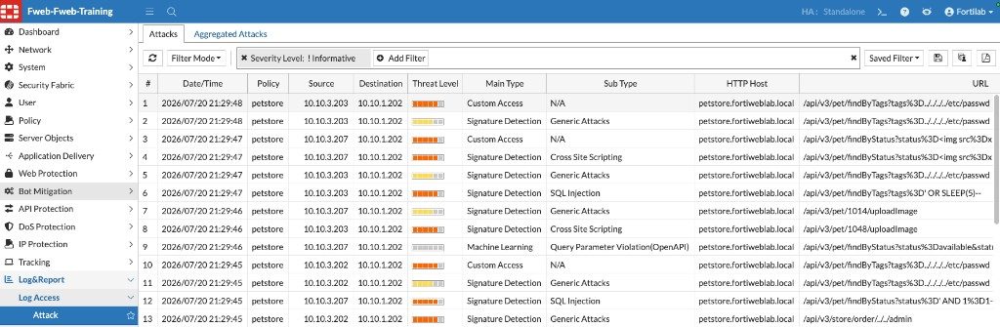

## Exercise 5.3 – Launch API Attacks Against PetStore

### Objective

Now that FortiWeb has learned normal PetStore API behavior, you launch attacks against the same endpoints.

The FortiWeb Lab Traffic Launcher maps attack payloads to previously discovered PetStore endpoints so you can observe how FortiWeb detects abnormal API requests.

---

### Step 1 – Launch the Traffic Generator

From the Guacamole desktop, open a terminal and run:

```bash
cd ~/fortiweb-lab-traffic
./fortiweb-lab-traffic
```



---

### Step 2 – Select the API Traffic Generator

At the main menu, enter:

```text
2
```



---

### Step 3 – Run PetStore Mapped Attacks

From the API Traffic Generator menu, enter:

```text
20
```

Option **20** is:

```text
PetStore Mapped Attacks – Focused Discovered Endpoints
```

This scenario generates attacks against previously learned endpoints. Attack types may include:

* SQL Injection
* Cross-Site Scripting (XSS)
* Command Injection
* Invalid JSON
* Schema violations
* Unexpected parameters
* Malicious parameter values
* Parameter manipulation



Because FortiWeb already understands what legitimate PetStore traffic looks like, these abnormal requests can be detected more accurately than with traditional signature-based inspection alone.

Allow the attack campaign to complete.

{}
Do not close the terminal while the script is running.
{}



---

### Step 4 – Confirm Campaign Completion

When the script finishes, review the terminal output for a completion message or summary of requests sent.

You do not need to open FortiWeb logs yet—that is the focus of Exercise 5.4. If time permits, you may briefly refresh the Attack Log to confirm events are beginning to appear.



---

### Verification Checklist

Confirm that you completed the following:

* Launched `./fortiweb-lab-traffic`
* Selected option **2** – API traffic generator
* Selected option **20** – PetStore Mapped Attacks
* Allowed the attack campaign to complete

---

### Next Exercise

In Exercise 5.4, you review FortiWeb API security events, examine attack details, and compare malicious requests with the learned API model from Exercise 5.2.
