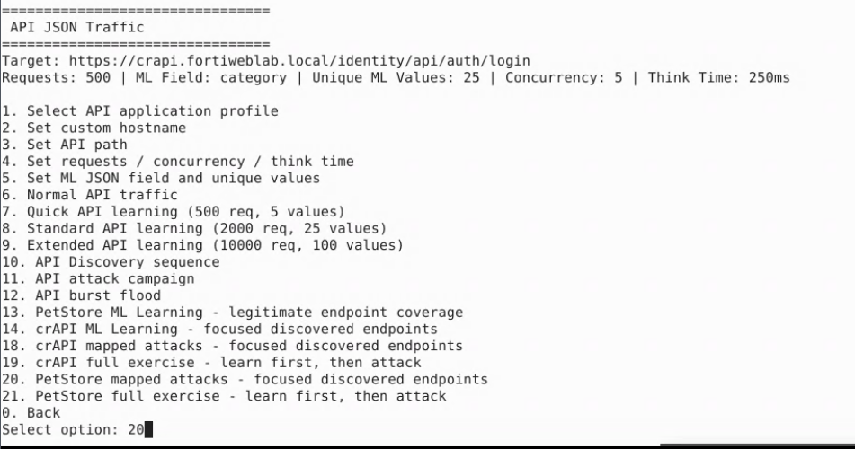

## Exercise 5.3 – Launch API Attacks Against PetStore

### Objective

Now that FortiWeb has learned normal PetStore API behavior, you launch attacks against the same endpoints.

The FortiWeb Lab Traffic Launcher maps attack payloads to previously discovered PetStore endpoints so you can observe how FortiWeb detects abnormal API requests—using both Machine Learning API Protection and the signature-based **Inline Standard Protection** profile assigned in Exercise 5.2.

---

### Step 1 – Launch the Traffic Generator

From the Guacamole desktop, open a terminal and run:

```bash
cd ~/fortiweb-lab-traffic
./fortiweb-lab-traffic
```

At the FortiWeb Lab Traffic Launcher menu, enter:

```text
2
```


This opens the **API JSON Traffic** menu.


---

### Step 2 – Run PetStore Mapped Attacks

From the API JSON Traffic menu, enter:

```text
20
```

Option **20** is:

```text
PetStore mapped attacks - focused discovered endpoints
```



This scenario generates attacks against previously learned endpoints. Attack types may include:

* SQL Injection
* Cross-Site Scripting (XSS)
* Command Injection
* Directory Traversal
* Invalid JSON
* Schema / OpenAPI violations
* Unexpected parameters
* Malicious parameter values

As the campaign runs, the terminal displays request progress. Many lines may show `ERROR`, `EOF`, `400`, or `500` responses. That often indicates FortiWeb interrupted or denied the connection after detecting an attack—expected behavior with **Alert & Deny** and layered protection enabled.


Allow the attack campaign to complete.

{}
Do not close the terminal while the script is running.
{}

---

### Step 3 – Confirm Campaign Completion

When the script finishes, the terminal shows a completion message similar to:

```text
Scenario completed: petstore_focused_mapped_attacks | requests=700 errors=501 elapsed=...
```

A high error count is normal for this attack scenario when FortiWeb is blocking malicious requests. Control then returns automatically to the **API JSON Traffic** menu.


---

### Step 4 – Quick Check of the Attack Log (Optional)

If time permits, briefly open FortiWeb Attack Logs to confirm events are appearing before the detailed review in Exercise 5.4.

1. Navigate to:

   **Log&Report → Log Access → Attack**

2. Confirm recent entries for the **petstore** policy and host `petstore.fortiweblab.local`.

You should see layered detections, for example:

| Main Type | Example Sub Type / finding |
|-----------|----------------------------|
| Signature Detection | SQL Injection, Cross Site Scripting, Generic Attacks |
| Machine Learning | Query Parameter Violation (OpenAPI) and related API anomalies |


Detailed log analysis is the focus of Exercise 5.4.

---

### Verification Checklist

Confirm that you completed the following:

* Launched `./fortiweb-lab-traffic`
* Selected option **2** – API traffic generator
* Selected option **20** – PetStore mapped attacks
* Allowed the attack campaign to complete and return to the API menu
* (Optional) Confirmed Attack Log entries for the petstore policy

---

### Next Exercise

In Exercise 5.4, you review FortiWeb API security events, examine attack details, and compare malicious requests with the learned API model from Exercise 5.2.
