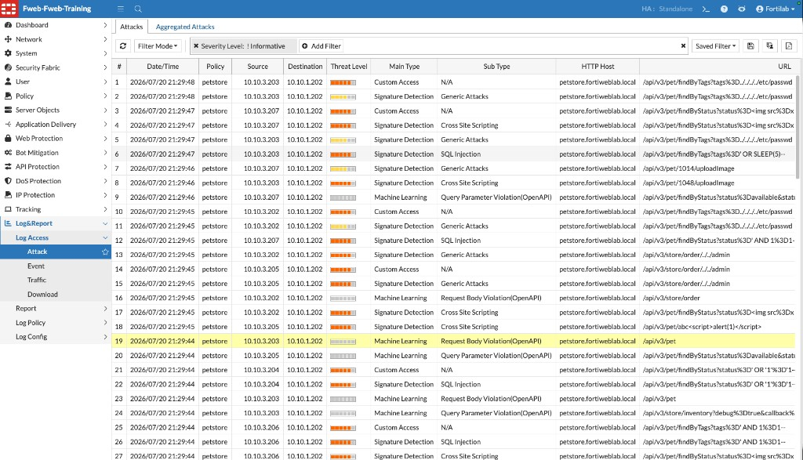
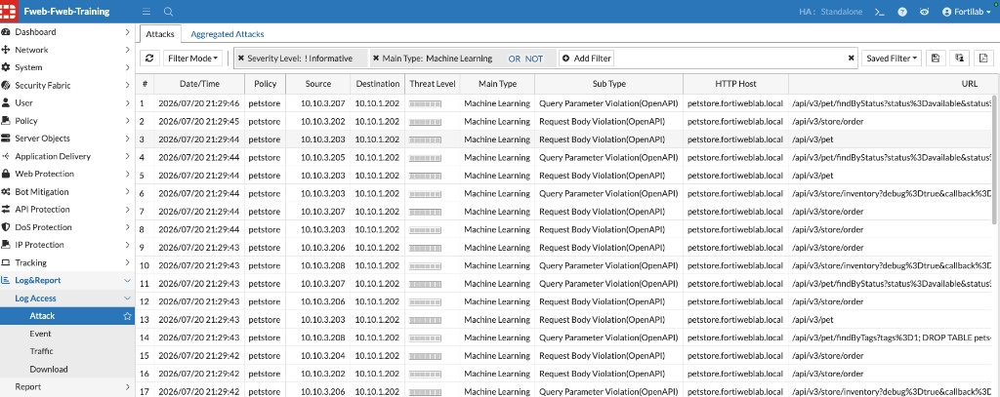
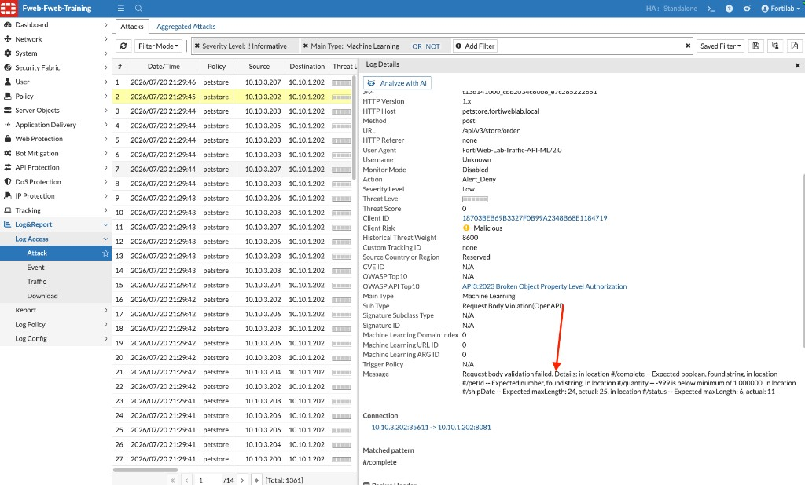
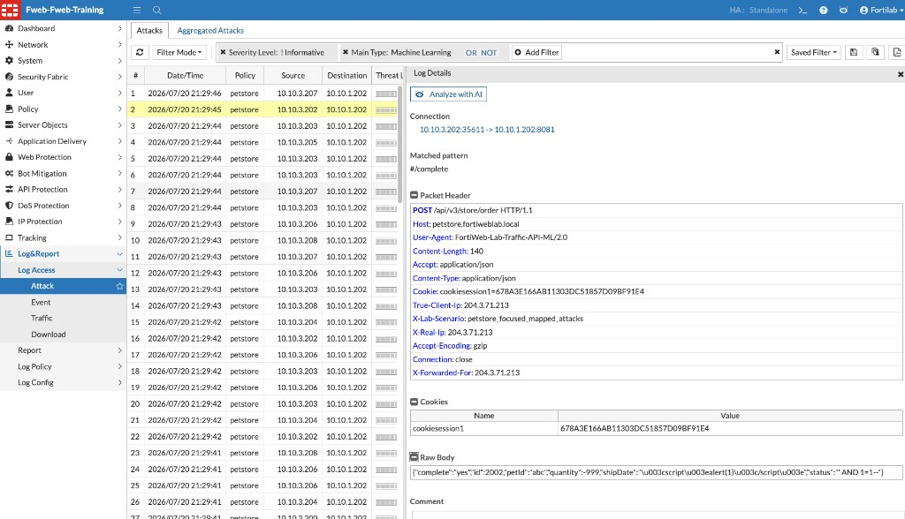
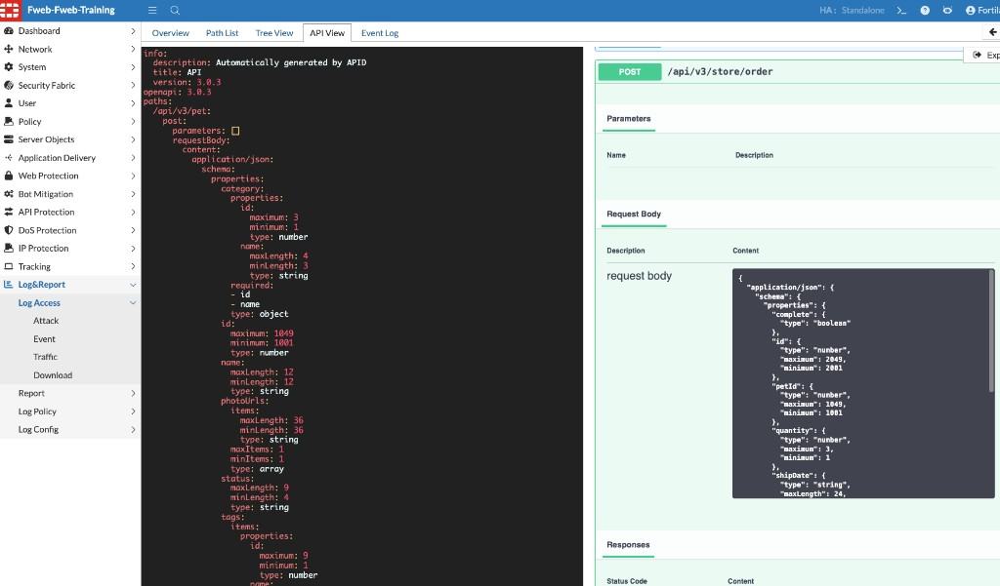

## Exercise 5.4 – Review API Security Logs

### Objective

After the PetStore mapped attack campaign completes, review FortiWeb Attack Logs to identify how **signature-based** protection and **Machine Learning API Protection** detected malicious or anomalous API requests.

Compare those Machine Learning events with the learned API schema from Exercise 5.2.

---

### Step 1 – Open the Attack Log

1. Log in to the FortiWeb administrative interface.
2. Navigate to:

   **Log&Report → Log Access → Attack**

3. Optionally filter out Informative events (for example, **Severity Level: ! Informative**).
4. Refresh the view if events do not appear immediately.

Confirm recent entries for the **petstore** policy and host `petstore.fortiweblab.local`.

You should see layered detections side by side, for example:

| Main Type | Example Sub Type |
|-----------|------------------|
| Signature Detection | Generic Attacks, Cross Site Scripting, SQL Injection |
| Machine Learning | Query Parameter Violation (OpenAPI), Request Body Violation (OpenAPI) |
| Custom Access | Access-rule related findings (if present) |

---

### Step 2 – Filter for Machine Learning Detections

To focus on API schema / ML findings:

1. Add a filter for **Main Type: Machine Learning**.
2. Keep **Severity Level: ! Informative** if helpful.

The filtered list should show PetStore events such as:

* **Query Parameter Violation (OpenAPI)**
* **Request Body Violation (OpenAPI)**

{}
Signature Detection entries show traditional payload matches (SQLi, XSS, traversal). Machine Learning entries show requests that violate the learned OpenAPI-style schema—even when the payload is embedded in a JSON body or query parameter.
{}

---

### Step 3 – Review a Schema Violation in Log Details

1. Select a Machine Learning entry such as **Request Body Violation (OpenAPI)** for `POST /api/v3/store/order`.
2. In **Log Details**, confirm fields such as:

| Field | Example lab result |
|-------|--------------------|
| HTTP Host | `petstore.fortiweblab.local` |
| Method / URL | `POST /api/v3/store/order` |
| Action | `Alert_Deny` |
| Main Type | Machine Learning |
| Sub Type | Request Body Violation (OpenAPI) |

3. Read the **Message** text carefully. It explains which JSON fields violated the learned schema—for example:

* `#/complete` — expected boolean, found string  
* `#/petId` — expected number, found string  
* `#/quantity` — value below the learned minimum  
* `#/shipDate` / `#/status` — length constraints violated  

---

### Step 4 – Inspect the Request Payload

Still in **Log Details**, scroll to the packet / raw body information for the same (or another) Machine Learning event.

Observe how attack content can appear inside JSON fields that look like a normal order request—for example:

* XSS-style content in `shipDate`
* SQL injection-style content in `status`

Also note lab identifiers such as:

* User-Agent: `FortiWeb-Lab-Traffic-API-ML/2.0`
* Scenario header: `petstore_focused_mapped_attacks`

#### Consider

Signatures may catch classic XSS or SQLi strings. Machine Learning API Protection also flags the request because the body does not match the learned schema types, ranges, and lengths for that endpoint.

---

### Step 5 – Compare Events With the Learned API Schema

1. Navigate to:

   **API Protection → ML Based API Protection**

2. Open the PetStore policy and select **API View** (or the equivalent schema view used in Exercise 5.2).
3. Locate an endpoint that appeared in the Attack Log—for example, `POST /api/v3/store/order` or `POST /api/v3/pet`.

Compare the learned constraints (types, minimum/maximum, minLength/maxLength) with the violation messages from Step 3. The Attack Log explains *why* the request failed validation against this learned schema.

#### Consider

Why is mapping attacks to previously discovered endpoints more useful than sending every payload to a single URL?

Mapped attacks exercise the same paths FortiWeb learned during legitimate traffic, which makes schema violations, unexpected parameters, and abnormal values easier to observe in the logs.

---

### Verification Checklist

Confirm that you completed the following:

* Opened **Log&Report → Log Access → Attack**
* Observed both Signature Detection and Machine Learning events for PetStore
* Filtered to **Main Type: Machine Learning**
* Reviewed schema violation details and request payload for at least one event
* Compared Attack Log findings with the learned schema in API View

---

### Reflection Questions

1. Which PetStore endpoints appeared most often in the attack logs?
2. Did FortiWeb detect schema violations, abnormal parameter values, traditional attack payloads, or a combination?
3. Which log fields helped you identify the violated parameter or detection reason?
4. How does ML-based API Protection help when an OpenAPI specification is missing or outdated?
5. How does this chapter’s API-focused detection differ from the web application signature exercises in Chapter 3?

---

### Chapter Summary

In this chapter, you learned that modern applications depend heavily on REST APIs, making API security a critical part of application protection. Unlike traditional web pages, APIs expose business logic and structured data directly to clients, creating challenges such as Broken Object Level Authorization (BOLA), excessive data exposure, schema violations, and API abuse.

You also explored FortiWeb’s API Protection capabilities, including API Discovery, OpenAPI validation concepts, JSON inspection, and Machine Learning–based behavioral analysis. By learning legitimate application behavior, FortiWeb can detect both known attacks and previously unseen anomalies—even without a manually maintained API specification.

Using PetStore, you completed the full workflow: exploring API endpoints, enabling ML API Protection with layered signature protection, generating legitimate traffic to build a behavioral model, launching mapped API attacks, and reviewing Attack Logs that show both signature matches and OpenAPI schema violations. This demonstrates how FortiWeb combines traditional inspection with behavioral analysis to protect modern REST APIs.
