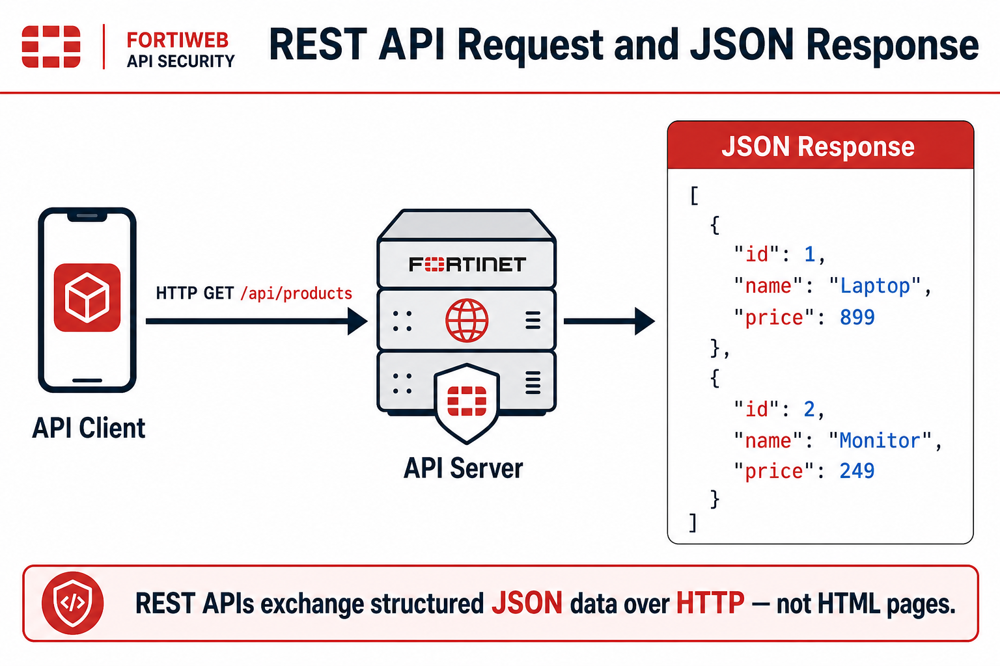
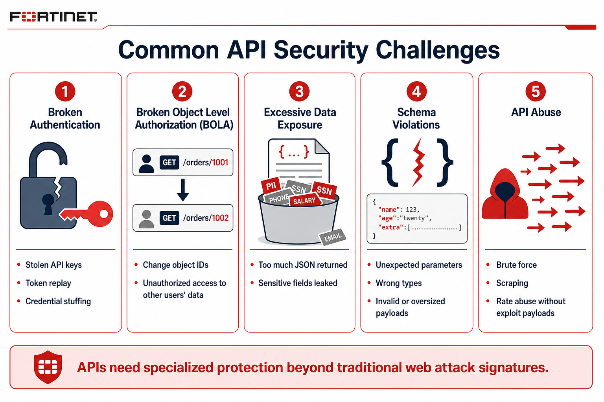
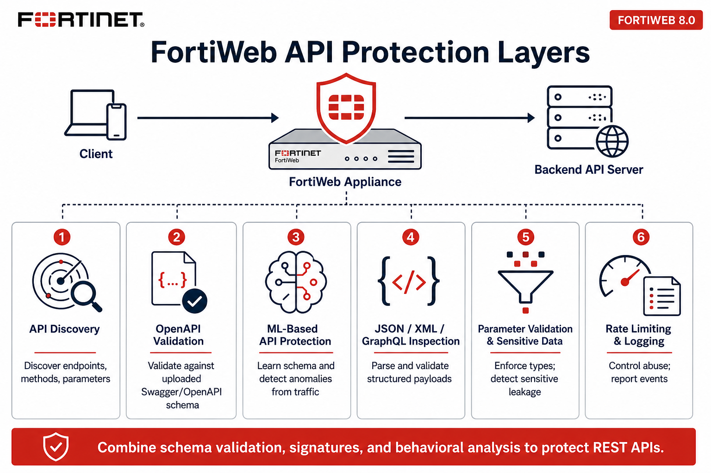
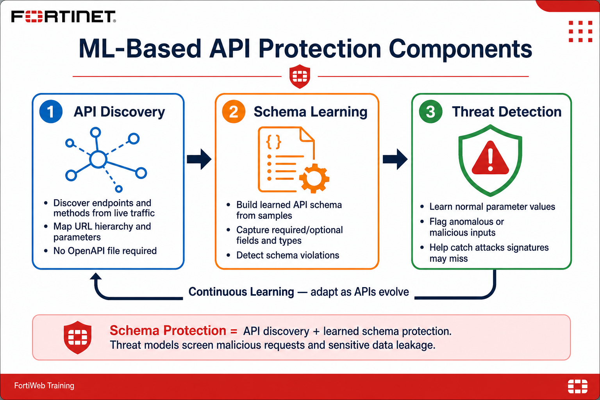

## **Objective**

Application Programming Interfaces (APIs) are the foundation of modern applications. Whether you are using a mobile banking app, shopping online, accessing cloud services, or interacting with an AI assistant, APIs exchange information between applications. Because APIs expose business logic and sensitive data directly, they are a primary target for attackers.

In this chapter, you learn how FortiWeb protects REST APIs using API Discovery, schema validation, parameter validation, and Machine Learning (ML)–based API Protection. You use the **PetStore** REST API to observe legitimate API traffic, allow FortiWeb to learn normal API behavior, launch targeted API attacks, and review the resulting security events.

### **Learning Objectives**

After completing this chapter, you will be able to:

* Explain what REST APIs are and why they need specialized security
* Identify common API attacks and abuse patterns
* Describe FortiWeb’s API Protection capabilities
* Understand how Machine Learning builds an API behavioral model
* Review automatically discovered API endpoints
* Analyze API security events and attack logs

---

### What Is an API?

An **Application Programming Interface (API)** is a set of rules that allows one application to communicate with another.

Unlike traditional websites that return HTML pages for users to view, APIs exchange structured data between software components. Today, APIs power nearly every modern application, including:

* Mobile applications
* Cloud applications
* Single-page applications (SPAs)
* Internet of Things (IoT) devices
* AI applications and services
* Microservices

The most common API architecture is **REST** (Representational State Transfer). REST APIs communicate using standard HTTP methods such as:

* `GET`
* `POST`
* `PUT`
* `PATCH`
* `DELETE`

Most REST APIs exchange information using **JSON** (JavaScript Object Notation).

For example, when a client requests a list of products, it may send:

```http
GET /api/products
```

The server returns structured JSON data:

```json
[
  {
    "id": 1,
    "name": "Laptop",
    "price": 899
  },
  {
    "id": 2,
    "name": "Monitor",
    "price": 249
  }
]
```

API consumers typically never see a rendered web page—they receive raw data that their application processes and displays. Because APIs provide direct access to application functionality and data, they are among the most valuable targets for attackers.



---

### API Security Challenges

Traditional web application attacks such as SQL Injection and Cross-Site Scripting remain important threats, but APIs introduce additional security challenges.

#### Broken Authentication

Many APIs rely on API keys, OAuth tokens, or JSON Web Tokens (JWTs) for authentication. If an attacker obtains a valid token, they can impersonate legitimate users and access protected resources.

Examples include:

* Stolen API keys
* Credential stuffing
* Session hijacking
* Token replay attacks

#### Broken Object Level Authorization (BOLA)

One of the most common API vulnerabilities occurs when applications fail to validate access to individual objects.

A legitimate request may be:

```http
GET /orders/1001
```

An attacker changes the request to:

```http
GET /orders/1002
```

If the application only checks whether the user is authenticated—and not whether they are authorized for Order 1002—the attacker may gain unauthorized access to another customer’s information.

#### Excessive Data Exposure

Many APIs return more information than clients actually require. Instead of returning only name and email, an API may accidentally expose password hashes, internal identifiers, payment data, personal information, or administrative fields.

Because APIs exchange raw data, these mistakes are often difficult for developers to notice.

#### Schema Violations

APIs expect requests to follow a specific structure. An attacker may intentionally send:

* Unexpected parameters
* Missing required fields
* Invalid JSON
* Incorrect data types
* Oversized payloads

Malformed requests often indicate reconnaissance or exploitation attempts.

#### API Abuse

Not every malicious request contains an exploit. Attackers frequently abuse APIs by sending large numbers of individually valid requests, including:

* Credential stuffing
* Brute-force attacks
* Account enumeration
* Web scraping
* Inventory hoarding
* Rate abuse

Because these requests can appear legitimate one at a time, behavioral analysis becomes especially important.



---

### How FortiWeb Protects APIs

FortiWeb provides multiple layers of API security that work together to protect modern REST APIs, including:

* API Discovery
* OpenAPI Specification validation
* Machine Learning (ML)–based API Protection
* JSON and XML validation
* GraphQL protection
* Parameter validation
* Sensitive data detection
* Rate limiting
* Logging and reporting

Rather than relying on a single detection technique, FortiWeb combines signature-based inspection, schema validation, and behavioral analysis to identify both known attacks and previously unseen threats.



#### API Discovery

One of the first challenges in securing APIs is knowing what APIs actually exist. Many organizations have undocumented APIs that were created years ago or added without proper documentation.

As legitimate traffic passes through FortiWeb, it can automatically discover:

* API endpoints
* HTTP methods
* URL paths
* Request parameters
* Response information

This inventory helps administrators identify unknown APIs, shadow APIs, deprecated APIs, and frequently used endpoints—before protection policies are fully enforced.

#### OpenAPI Validation

Many development teams publish an **OpenAPI Specification** (formerly Swagger) that describes available endpoints, supported methods, required parameters, data types, and JSON schema.

FortiWeb can import this specification and compare every incoming request against it. Requests that violate the published API definition can be logged or blocked before they reach the application. This provides highly accurate protection when a current OpenAPI specification is available.

#### Machine Learning–Based API Protection

Many organizations do not maintain accurate OpenAPI documentation. Applications change frequently, new APIs are deployed, parameters are added, and documentation becomes outdated.

To address this, FortiWeb includes **Machine Learning–Based API Protection**. Instead of relying only on manually created schemas, FortiWeb can learn application behavior from legitimate traffic.

During learning, FortiWeb analyzes characteristics such as:

* URLs and endpoint hierarchy
* HTTP methods
* JSON request bodies
* Parameter names, types, and values
* Request frequency and normal application behavior

Using this information, FortiWeb creates a behavioral model of normal API usage. Future requests are compared against that model, and significant deviations are identified as anomalies.

---

### Three Components of ML-Based API Protection

Machine Learning–based API Protection consists of three complementary functions.

#### 1. API Discovery

FortiWeb automatically discovers endpoints, methods, parameters, and URL structure. No OpenAPI specification is required.

#### 2. Schema Learning

FortiWeb automatically builds an API schema from observed traffic. The learned schema can include required and optional fields, parameter names and types, and expected JSON structure. Requests that violate this learned schema can be detected immediately.

#### 3. Threat Detection

FortiWeb also learns normal parameter values. For example, suppose a product API normally receives values such as:

```text
category = electronics
category = books
category = clothing
```

If an attacker submits:

```text
category=' OR 1=1 --
```

or

```text
category=<script>alert(1)</script>
```

the value differs significantly from the learned behavioral model. Although the endpoint itself may be legitimate, the request is recognized as anomalous and can be logged or blocked.

This behavioral analysis helps FortiWeb detect attacks that traditional signature-based inspection alone might miss.

#### Continuous Learning

Applications evolve over time. New endpoints appear, existing APIs change, and additional parameters are introduced. FortiWeb supports continuous learning so the ML model can adapt as legitimate application behavior changes—helping keep API protection accurate as applications evolve.



---

### Lab Overview

In this chapter you use the **PetStore** REST API to demonstrate FortiWeb’s API Protection capabilities.

| Exercise | Focus |
|----------|--------|
| 5.1 | Explore PetStore API endpoints |
| 5.2 | Generate legitimate traffic and build the ML API model |
| 5.3 | Launch mapped API attacks |
| 5.4 | Review API security logs |

### **Topics Covered**

#### **API Security Challenges**

* Broken authentication and BOLA
* Excessive data exposure
* Schema violations
* API abuse

#### **API Protection Features**

* API Discovery
* OpenAPI and learned-schema validation
* ML-based API Protection
* Parameter and JSON inspection
* Logging and event analysis

### **Hands-On Tasks**

* [Exercise 5.1 – Explore API Endpoints](5.1_Explore_API_Endpoints/)
* [Exercise 5.2 – Build the API ML Model](5.2_Build_API_ML_Model/)
* [Exercise 5.3 – Launch API Attacks](5.3_Launch_API_Attacks/)
* [Exercise 5.4 – Review API Security Logs](5.4_Review_API_Security_Logs/)

### **Key Takeaways**

* Understand why APIs need specialized security beyond traditional WAF signatures
* See how FortiWeb discovers APIs, learns normal behavior, and detects API attacks
