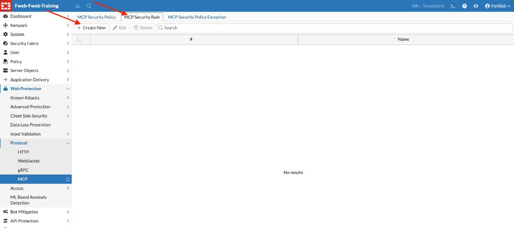
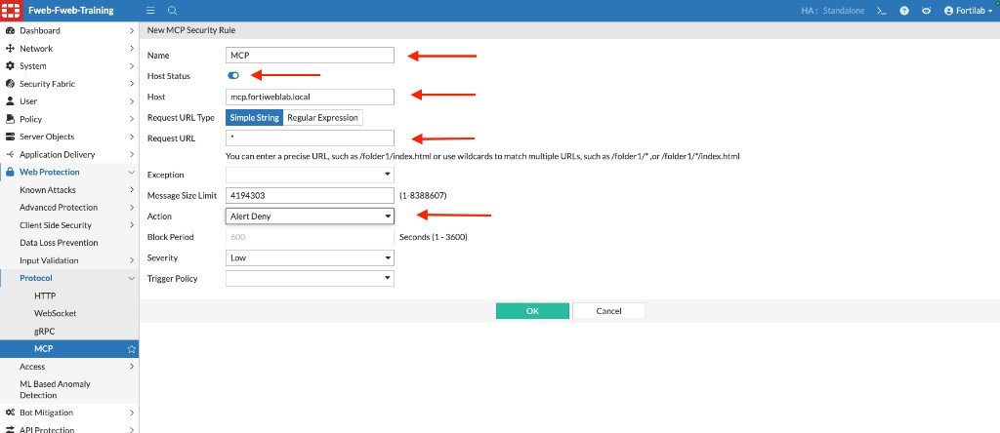
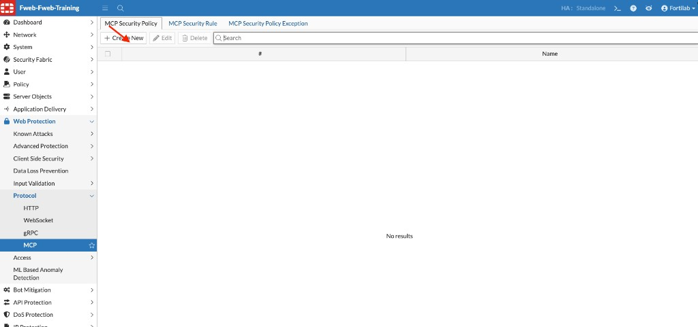
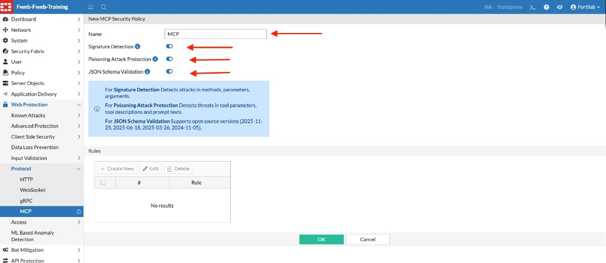
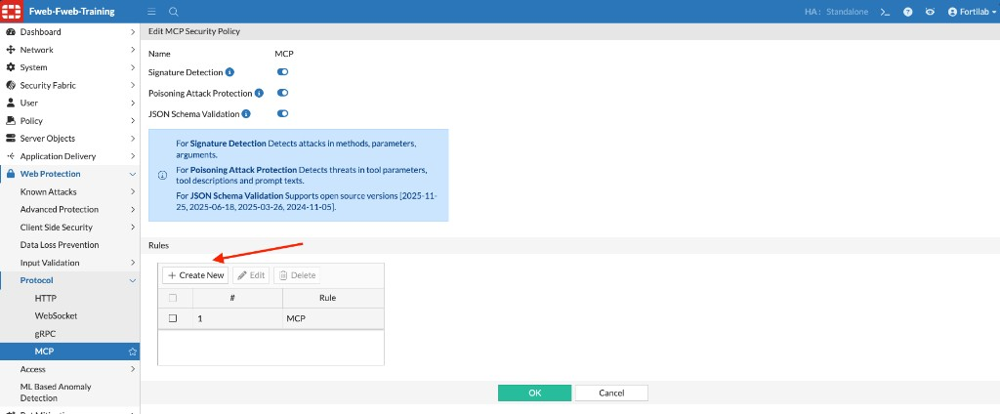
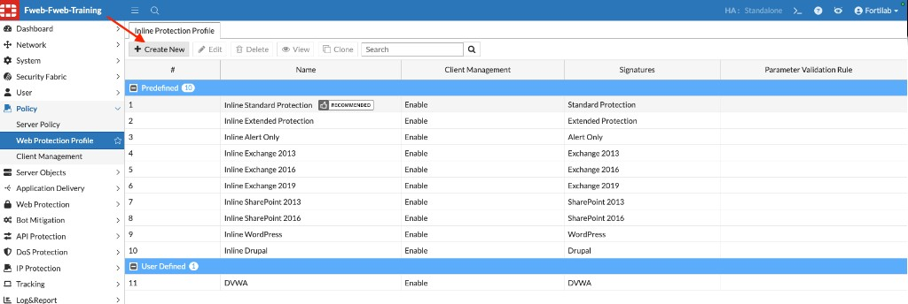
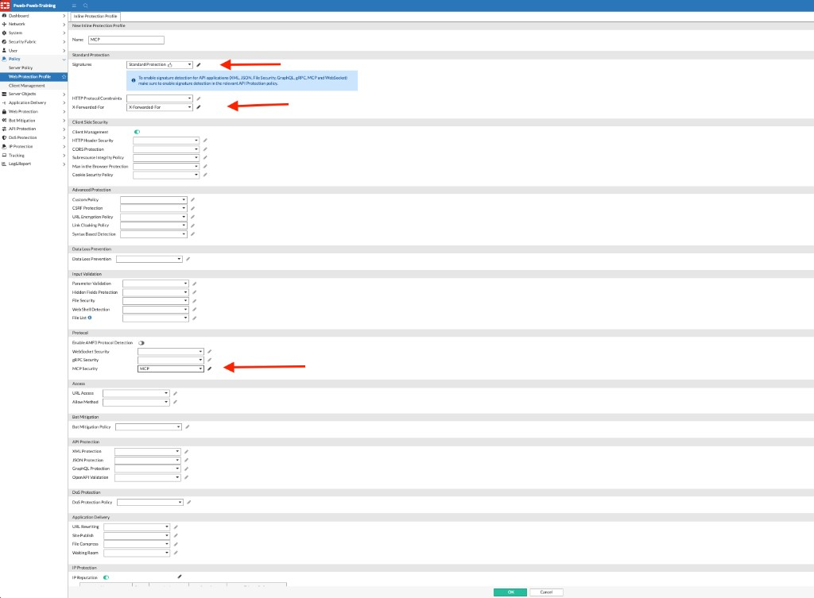
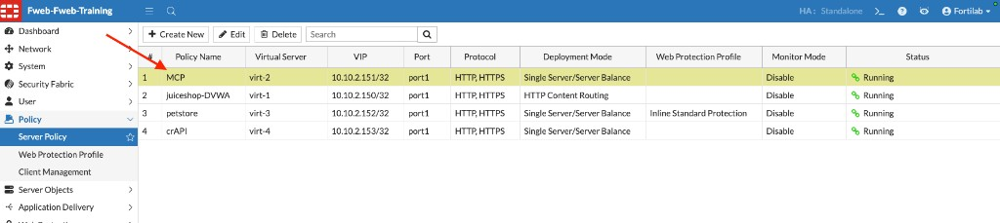
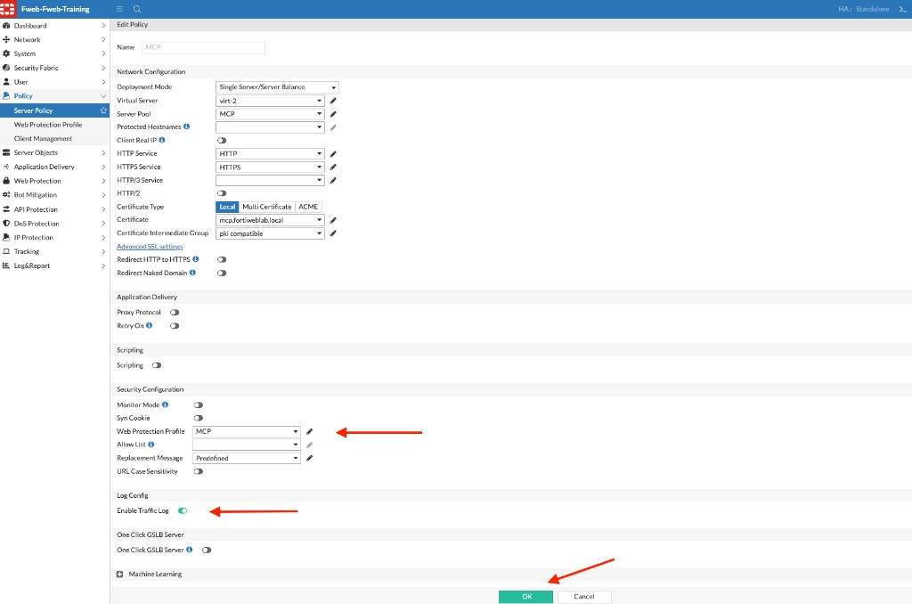

## Exercise 6.1 – Configure MCP Security

### Objective

Configure FortiWeb MCP Security so the appliance can inspect Model Context Protocol traffic before you generate legitimate or attack traffic.

According to the FortiWeb Administration Guide, MCP Security sits in the **Protocol Constraints** layer. FortiWeb acts as a reverse proxy between the MCP client (AI application) and MCP server (tool provider), parsing Streamable HTTP / Server-Sent Events (SSE) JSON-RPC messages and applying:

* **Signature Detection** — inspect methods, tool names, and argument values for injection and other known attacks
* **Poisoning Attack Protection** — inspect tool descriptions, parameters, and prompt text for jailbreak / override attempts
* **JSON Schema Validation** — validate streamed messages against FortiGuard MCP schemas

For additional detail, see [MCP Protocol](https://docs.fortinet.com/document/fortiweb/8.0.5/administration-guide/97697/mcp-protocol).

The recommended configuration sequence is:

1. Create an MCP Security Rule  
2. Create an MCP Security Policy and enable inspection engines  
3. Attach the rule to the policy  
4. Create a Web Protection Profile that references the MCP policy  
5. Assign that profile to the MCP server policy  

---

### Step 1 – Create an MCP Security Rule

1. Navigate to:

   **Web Protection → Protocol → MCP**

2. Select the **MCP Security Rule** tab.
3. Click **+ Create New**.

4. Configure the rule as follows:

| Setting | Value |
|---------|-------|
| Name | `MCP` |
| Host Status | Enabled |
| Host | `mcp.fortiweblab.local` |
| Request URL Type | Simple String |
| Request URL | `*` |
| Message Size Limit | Leave the lab default (for example, `4194303`) |
| Action | `Alert Deny` |
| Severity | `Low` |

Leave **Exception** and **Trigger Policy** empty unless your instructor provides values.

5. Click **OK**.

{}
Confirm the host name with your instructor if the lab uses a different MCP virtual host.
{}

---

### Step 2 – Create an MCP Security Policy

1. Select the **MCP Security Policy** tab.
2. Click **+ Create New**.

3. Configure:

| Setting | Value |
|---------|-------|
| Name | `MCP` |
| Signature Detection | Enabled |
| Poisoning Attack Protection | Enabled |
| JSON Schema Validation | Enabled |

4. Click **OK** to save the policy.

The FortiWeb UI describes these engines as:

* **Signature Detection** — detects attacks in methods, parameters, and arguments  
* **Poisoning Attack Protection** — detects threats in tool parameters, tool descriptions, and prompt texts  
* **JSON Schema Validation** — validates messages against supported open-source MCP schema versions published through FortiGuard  

---

### Step 3 – Attach the MCP Rule to the Policy

1. Open the **MCP** security policy for editing (if it is not already open).
2. In the **Rules** section, click **+ Create New**.
3. Select the **MCP** security rule created in Step 1 and save.

4. Click **OK** to save the MCP Security Policy.

Confirm that the Rules table lists **MCP**.

---

### Step 4 – Create a Web Protection Profile for MCP

1. Navigate to:

   **Policy → Web Protection Profile**

2. On the **Inline Protection Profile** tab, click **+ Create New**.

3. Name the profile `MCP` and configure at least:

| Setting | Value |
|---------|-------|
| Name | `MCP` |
| Signatures | `Standard Protection` |
| X-Forwarded-For | `X-Forwarded-For` |
| MCP Security (under Protocol) | `MCP` |

4. Click **OK**.

{}
The Signatures information note in the GUI reminds you that signature detection for protocol applications such as MCP also depends on enabling signature inspection in the relevant API/protocol protection settings. In this lab, Signature Detection is already enabled on the MCP Security Policy.
{}

---

### Step 5 – Assign the Profile to the MCP Server Policy

1. Navigate to:

   **Policy → Server Policy**

2. Select the **MCP** policy, then click **Edit**.

3. In **Security Configuration**, set **Web Protection Profile** to `MCP`.
4. Confirm **Enable Traffic Log** is **ON**.
5. Click **OK**.

FortiWeb is now ready to inspect MCP traffic for `mcp.fortiweblab.local` using signatures, poisoning protection, and JSON schema validation.

---

### Verification Checklist

* Created the MCP Security rule for `mcp.fortiweblab.local`
* Created the MCP Security Policy with Signature Detection, Poisoning Attack Protection, and JSON Schema Validation enabled
* Attached the MCP rule to the MCP policy
* Created the `MCP` Web Protection Profile and selected MCP Security = `MCP`
* Assigned the `MCP` profile to the MCP server policy and enabled Traffic Log

### Next Exercise

In Exercise 6.2, you generate legitimate MCP traffic and confirm that valid requests still succeed with the policy enabled.
