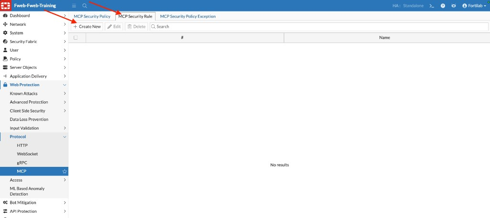
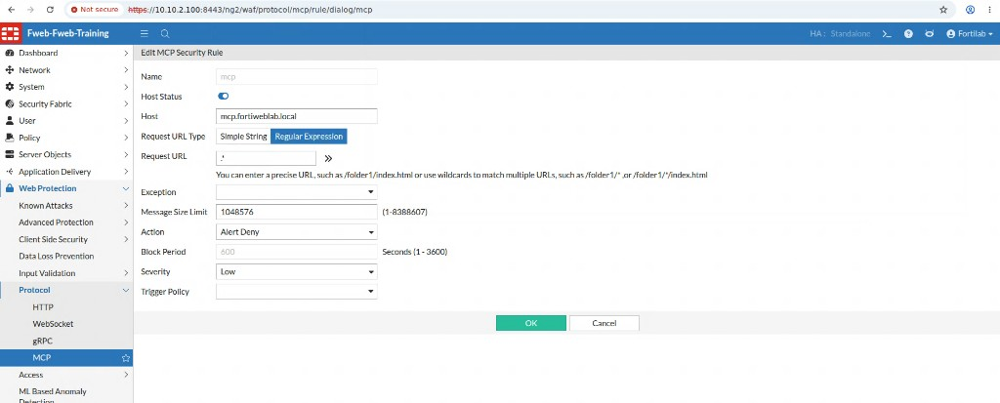
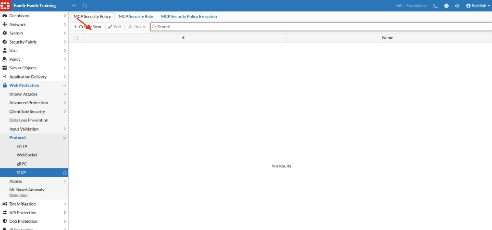
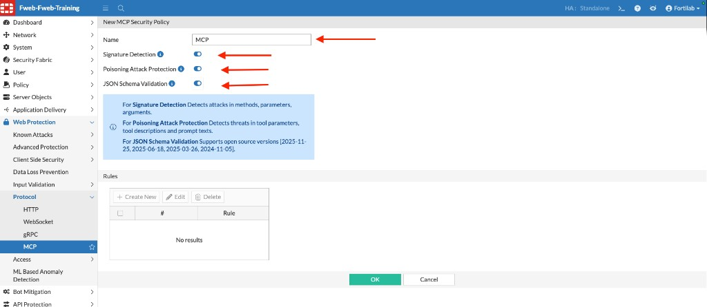
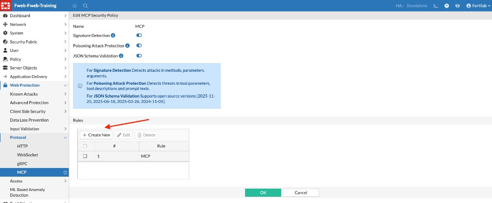
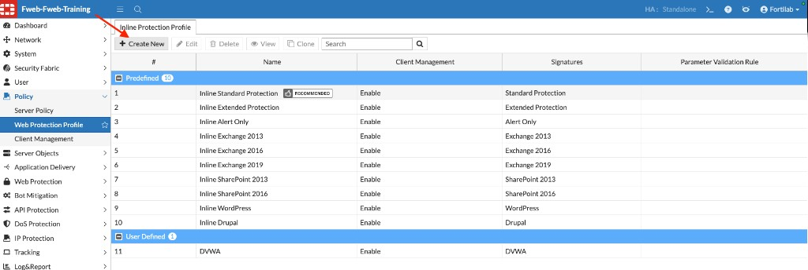
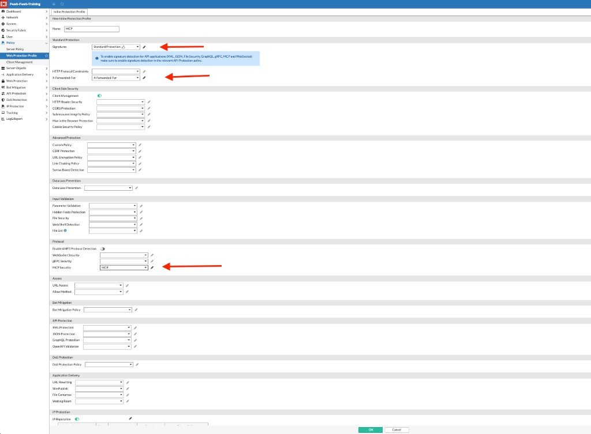
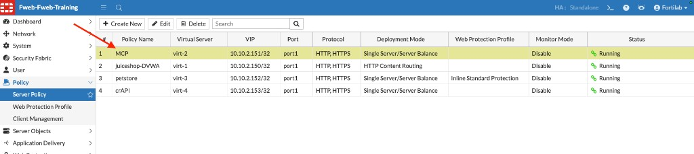
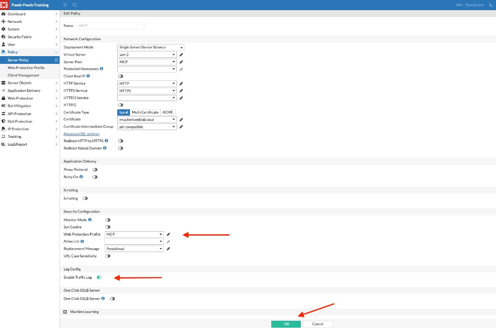

## Exercise 6.1 – Configure MCP Security

### Objective

Configure FortiWeb MCP Security to inspect Model Context Protocol traffic before generating legitimate requests or launching attacks.
MCP Security sits in the **Protocol Constraints** layer.FortiWeb operates as a reverse proxy between the MCP client (AI application) and MCP server (tool provider), parsing Streamable HTTP / Server-Sent Events (SSE) JSON-RPC messages and applying:

 * **Signature Detection** — inspect methods, tool names, and argument values for injection and other known attacks
* **Poisoning Attack Protection** — inspect tool descriptions, parameters, and prompt text for jailbreak / override attempts
* **JSON Schema Validation** — validate streamed messages against FortiGuard MCP schemas

For additional detail, see [MCP Protocol](https://docs.fortinet.com/document/fortiweb/8.0.7/administration-guide/97697/mcp-protocol).

{}
This lab uses FortiWeb 8.0.7. In this lab environment, MCP signature inspection is enabled in the Web Protection Profile under Signature Detection → MCP. The MCP Security Policy contains the Poisoning Attack Protection and JSON Schema Validation settings.
{}

Configure the components in the following order:

1. Create an MCP Security Rule  
2. Create an MCP Security Policy, enable Poisoning Attack Protection and JSON Schema Validation, and add the MCP Security Rule. 
3. Create a Web Protection Profile, select the MCP Security Policy, and enable Signature Detection → MCP  
4. Assign the Web Protection Profile to the server policy that handles MCP traffic. 

---

### Step 1 – Create an MCP Security Rule

1. Navigate to:

   **Web Protection → Protocol → MCP**

2. Select the **MCP Security Rule** tab.
3. Click **+ Create New**.

4. Configure the rule as follows:

| Setting | Value |
|---------|-------|
| Name | `MCP` |
| Host Status | Enabled |
| Host | `mcp.fortiweblab.local` |
| Request URL Type | Regular Expression |
| Request URL | `.*` |
| Message Size Limit | `1048576` (1 MiB) |
| Action | `Alert Deny` |
| Severity | `Low` |

Leave **Exception** and **Trigger Policy** empty unless your instructor provides values.

5. Click **OK**.

---

### Step 2 – Create an MCP Security Policy

1. Select the **MCP Security Policy** tab.
2. Click **+ Create New**.

3. Configure:

| Setting | Value |
|---------|-------|
| Name | `MCP` |
| Poisoning Attack Protection | Enabled |
| JSON Schema Validation | Enabled |

4. Click **OK** to save the policy.

The FortiWeb UI describes these engines as:

* **Poisoning Attack Protection** — detects threats in tool parameters, tool descriptions, and prompt texts  
* **JSON Schema Validation** — validates messages against supported open-source MCP schema versions published through FortiGuard  

Signature Detection for MCP is configured on the Web Protection Profile in Step 4.  

---

### Step 3 – Attach the MCP Rule to the Policy

1. Open the **MCP** security policy for editing (if it is not already open).
2. In the **Rules** section, click **+ Create New**.
3. Select the **MCP** security rule created in Step 1 and save.

4. Click **OK** to save the MCP Security Policy.

Confirm that the Rules table lists **MCP**.

---

### Step 4 – Create a Web Protection Profile for MCP

1. Navigate to:

   **Policy → Web Protection Profile**

2. On the **Inline Protection Profile** tab, click **+ Create New**.

3. Name the profile `MCP` and configure at least:

| Setting | Value |
|---------|-------|
| Name | `MCP` |
| Signatures | `Standard Protection` or `Extended Protection` |
| Signature Detection | **MCP** checked |
| X-Forwarded-For | `X-Forwarded-For` |
| MCP Security (under Protocol) | `MCP` |

4. Click **OK**.

{}
If **MCP Security** is empty on this profile, FortiWeb still logs HTTPS to the MCP server policy (Traffic Log Policy = MCP) but **does not** classify Streamable HTTP as MCP. FortiView MCP Analysis stays empty. Signature Detection → **MCP** must also be checked or argument signatures will not run inside parsed MCP fields.
{}

---

### Step 5 – Assign the Profile to the MCP Server Policy

1. Navigate to:

   **Policy → Server Policy**

2. Select the **MCP** policy, then click **Edit**.

3. In **Security Configuration**, set **Web Protection Profile** to `MCP`.
4. Confirm **Enable Traffic Log** is **ON**.
5. Click **OK**.

FortiWeb is now ready to inspect MCP traffic for `mcp.fortiweblab.local` using signatures, poisoning protection, and JSON schema validation.

---

### Verification Checklist

* Created the MCP Security rule for `mcp.fortiweblab.local` (or host status off with URL `.*`)
* Created the MCP Security Policy with Poisoning Attack Protection and JSON Schema Validation enabled
* Attached the MCP rule to the MCP policy
* Created the `MCP` Web Protection Profile, set **MCP Security = MCP**, and checked **Signature Detection → MCP**
* Assigned the `MCP` profile to the MCP server policy and enabled Traffic Log

### Next Exercise

In Exercise 6.2, you confirm the running path and open the AcmeCorp assistant.
