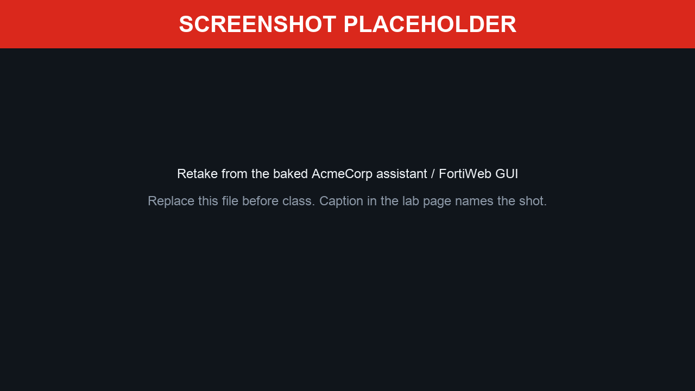
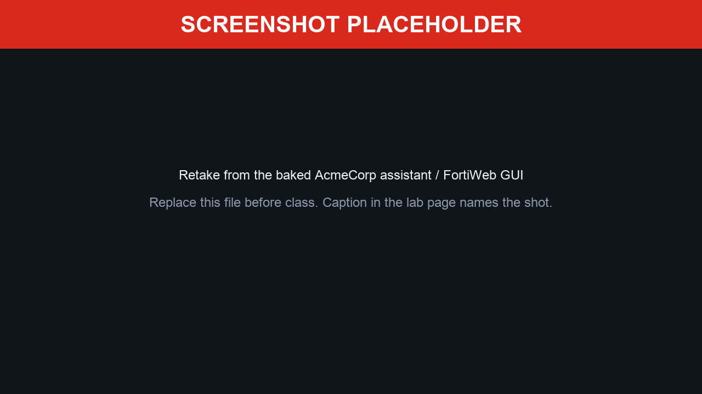

## Exercise 6.2 – Confirm the MCP Path and Open the Assistant

### Objective

Confirm that FortiWeb is already sitting on the AI-to-tool path, then open the lab assistant so later exercises inspect **tools**, not just protocol messages.

The running path is:

```text
Student browser
    ↓
AI agent (LLM client)
    ↓ HTTPS
FortiWeb   MCP Security — Protocol Constraints
    ↓ HTTP
MCP server (broker)
    ↓
Enterprise tools (simulated in this lab)
```

Protected endpoint (Streamable HTTP):

```text
https://mcp.fortiweblab.local/mcp
```

FortiWeb classifies this path as MCP only when the client uses Streamable HTTP (`Accept: text/event-stream` and `Content-Type: text/event-stream`, with JSON-RPC in SSE `data:` frames). The lab assistant already does that. Do not POST plain `application/json` without the SSE Content-Type.

{}
Complete [Exercise 6.1](../6.1_Configure_MCP_Security/) first. If those objects already exist, do **not** recreate them—only confirm they are still assigned.
{}

---

### Step 1 – Confirm FortiWeb MCP Security

1. Sign in to FortiWeb (`https://10.10.2.100`) as `Fortilab` / `Fortinetlab1!`.
2. Open **Web Protection → Protocol → MCP**.
3. Confirm an **MCP Security Policy** named `MCP` (or `mcp`) with:

| Engine | Expected state |
|--------|----------------|
| Poisoning Attack Protection | Enabled |
| JSON Schema Validation | Enabled |


4. Open **Policy → Web Protection Profile**, edit **MCP** (or `mcp`), and confirm:

| Setting | Expected state |
|---------|----------------|
| MCP Security (Protocol) | `MCP` or `mcp` |
| Signature Detection → MCP | Checked |

5. Open **Policy → Server Policy**, edit **MCP**, and confirm:

| Setting | Expected value |
|---------|----------------|
| Web Protection Profile | `MCP` |
| Enable Traffic Log | ON |



{}
MCP Security has **no learning phase**. If this profile is assigned, inspection is already live for `mcp.fortiweblab.local`.
{}

---

### Step 2 – Confirm the MCP broker is healthy

From the Guacamole desktop:

```bash
curl https://mcp.fortiweblab.local/healthz
```

Expected:

```json
{"mode":"normal","status":"ok"}
```

If `mode` is not `normal`:

```bash
curl -sk 'https://mcp.fortiweblab.local/mode?set=normal'
```

---

### Step 3 – Open the AcmeCorp assistant

The assistant is already running on the baked Guacamole image. From the Guacamole browser:

```text
http://127.0.0.1:3000
```

Confirm **Protected path connected** and that the left rail lists enterprise tools such as `kb.search`, `crm.lookup`, `automation.run`, and `files.get`. A yellow banner means `MCP_URL` is loopback — FortiWeb is not on the path; do not continue until that is fixed.

You can change the MCP headend scenario from the assistant **Headend** rail, from `https://mcp.fortiweblab.local/control`, or:

```bash
curl -sk https://mcp.fortiweblab.local/mode
curl -sk 'https://mcp.fortiweblab.local/mode?set=normal'
```



Treat this UI as a **company AI assistant**. The important question is not “does JSON-RPC work?” It is:

> Which enterprise resources can this assistant reach through MCP, and is FortiWeb inspecting that path?

---

### Step 4 – Name the components out loud

Using the diagram from the chapter introduction, identify each hop in the running lab:

| Diagram box | Lab object |
|-------------|------------|
| User | You, in the Student view |
| LLM / AI agent | AcmeCorp Internal Assistant on `http://127.0.0.1:3000` (baked Guacamole image) |
| FortiWeb | Policy **MCP**, host `mcp.fortiweblab.local` |
| MCP server | Headend at `10.10.1.202`, URL `/mcp` |
| Enterprise tools | Functions advertised by the MCP server (Exercise 6.3) |

---

### Verification Checklist

* Confirmed MCP Security Policy (Poisoning + JSON Schema) and Web Protection Profile **MCP Security** plus **Signature Detection → MCP**
* Confirmed the MCP server policy uses that profile and Traffic Log is on
* `/healthz` returned `"mode":"normal"`
* Opened the AcmeCorp assistant and saw **Protected path connected**

### Next Exercise

In Exercise 6.3 you inventory the tools the assistant can discover—name, description, parameters, and the enterprise system each tool implies.
