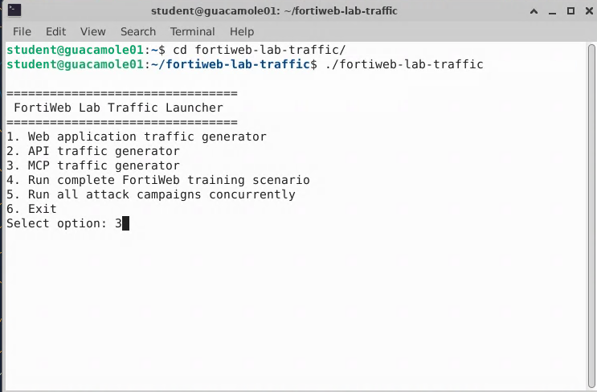
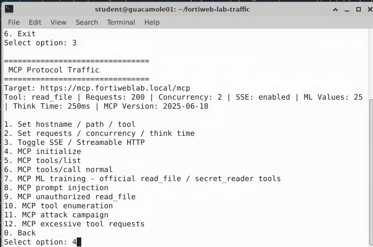
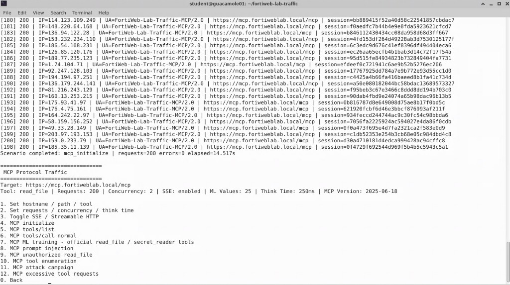
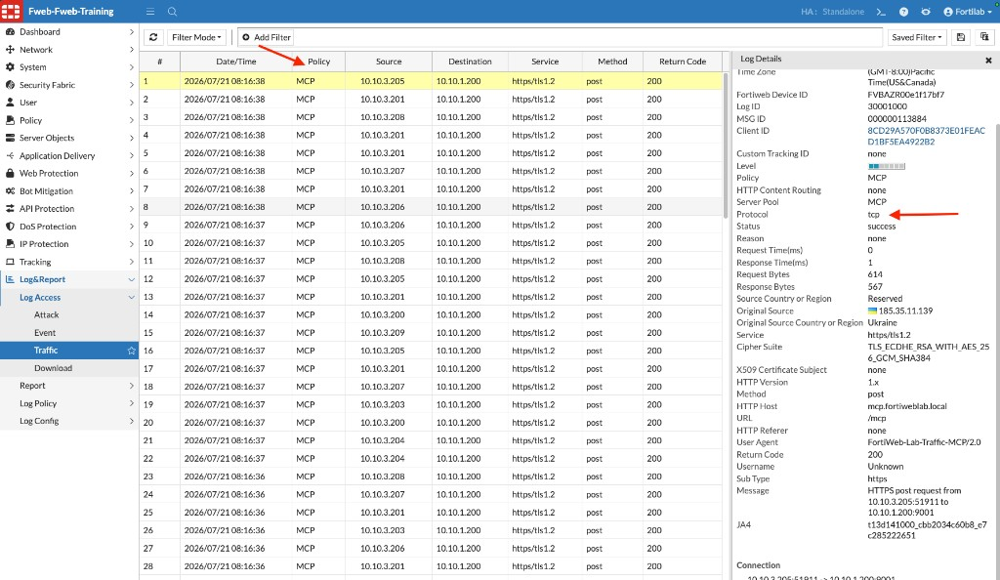
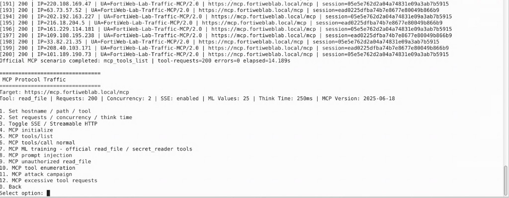
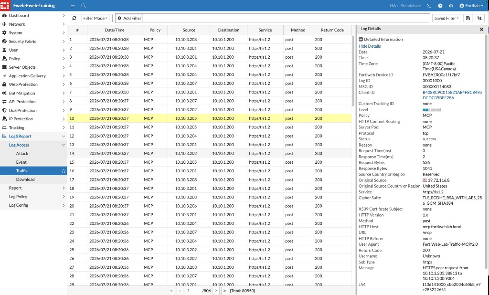
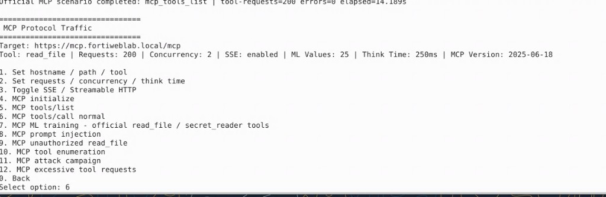

## Exercise 6.2 – Generate Legitimate MCP Traffic

### Objective

With MCP Security configured, generate normal MCP communication and observe how FortiWeb records AI client activity. Confirm that legitimate requests still succeed under the new policy.

The traffic simulates session initialization, tool discovery, and authorized tool calls over Streamable HTTP / SSE.

{}
Run these scenarios only in the controlled training environment.
{}

---

### Step 1 – Launch the MCP Traffic Generator

From the Guacamole desktop, open a terminal and run:

```bash
cd fortiweb-lab-traffic/
./fortiweb-lab-traffic
```

At the FortiWeb Lab Traffic Launcher menu, enter:

```text
3
```



This opens the **MCP Protocol Traffic** menu. Confirm the target is:

```text
https://mcp.fortiweblab.local/mcp
```

---

### Step 2 – Initialize an MCP Session

From the MCP Protocol Traffic menu, enter:

```text
4
```

Option **4** is:

```text
MCP initialize
```



Allow the scenario to complete. You should see a message similar to:

```text
Scenario completed: mcp_initialize | requests=200 errors=0 elapsed=...
```

Control returns to the MCP Protocol Traffic menu.



In FortiWeb, navigate to:

**Log&Report → Log Access → Traffic**

Confirm recent entries for the **MCP** policy, host `mcp.fortiweblab.local`, URL `/mcp`, and return code `200`.



---

### Step 3 – Discover Available Tools

From the MCP Protocol Traffic menu, enter:

```text
5
```

Option **5** is:

```text
MCP tools/list
```

The client retrieves the tools exposed by the MCP server. When the scenario finishes, you should see a message similar to:

```text
Official MCP scenario completed: mcp_tools_list | tool-requests=200 errors=0 elapsed=...
```



Refresh the Traffic Log and confirm additional successful **MCP** policy entries for `mcp.fortiweblab.local`.



{}
Tool discovery is expected MCP behavior, but it also reveals the server’s capabilities. Production deployments should expose only the tools required by authorized clients.
{}

---

### Step 4 – Call a Normal MCP Tool

From the MCP Protocol Traffic menu, enter:

```text
6
```

Option **6** is:

```text
MCP tools/call normal
```



This scenario issues legitimate `tools/call` requests for an authorized tool (for example, `read_file`) with valid arguments. Allow the scenario to complete, then refresh the Traffic Log and confirm successful (`200`) MCP transactions under the **MCP** policy.

Because this is legitimate traffic with MCP Security already enabled, requests should normally succeed. If they are blocked unexpectedly, review the MCP Security Policy and rule settings from Exercise 6.1 with your instructor.

{}
Do not close the terminal while a scenario is running.
{}

---

### Verification Checklist

* Selected option **3** – MCP traffic generator
* Completed option **4** – MCP initialize
* Completed option **5** – MCP tools/list
* Completed option **6** – MCP tools/call normal
* Located successful MCP requests in the Traffic Log (`Policy: MCP`, host `mcp.fortiweblab.local`, return code `200`)
* Confirmed that valid MCP traffic still succeeds with the policy enabled

### Next Exercise

In Exercise 6.3, you run the MCP Attack Campaign against the protected service.
