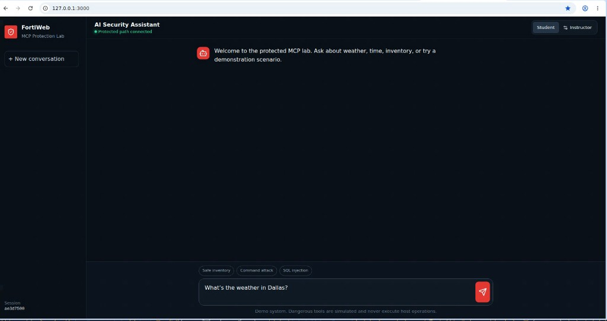
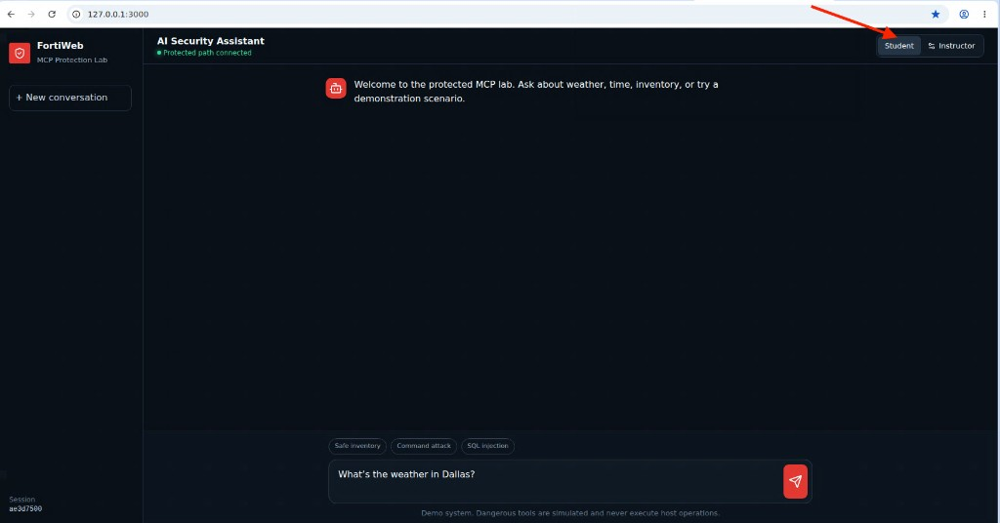
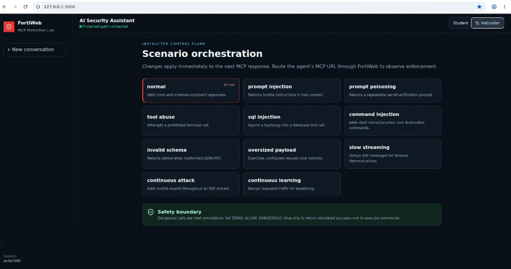
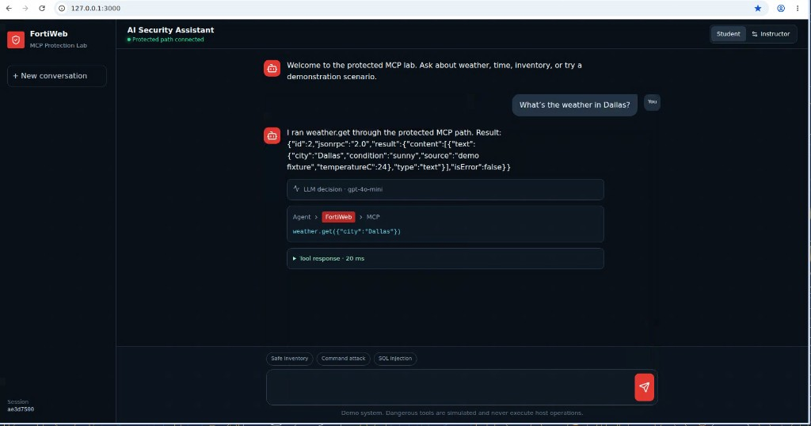
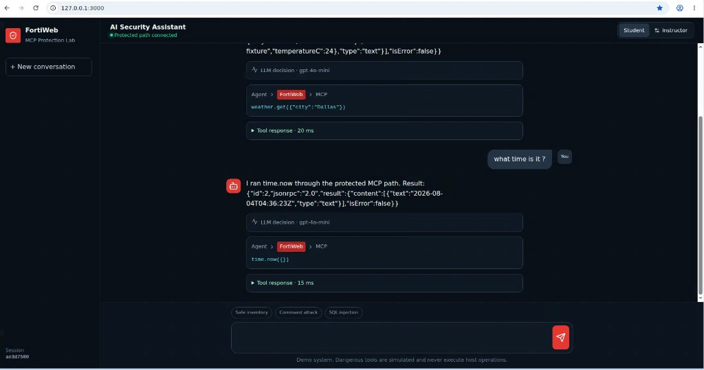
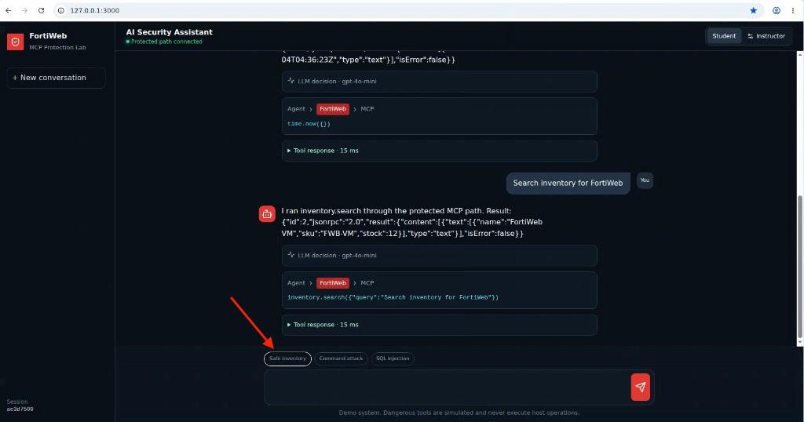
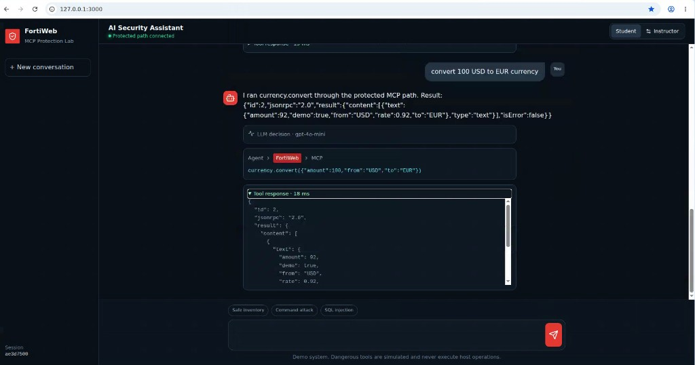
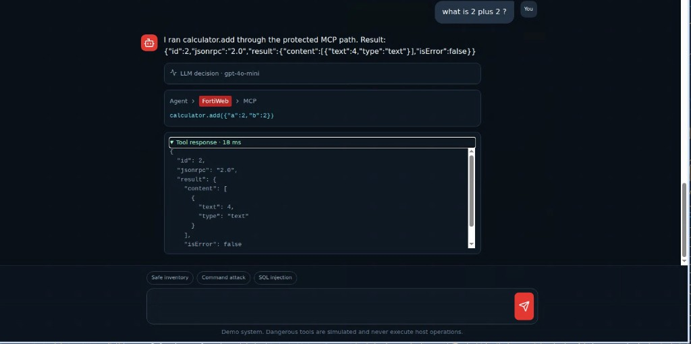
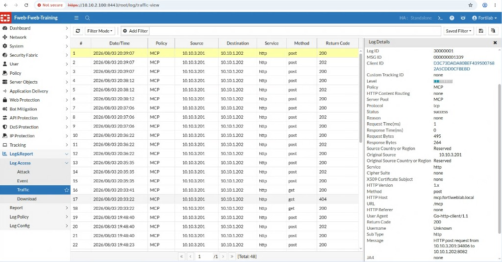
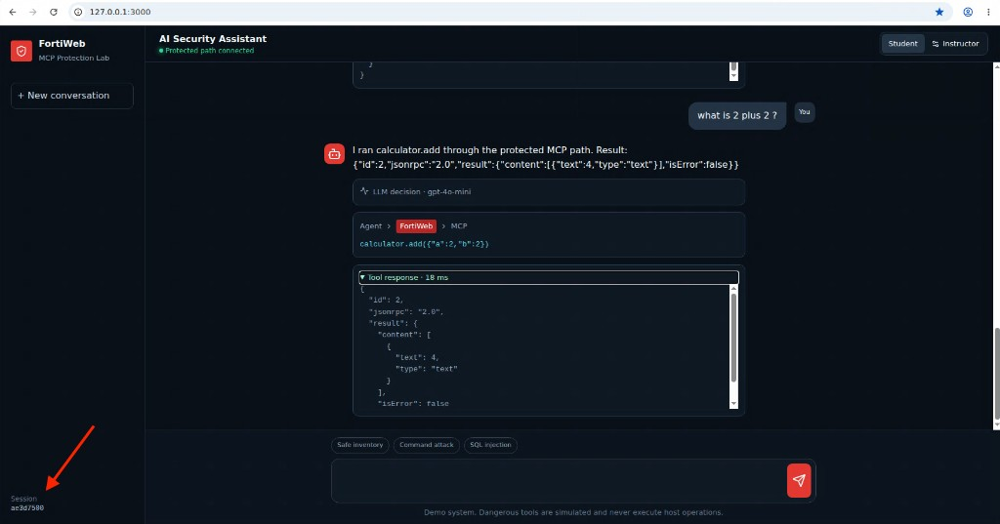

## Exercise 6.2 – Generate Legitimate MCP Traffic

### Objective

Use the **FortiWeb MCP Protection Lab AI Agent** to generate legitimate Model Context Protocol traffic. Confirm that the agent can initialize an MCP session, invoke approved tools, and receive valid responses through FortiWeb.

During this exercise, you will:

* Open the AI Agent student interface
* Set the MCP headend to **normal**
* Submit legitimate natural-language requests
* Observe MCP tool invocation in the GUI (`Agent > FortiWeb > MCP`)
* Confirm successful requests in the FortiWeb Traffic Log

The protected communication path is:

```text
Student Browser
    ↓
AI Agent
    ↓ HTTPS
FortiWeb
    ↓ HTTP
MCP Headend
```

The lab MCP endpoint is:

```text
https://mcp.fortiweblab.local/mcp
```

{}
FortiWeb MCP Security does not require a learning phase. Inspection begins as soon as the MCP Security Policy is assigned to the Web Protection Profile used by the active server policy.
{}

### Prerequisites

Before beginning, confirm that:

* The MCP headend is running and healthy
* The AI Agent and web interface are running
* `mcp.fortiweblab.local` resolves to the FortiWeb virtual-server address
* The FortiWeb MCP server policy is enabled
* The MCP Security Policy is assigned to the active Web Protection Profile
* Standard Protection signatures are enabled
* The **Instructor** control plane is available in the AI Agent interface

You can verify the protected MCP endpoint from the Guacamole desktop:

```bash
curl https://mcp.fortiweblab.local/healthz
```

The expected response is:

```json
{"mode":"normal","status":"ok"}
```

---

### Step 1 – Open the AI Agent

From the Guacamole desktop, open a browser and navigate to:

```text
http://127.0.0.1:3000
```

The **FortiWeb MCP Protection Lab** interface opens. Confirm the status shows **Protected path connected**.



The header contains two views:

* **Student** — Submit natural-language prompts and inspect MCP tool activity
* **Instructor** — Select the MCP headend scenario (normal or attack demonstrations)

Ensure **Student** is selected before you continue with legitimate prompts.



---

### Step 2 – Select Normal Operation

1. Select **Instructor** in the header.
2. On **Scenario orchestration**, select **normal**.
3. Confirm the card is marked **ACTIVE** (*Valid tools and schema-compliant responses*).
4. Return to **Student**.



**normal** returns valid, deterministic MCP tool responses without deliberately inserting malicious content or protocol errors.

{}
Scenario changes apply immediately to the next MCP response. Route the agent’s MCP URL through FortiWeb to observe enforcement.
{}

---

### Step 3 – Generate a Weather Tool Call

In the Student prompt field, enter:

```text
What's the weather in Dallas?
```

Click **Send**.

The assistant should report that it ran `weather.get` through the protected MCP path. Confirm:

| Field | Expected value |
|-------|----------------|
| Path | `Agent > FortiWeb > MCP` |
| Function call | `weather.get({"city":"Dallas"})` |
| Result | Demonstration weather for Dallas (for example sunny / 24°C) |



Behind the GUI, the agent performs the MCP sequence:

```text
initialize
notifications/initialized
tools/call
```

The MCP headend returns each requested response using JSON-RPC over Streamable HTTP/SSE.

---

### Step 4 – Generate Additional Legitimate Tool Calls

Submit the following prompts one at a time (or use the suggested chips where noted).

**Current time**

```text
What time is it?
```

Expected tool: `time.now`



**Inventory search**

Click **Safe inventory**, or enter:

```text
Search inventory for FortiWeb
```

Expected tool: `inventory.search`



**Currency conversion**

```text
Convert 100 USD to EUR currency
```

Expected tool: `currency.convert`



**Calculator**

```text
What is 2 plus 2?
```

Expected tool: `calculator.add`



For each request, confirm:

* The AI Agent selected a tool
* The path shows **Agent > FortiWeb > MCP**
* The MCP headend returned a result (`isError: false`)
* No FortiWeb block notification appeared
* The final AI response was displayed

{}
The lab uses deterministic tool selection so demonstrations remain repeatable. Suggested chips such as **Safe inventory**, **Command attack**, and **SQL injection** are available for later attack scenarios; use only safe/legitimate prompts in this exercise.
{}

---

### Step 5 – Review FortiWeb Traffic Logs

1. Log in to the FortiWeb administrative interface.
2. Navigate to **Log & Report → Log Access → Traffic**.
3. Refresh the log view.
4. Confirm entries for:

| Field | Typical value |
|-------|----------------|
| Policy | MCP |
| HTTP Host | `mcp.fortiweblab.local` |
| URL | `/mcp` |
| Method | POST (and related GET health checks) |
| Return code | `200` / `202` |
| Destination | `10.10.1.202` (MCP headend) |



A single GUI prompt can produce multiple `/mcp` transactions because the client initializes an MCP session before invoking the selected tool.

Expected MCP methods include:

* `initialize`
* `notifications/initialized`
* `tools/call`

---

### Step 6 – Correlate the GUI and FortiWeb Logs

In the AI Agent sidebar, locate the **Session** identifier (lower left).



Compare:

* The approximate request time in the GUI
* The source address in FortiWeb (for example `10.10.3.201`)
* The destination server pool **MCP**
* The host `mcp.fortiweblab.local`
* The URL `/mcp`
* The HTTP method `POST`
* The return code

This correlation demonstrates that every visible tool call traverses the protected FortiWeb path.

---

### Expected Results

| Test | Expected MCP tool | Expected result |
|------|-------------------|-----------------|
| Weather in Dallas | `weather.get` | Allowed |
| Current time | `time.now` | Allowed |
| Inventory search | `inventory.search` | Allowed |
| Currency conversion | `currency.convert` | Allowed |
| Calculator | `calculator.add` | Allowed |

Legitimate MCP requests should normally succeed while the MCP Security Policy remains active.

---

### Troubleshooting

If the GUI reports a connection error:

* Confirm the headend health:

  ```bash
  curl https://mcp.fortiweblab.local/healthz
  ```

* Confirm the AI Agent health:

  ```bash
  curl http://127.0.0.1:8088/healthz
  ```

* Confirm MCP tool access through the agent:

  ```bash
  curl http://127.0.0.1:8088/api/tools
  ```

* Review the agent logs:

  ```bash
  docker compose logs --tail=100 agent
  ```

* Confirm the FortiWeb certificate is trusted by the AI Agent container.
* Confirm the MCP rule matches host `mcp.fortiweblab.local` and URL `/mcp`.

---

### Verification Checklist

* Opened the AI Agent interface (`http://127.0.0.1:3000`)
* Selected **Instructor → normal** (ACTIVE)
* Successfully invoked `weather.get`
* Successfully invoked `time.now`
* Successfully invoked `inventory.search`
* Observed the **Agent > FortiWeb > MCP** path
* Located successful `/mcp` requests in the FortiWeb Traffic Log
* Confirmed legitimate MCP traffic was allowed

### Next Exercise

In Exercise 6.3, you use the same AI Agent Instructor scenarios to generate command injection, SQL injection, prompt poisoning, malformed JSON-RPC, and oversized MCP response traffic.
