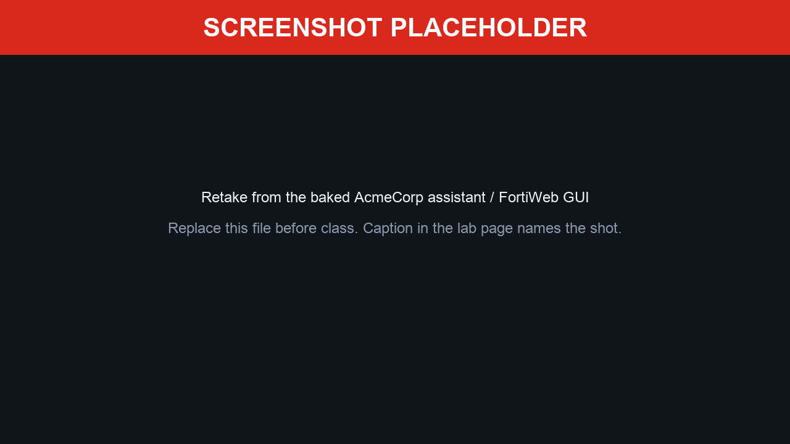

## Exercise 6.3 – Explore Enterprise Tools

### Objective

Inventory what the AI assistant can **discover and invoke**. Students should leave this exercise able to explain, for each tool: name, description, input parameters, returned data, and which enterprise system it would represent in production.

MCP discovery is itself part of the attack surface. `tools/list` tells an agent (or an attacker) what the broker can reach.

{}
Screenshots on this page are **placeholders**. Retake them from the baked AcmeCorp assistant before class.
{}



---

### How to read a tool

For every tool, record:

| Field | Why it matters |
|-------|----------------|
| **Tool name** | What the model will put in `tools/call` |
| **Description** | How the model decides to use it — also a poisoning target |
| **Input parameters** | Where malicious arguments land |
| **Returned data** | What can leak if the call succeeds |

The GUI shows this after a successful call as **Agent > FortiWeb > MCP**, with the function name and JSON result.


---

### Step 1 – List tools from the agent

From Guacamole, either:

```bash
curl -s http://127.0.0.1:3000/api/tools
curl -sk https://mcp.fortiweblab.local/tools
```

The **List MCP tools** chip in the assistant sends `tools/list` over Streamable HTTP through FortiWeb.

If the agent API is unavailable, use the Student UI: send a prompt such as `What can you help me with?` and note every tool name that appears in the activity pane.

Copy the advertised names into the table in Step 3.

---

### Step 2 – Think in enterprise systems

The lab assistant advertises **enterprise** tools (wiki, CRM, tickets, files, cloud), not toy functions. For each tool, ask which production system it would represent if this were a real company assistant.

#### AcmeCorp AI Assistant — catalog

| Tool | Enterprise system | Description | Typical inputs | Typical returned data |
|------|-------------------|-------------|----------------|------------------------|
| `kb.search` | Knowledge base / wiki | Search internal documentation | `query`, `space` | Document titles, snippets, links |
| `repo.search` | GitHub / GitLab | Search source code | `repo`, `query` | File path, snippet, commit |
| `db.query` / `crm.lookup` | Database / CRM | Retrieve a customer record | `customer_id` | Name, account, notes |
| `tickets.get` / `tickets.create` | ITSM | Read or open a support ticket | `ticket_id` or `summary` | Ticket number, status |
| `automation.run` | Ops / CI runbooks | Run an approved job by name | `job` | Job status (stubbed; never executes) |
| `docs.read` | Document repository | Read an internal document | `doc_id` or `path` | Document body |
| `files.get` | File / engineering repo | Retrieve an engineering file | `path` | File metadata / content |
| `pricing.get` | Pricing database | Retrieve product pricing | `sku` | Price, currency, discount |
| `hr.policy.search` | HR handbook | Search employee policy | `query` | Policy section |
| `cloud.inventory` | Cloud account | List cloud assets | `account`, `region` | Resource IDs, tags |
| `admin.exportDatabase` | Administrative platform | Privileged export (should be denied) | none / `confirm` | Must not succeed for students |

{}
Privileged tools such as `admin.deleteAllUsers`, `admin.exportDatabase`, and `admin.resetPasswords` are **unauthorized** in this lab. Exercise 6.5 uses them only as invalid/unauthorized MCP methods so FortiWeb can demonstrate a deny. They must not execute host operations.
{}

---

### Step 3 – Map the running lab tools

Fill this table from Step 1. Use the current lab names on the left and the closest AcmeCorp analogue on the right.

| Lab tool (from `/api/tools` or GUI) | Parameters you observed | Returned data you observed | Enterprise system |
|-------------------------------------|-------------------------|----------------------------|-------------------|
| `kb.search` | | | Knowledge base / wiki |
| `crm.lookup` | | | CRM |
| `tickets.create` | | | ITSM |
| `files.get` | | | File / engineering repo |
| `cloud.inventory` | | | Cloud account |
| `automation.run` | | | Ops runbooks |
| _(add any others)_ | | | |

Also note any **dangerous-looking** names the broker advertises (for example `automation.run`, `admin.exportDatabase`). Those are the MCP-layer equivalents of admin or data-plane tools.

---

### Step 4 – Why tool metadata is sensitive

If the description of `crm.lookup` says “returns full customer record including internal notes and API keys,” the model is more likely to call it when a user asks for “everything about this customer.”

That is **tool poisoning** when the description is malicious, and **excessive capability advertising** even when it is merely sloppy. Exercise 6.5 demonstrates both.

```text
tools/list  →  model reads names + descriptions + schemas
                 ↓
            model chooses a tool
                 ↓
            tools/call  →  FortiWeb  →  MCP  →  enterprise system
```

---

### Verification Checklist

* Retrieved the live tool list from the agent or GUI
* Recorded name, parameters, and result shape for at least four tools
* Mapped each lab tool to an enterprise system
* Can explain why `tools/list` itself expands the attack surface

### Next Exercise

In Exercise 6.4 you generate **legitimate** MCP traffic that looks like normal assistant work, then prove those calls in the FortiWeb Traffic Log.
