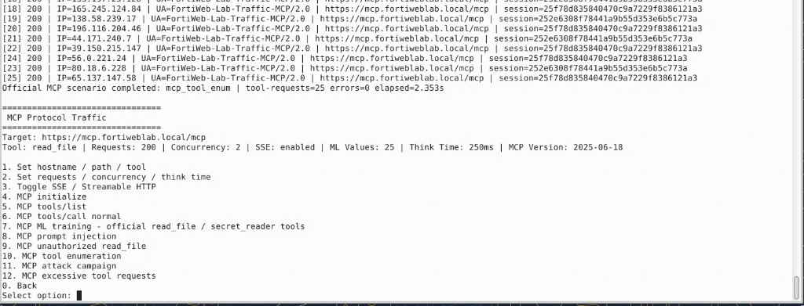

## Exercise 6.3 – Launch MCP Attacks

### Objective

Use the training traffic generator to send MCP-specific attacks to the protected MCP server.

{}
Run this campaign only against the lab MCP service. Do not target systems outside the training environment.
{}

### Step 1 – Launch the Traffic Generator

From the Guacamole terminal, run:

```bash
cd ~/fortiweb-lab-traffic
./fortiweb-lab-traffic
```

Select:

```text
3 – MCP Traffic Generator
```


### Step 2 – Run the MCP Attack Campaign

Select:

```text
11 – MCP Attack Campaign
```

The campaign may generate:

* Prompt injection or prompt poisoning
* Unauthorized file-access attempts
* Tool enumeration and invalid tool invocation
* SQL Injection, XSS, and Command Injection in tool parameters
* Malformed JSON-RPC messages
* MCP schema violations


The generator varies payloads and simulated source addresses to produce a broader set of events.

### Step 3 – Confirm Completion

Allow the campaign to finish and review the terminal summary.



### Verification Checklist

* Selected the MCP Traffic Generator
* Ran option 11, MCP Attack Campaign
* Allowed the scenario to complete

### Next Exercise

In Exercise 6.4, you identify signature detections, schema violations, and prompt-poisoning events in the FortiWeb Attack Log.
