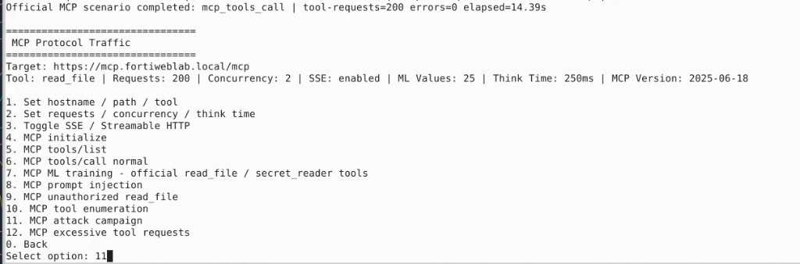

## Exercise 6.3 – Launch MCP Attacks

### Objective

Use the training traffic generator to send MCP-specific attacks to the protected MCP server. The campaign exercises the MCP Security Policy and Inline Standard Protection profile configured in Exercise 6.1.

{}
Run this campaign only against the lab MCP service. Do not target systems outside the training environment.
{}

---

### Step 1 – Open the MCP Traffic Generator

If you are still in the **MCP Protocol Traffic** menu from Exercise 6.2, continue with Step 2.

Otherwise, from the Guacamole desktop, open a terminal and run:

```bash
cd fortiweb-lab-traffic/
./fortiweb-lab-traffic
```

At the FortiWeb Lab Traffic Launcher menu, enter:

```text
3
```

Confirm the target is:

```text
https://mcp.fortiweblab.local/mcp
```

---

### Step 2 – Run the MCP Attack Campaign

From the MCP Protocol Traffic menu, enter:

```text
11
```

Option **11** is:

```text
MCP attack campaign
```



The campaign may generate:

* Prompt injection or prompt poisoning
* Unauthorized file-access attempts
* Tool enumeration and invalid tool invocation
* SQL Injection, XSS, and Command Injection in tool parameters
* Malformed JSON-RPC messages
* MCP schema violations

As the campaign runs, the terminal displays request progress. You may see intermediate scenario completion messages for individual attack types. Many responses may still show `200` in the generator while FortiWeb records `Alert_Deny` in the Attack Log—confirm detections in Exercise 6.4.

{}
Do not close the terminal while the campaign is running.
{}

---

### Step 3 – Confirm Completion

Allow the campaign to finish. When control returns to the MCP Protocol Traffic menu, you should see a completion message similar to:

```text
Official MCP scenario completed: mcp_tool_enum | tool-requests=... errors=0 elapsed=...
```

The exact scenario name may vary depending on which attack types the campaign ran last.


---

### Verification Checklist

* Opened the MCP Protocol Traffic menu (option **3**)
* Selected option **11** – MCP attack campaign
* Allowed the campaign to complete and return to the MCP menu

---

### Next Exercise

In Exercise 6.4, you review FortiWeb Attack Logs for signature detections and other MCP-related events generated by this campaign.
