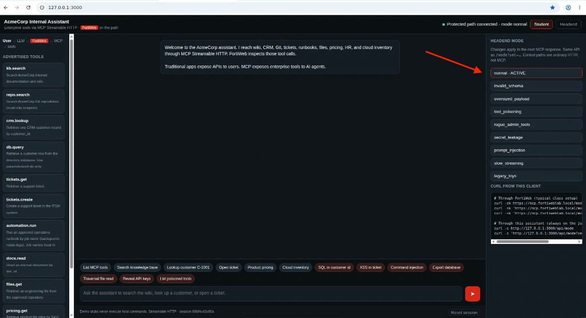
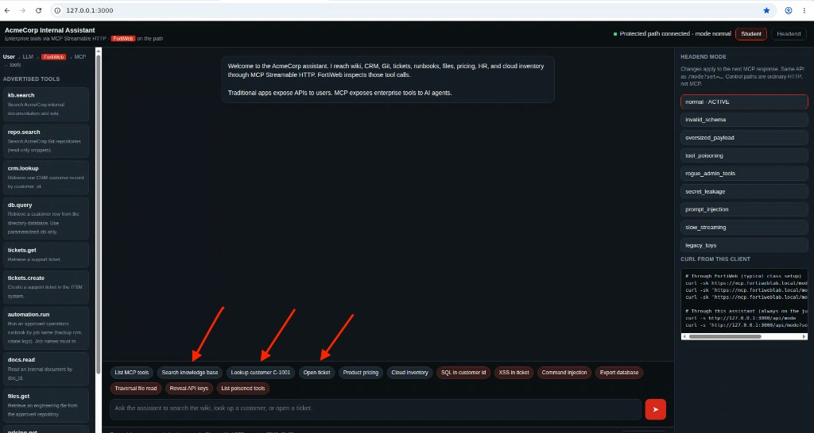
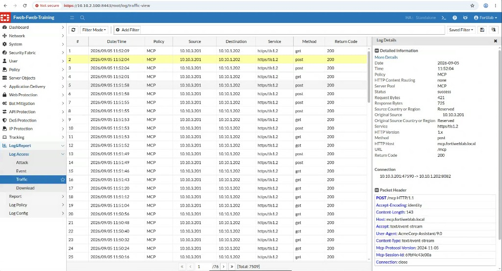

## Exercise 6.4 – Generate Legitimate Enterprise MCP Traffic

### Objective

Generate **normal** AI-to-tool traffic: the assistant discovers tools, invokes approved functions with valid arguments, and FortiWeb allows the calls. You then prove those calls in the Traffic Log.

This baseline is required before Exercise 6.5. Without it you cannot tell a block from a broken lab.

{}
FortiWeb MCP Security does not learn from this traffic. You generate it so **you** can recognize a healthy `/mcp` session (initialize → tools/call, HTTP 200/202) before you send attacks.
{}

---

### Step 1 – Set the broker to normal

1. Open `http://127.0.0.1:3000`.
2. On the **Headend** rail, select **normal** until it shows **ACTIVE**.
3. Stay on **Student**. Confirm the header shows **Protected path connected** and **mode normal**.



---

### Step 2 – Run legitimate workflows

Submit these prompts **one at a time** (chips on the AcmeCorp assistant match the first column). For each, confirm:

* Path shows **Agent > FortiWeb > MCP**
* A tool name and arguments appear
* `isError` is false (or the GUI shows a normal result)
* No FortiWeb block banner

| Business workflow | Student prompt or chip | Typical tool |
|-------------------|------------------------|--------------|
| Tool discovery | **List MCP tools** | `tools/list` |
| Knowledge / wiki search | **Search knowledge base** | `kb.search` |
| CRM lookup | **Lookup customer C-1001** | `crm.lookup` |
| ITSM | **Open ticket** | `tickets.create` |
| Pricing | **Product pricing** | `pricing.get` |
| Cloud | **Cloud inventory** | `cloud.inventory` |

Use the **legitimate** chips on the AcmeCorp assistant, including **Search knowledge base**, **Lookup customer C-1001**, and **Open ticket**. Leave the red attack chips for Exercise 6.5.



Behind each GUI prompt the client typically sends:

```text
initialize
notifications/initialized
tools/call
```

That is why one sentence in the UI can create several Traffic Log rows for `POST /mcp`.

---

### Step 3 – Observe normal traffic in FortiWeb

1. Sign in to FortiWeb.
2. Open **Log & Report → Log Access → Traffic**.
3. Filter or scan for host `mcp.fortiweblab.local` and policy **MCP**.

| Field | Typical legitimate value |
|-------|--------------------------|
| Policy | `MCP` |
| HTTP Host | `mcp.fortiweblab.local` |
| URL | `/mcp` |
| Method | POST |
| Return code | `200` or `202` |
| Destination | `10.10.1.202` |



4. In the assistant sidebar, note the **Session** id and match the time window to the Traffic Log (the packet header also shows `Mcp-Session-Id`).
5. Open **Dashboard → FortiView → MCP Analysis**. Set policy **MCP**, MCP server **All** or `acmecorp-mcp-headend`, last hour. You should see sessions and methods such as `initialize`, `tools/list`, and `tools/call`. Traffic Log Policy = MCP is **not** the same as this dashboard.

Legitimate calls should **not** produce Attack Log **Alert_Deny** rows for these prompts. If they do, stop and tell the instructor—the baseline is dirty.

---

### Expected Results

| Workflow | Allowed through FortiWeb? | Traffic Log | FortiView MCP Analysis |
|----------|---------------------------|-------------|------------------------|
| List MCP tools | Yes | `POST /mcp` 200 | `tools/list` |
| Knowledge / CRM / ticket / cloud | Yes | `POST /mcp` 200 | `tools/call` |

---

### Verification Checklist

* Headend mode is **normal**
* At least three legitimate tool calls succeeded in the GUI
* Located matching **MCP** policy rows in the Traffic Log
* FortiView MCP Analysis shows the MCP server `acmecorp-mcp-headend`
* Confirmed return codes 200/202 and no unexpected Alert_Deny for these prompts

### Next Exercise

In Exercise 6.5 you launch **individual** MCP attacks against the same path and record which FortiWeb engine should fire.
