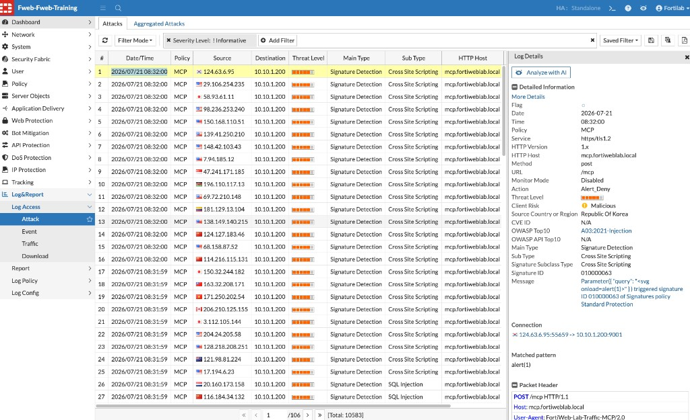
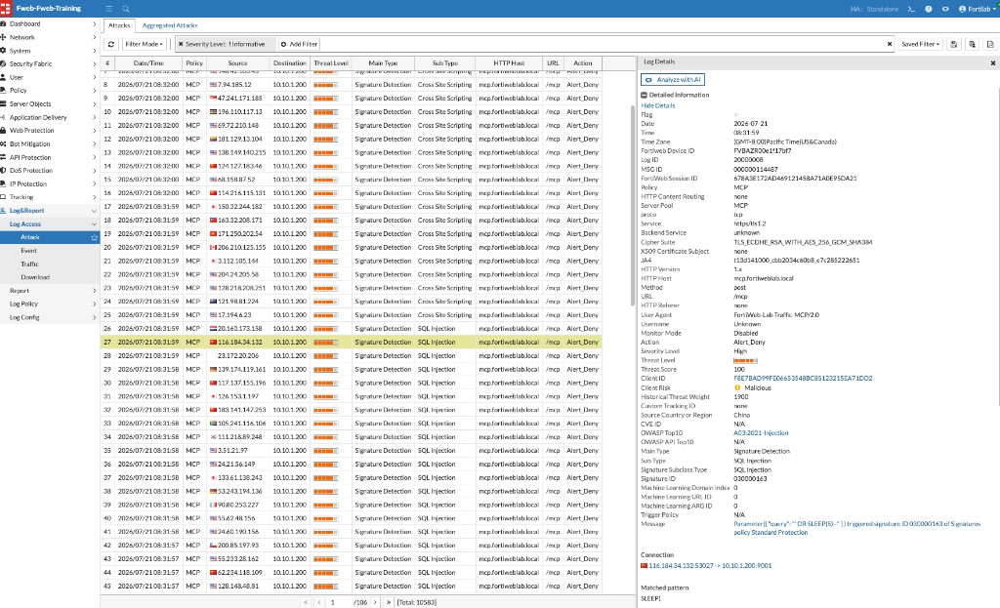

## Exercise 6.4 – Review MCP Attack Logs

### Objective

After the MCP Attack Campaign completes, review FortiWeb Attack Logs to identify how signature-based protection (and other MCP Security layers, when present) detected malicious tool arguments and protocol abuse against `mcp.fortiweblab.local`.

---

### Step 1 – Open the Attack Log

1. Log in to the FortiWeb administrative interface.
2. Navigate to:

   **Log&Report → Log Access → Attack**

3. Optionally filter out Informative events (for example, **Severity Level: ! Informative**).
4. Refresh the view if events do not appear immediately.

Confirm recent entries for the **MCP** policy and host `mcp.fortiweblab.local`.

You should see detections such as:

| Main Type | Example Sub Type |
|-----------|------------------|
| Signature Detection | Cross Site Scripting, SQL Injection |
| MCP / schema or prompt findings | Schema violations or prompt-poisoning events (if present in your run) |

---

### Step 2 – Review a Cross-Site Scripting Detection

1. Select a **Signature Detection** entry with Sub Type **Cross Site Scripting** for host `mcp.fortiweblab.local`.
2. In **Log Details**, confirm fields such as:

| Field | Example lab result |
|-------|--------------------|
| Policy | `MCP` |
| Method / URL | `post` `/mcp` |
| Action | `Alert_Deny` |
| Main Type | Signature Detection |
| Sub Type | Cross Site Scripting |
| User Agent | `FortiWeb-Lab-Traffic-MCP/2.0` |
| OWASP Top10 | `A03:2021-Injection` |

3. Read the **Message** and matched pattern. In this lab example, a JSON parameter such as:

```json
{"query": "<svg onload=alert(1)>"}
```

triggered signature ID `010000063` in the **Standard Protection** signatures policy, with matched pattern `alert(1)`.



{}
Signatures inspect values inside MCP JSON-RPC tool arguments—not only classic form fields. Injection payloads embedded in `query` or similar parameters are still matched.
{}

---

### Step 3 – Review a SQL Injection Detection

1. Select another **Signature Detection** entry with Sub Type **SQL Injection**.
2. In **Log Details**, confirm **Action** is `Alert_Deny` and note the signature ID and matched pattern.

In this lab example, a parameter such as:

```json
{"query": "' OR SLEEP(5)--"}
```

triggered signature ID `030000163`, with matched pattern `SLEEP(`.



#### Consider

Legitimate MCP traffic from Exercise 6.2 used authorized tools and valid arguments and typically returned `200` in the Traffic Log. Attack entries show **Alert_Deny**, high threat scores, and **Client Risk: Malicious**.

---

### Step 4 – Look for Additional MCP Detections (Optional)

If your campaign produced more than classic XSS and SQLi, scan the Attack Log for:

* MCP JSON schema validation failures
* Prompt poisoning / prompt injection findings
* Unauthorized tool access or related MCP Security Policy events

Open any such events and compare the matched protection and message with the Signature Detection examples above.

---

### Verification Checklist

* Opened **Log&Report → Log Access → Attack**
* Located **MCP** policy events for `mcp.fortiweblab.local`
* Reviewed at least one **Cross Site Scripting** entry with `Alert_Deny`
* Reviewed at least one **SQL Injection** entry with `Alert_Deny`
* Noted how attack payloads appeared inside MCP JSON parameters

---

### Reflection Questions

1. Which attacks were detected by signatures inside MCP tool parameters?
2. Which log fields confirm the policy name, host, and that the request was denied?
3. How does detection inside JSON tool arguments differ from classic HTML form inspection?
4. Did your run also show MCP schema or prompt-protection events? If so, how did those messages differ from signature matches?
5. Why must MCP security include authorization and least privilege in addition to protocol and signature inspection?

---

### Chapter Summary

You configured MCP-aware security, generated legitimate MCP traffic, launched an attack campaign, and reviewed FortiWeb detections. The exercises show how FortiWeb extends application protection to AI tool interactions—inspecting MCP JSON-RPC traffic with signatures, prompt protection, and schema validation so that malicious tool arguments can be blocked before they reach the MCP server.
