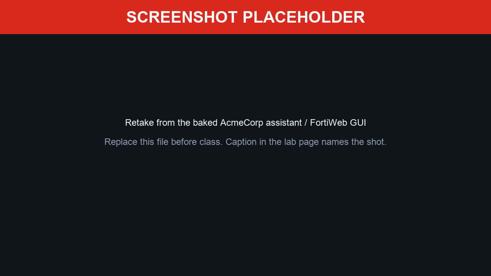
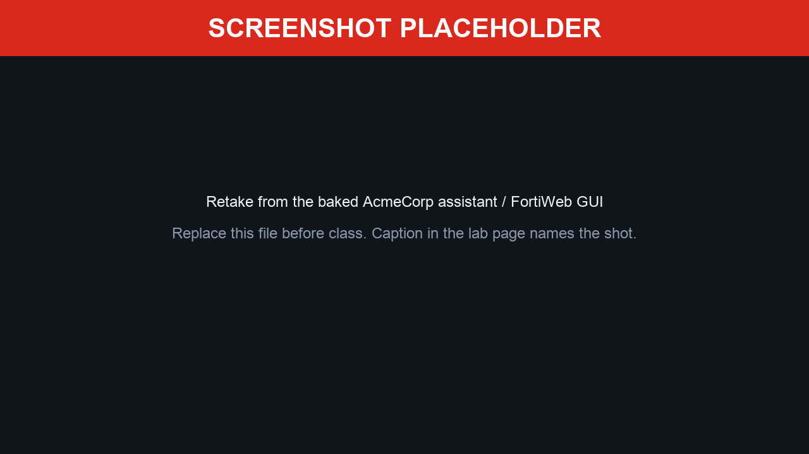
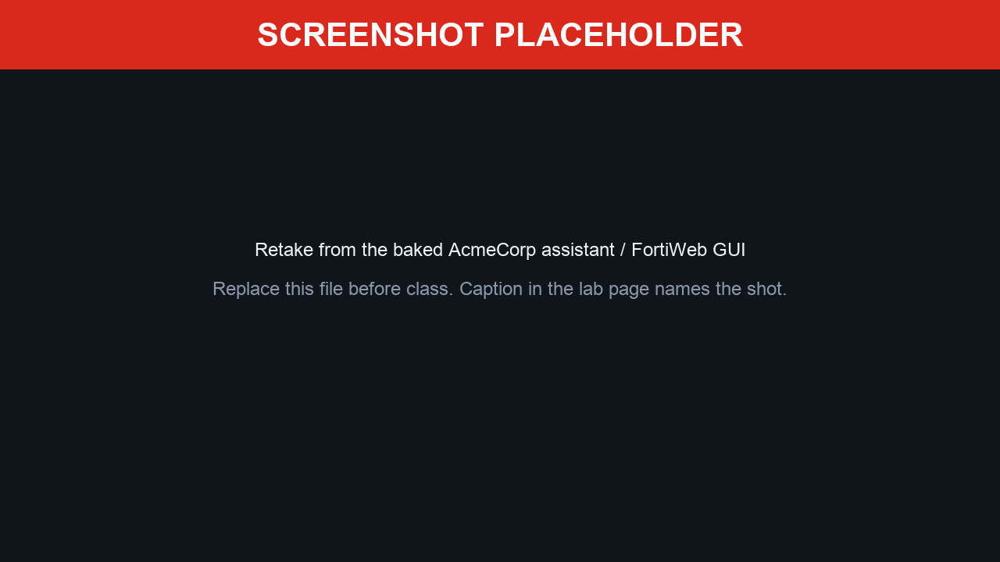

## Exercise 6.6 – Review FortiWeb Detection

### Objective

Prove each Exercise 6.5 demonstration with logs. A GUI banner is not enough. Students should leave able to answer: **which FortiWeb capability detected this, and was the request denied?**

```text
Attack  →  FortiWeb detection  →  log entry  →  blocked or allowed
```

---

{}
Screenshots on this page are **placeholders**. Retake them from FortiWeb Attack Log before class.
{}

### Step 1 – Open Attack Log

**Log & Report → Log Access → Attack**

Optional: **Severity Level: ! Informative**. Refresh if events are delayed.

Filter mentally (or with GUI filters) on:

| Field | Value |
|-------|--------|
| Policy | `MCP` |
| Host | `mcp.fortiweblab.local` |
| URL | `/mcp` |
| Action | typically `Alert_Deny` |

You should see a mix similar to:

| Main Type | Example Sub Type | Maps to exercise |
|-----------|------------------|------------------|
| Signature Detection | SQL Injection | 6.5-1 malicious arguments |
| Signature Detection | Cross Site Scripting | Injection in JSON arguments |
| Signature Detection | Command injection / traversal | 6.5-2, 6.5-7 |
| MCP Violations | MCP Json Schema Validation | 6.5-3 |
| MCP Violations | MCP Security Size Limit | 6.5-3 oversized |
| Poisoning / prompt findings | Tool or prompt text | 6.5-4, 6.5-6, 6.5-8 |



Also open **Dashboard → FortiView → MCP Analysis** (policy **MCP**, MCP server **All** or `acmecorp-mcp-headend`). Attack Log proves the engine and action. FortiView proves FortiWeb **classified** the session as MCP. Traffic Log Policy = MCP only proves the HTTPS server policy matched.

---

### Step 2 – Open a SQL Injection argument event

Select **Signature Detection** / **SQL Injection** for `mcp.fortiweblab.local`.

Confirm:

| Field | Example |
|-------|---------|
| Policy | `MCP` |
| Method / URL | `post` `/mcp` |
| Action | `Alert_Deny` |
| Main Type | Signature Detection |
| Sub Type | SQL Injection |
| Message / pattern | Injection inside a JSON parameter such as `query` or `customer_id` |



{}
Signatures inspect values **inside MCP JSON-RPC arguments**, not only HTML forms. `' OR '1'='1` in `crm.lookup` is still SQL Injection.
{}

---

### Step 3 – Open an XSS or other injection in tool JSON

Select **Cross Site Scripting** (or another injection subtype) and confirm the matched pattern sits in a JSON field, for example:

```json
{"summary": "<svg onload=alert(1)>"}
```



---

### Step 4 – Correlate Traffic Log

**Log & Report → Log Access → Traffic**

For the same timestamps:

* Legitimate 6.4 rows: `200` / `202`
* Denied 6.5 rows: error status or missing backend success, plus a matching Attack Log `Alert_Deny`

Enumeration (`tools/list`) may appear **only** in Traffic Log if it was allowed. That is still a finding: the assistant advertised its control plane.

---

### Step 5 – Complete the evidence table

Copy your 6.5 scorecard and add log IDs or timestamps.

| Attack class | Main Type | Sub Type | Action | Traffic status |
|--------------|-----------|----------|--------|----------------|
| Malicious arguments | | | | |
| Unauthorized tool | | | | |
| Schema / size | | | | |
| Poisoning / prompt | | | | |
| Enumeration | _(often none)_ | | Allow | 200/202 |
| Path traversal / secrets | | | | |

If a class produced **no** Attack Log, say so honestly. That is either “allowed by design” (enumeration) or a demo gap (Exercise 6.5).

---

### Verification Checklist

* Filtered Attack Log to policy **MCP** / host `mcp.fortiweblab.local`
* Opened at least one SQL Injection detail showing a JSON argument
* Opened at least one additional MCP-related event (schema, size, XSS, or poisoning)
* Matched time windows in Traffic Log
* Confirmed the same window in **Dashboard → FortiView → MCP Analysis** (policy **MCP**, server **All**)
* Filled the evidence table, including any allows

### Next Exercise

In Exercise 6.7 you contrast a prompt that only changes the model’s words with an MCP call that would change enterprise state.
