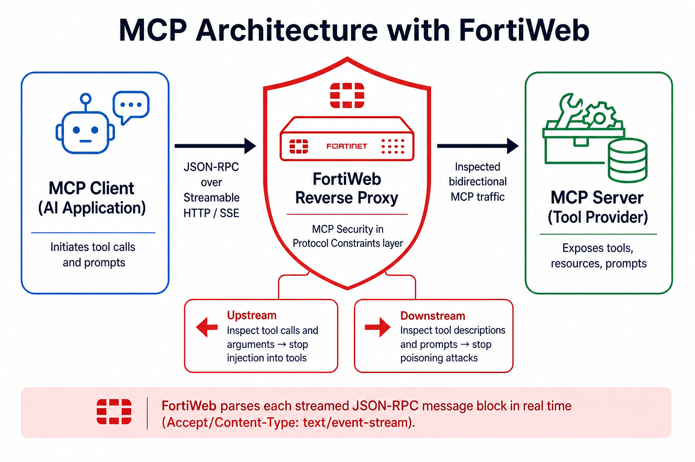
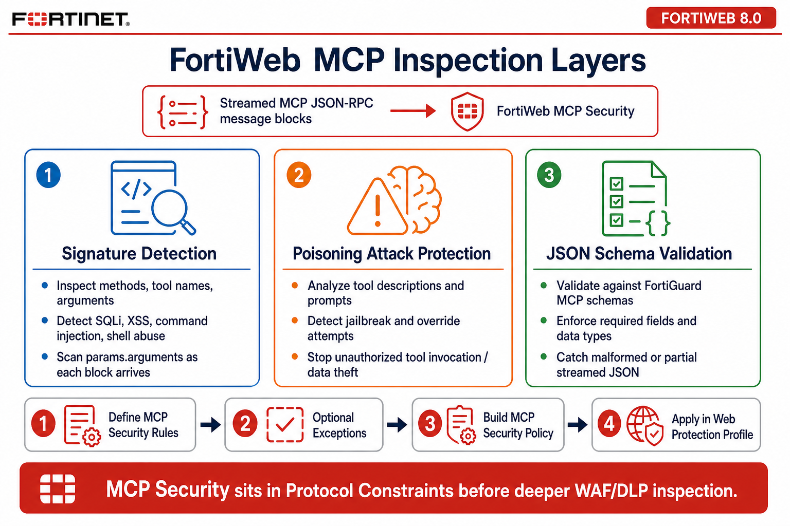

## Objective

Modern AI assistants can retrieve live information, invoke tools, and interact with external systems through the **Model Context Protocol (MCP)**. These capabilities make AI applications more useful, but they also introduce a new attack surface.

In this chapter, you learn how FortiWeb provides protocol-aware protection for MCP-enabled applications. You generate legitimate MCP traffic, configure MCP Security, launch an MCP attack campaign, and analyze the resulting Traffic and Attack Logs.

### Learning Objectives

After completing this chapter, you will be able to:

* Explain the purpose and architecture of MCP
* Describe risks introduced by AI tool invocation
* Configure FortiWeb MCP Security
* Generate legitimate and malicious MCP traffic
* Analyze MCP activity in FortiWeb Traffic and Attack Logs

---

### Understanding the Model Context Protocol

Large Language Models (LLMs) can understand and generate natural language, but they cannot independently query databases, access files, or call enterprise services. MCP is an open protocol that standardizes how AI applications connect to external data and tools.

An MCP deployment normally includes:

| Component | Role |
|-----------|------|
| MCP client | AI assistant or application that initiates requests |
| MCP server | Service that exposes resources and tools |
| Tools | Functions such as reading approved files, querying data, or retrieving information |

MCP commonly carries structured JSON-RPC messages over transports such as Streamable HTTP. Some deployments also use Server-Sent Events (SSE) for streamed server responses.

For additional detail, see [MCP Protocol](https://docs.fortinet.com/document/fortiweb/8.0.5/administration-guide/97697/mcp-protocol) in the FortiWeb 8.0.5 Administration Guide.

### Why MCP Security Matters

MCP tools may expose privileged operations, including file access, database queries, cloud services, internal APIs, and enterprise applications. If an attacker manipulates a prompt or tool argument, the AI application may invoke a tool in an unsafe or unauthorized way.

Relevant threats include:

* Prompt injection and prompt poisoning
* Unauthorized tool invocation and tool enumeration
* Malicious tool arguments
* Command Injection, SQL Injection, and Cross-Site Scripting
* Directory traversal and unauthorized file access
* Malformed JSON-RPC messages and schema violations
* Excessive tool requests and data-exfiltration attempts

{}
MCP-aware inspection complements—not replaces—authorization, least-privilege tool design, input validation, and application-side security controls.
{}

### How FortiWeb Protects MCP Applications

FortiWeb operates as a reverse proxy between the MCP client and MCP server. It sits in the **Protocol Constraints** layer so it can validate Streamable HTTP / Server-Sent Events (SSE) JSON-RPC traffic before deeper WAF or DLP inspection. FortiWeb identifies MCP streams using headers such as `Accept: text/event-stream` or `Content-Type: text/event-stream`, then inspects each message block as it arrives.

It can apply several complementary controls:

#### Signature Detection

Inspects MCP methods, tool names, and parameters—including values in `params.arguments`—for known techniques such as SQL Injection, XSS, Command Injection, and Directory Traversal.

#### Prompt Poisoning Protection

Analyzes prompts, tool descriptions, and tool arguments for instructions designed to override intended behavior, bypass controls, retrieve sensitive information, or trigger unauthorized actions (including jailbreak-style prompts).

#### MCP JSON Schema Validation

Validates streamed JSON-RPC message structure against official MCP schema files from FortiGuard. Malformed messages, missing required fields, or incorrect data types can be rejected before they reach the MCP server.

### Hands-On Tasks

* [Exercise 6.1 – Generate Legitimate MCP Traffic](6.1_Generate_Legitimate_MCP_Traffic/)
* [Exercise 6.2 – Configure MCP Security](6.2_Configure_MCP_Security/)
* [Exercise 6.3 – Launch MCP Attacks](6.3_Launch_MCP_Attacks/)
* [Exercise 6.4 – Review MCP Attack Logs](6.4_Review_MCP_Attack_Logs/)

### Key Takeaways

* MCP introduces tool-specific risks beyond conventional web requests
* FortiWeb combines protocol validation, prompt protection, and signatures
* Traffic and Attack Logs provide visibility into normal and malicious MCP activity
