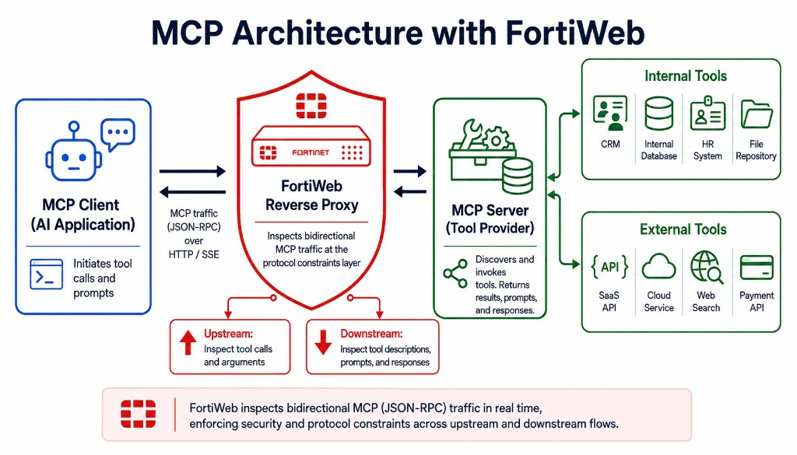
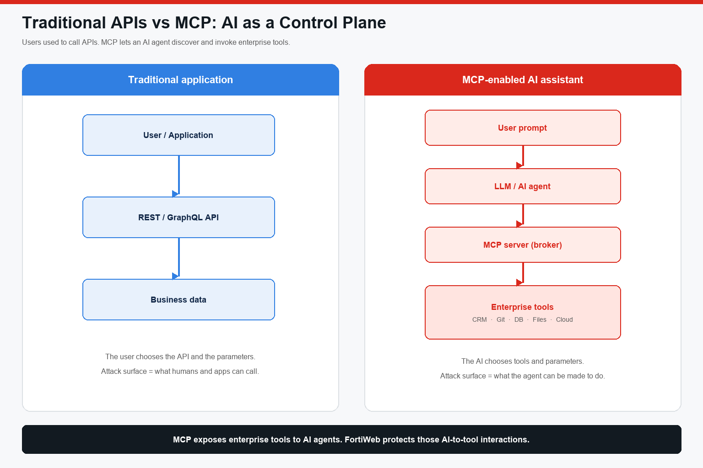
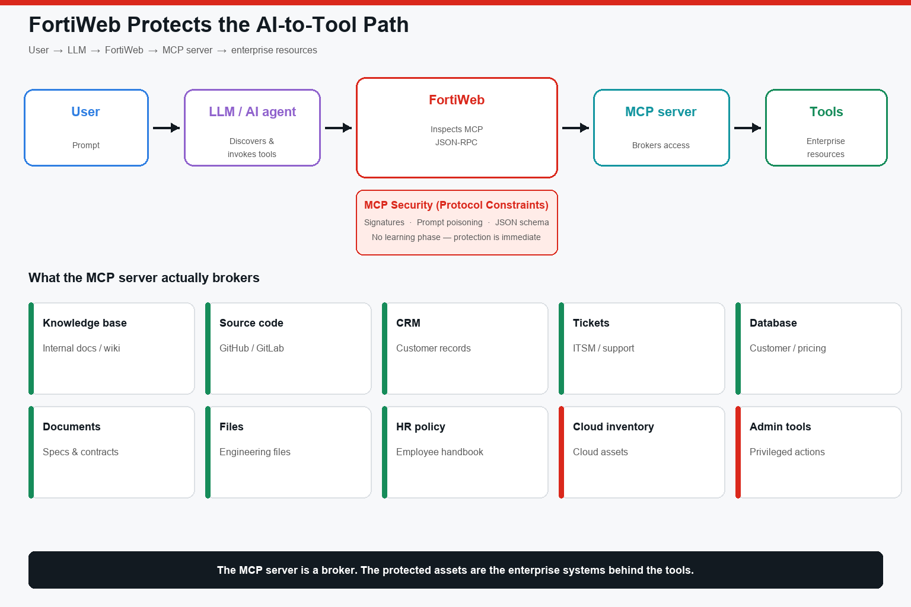
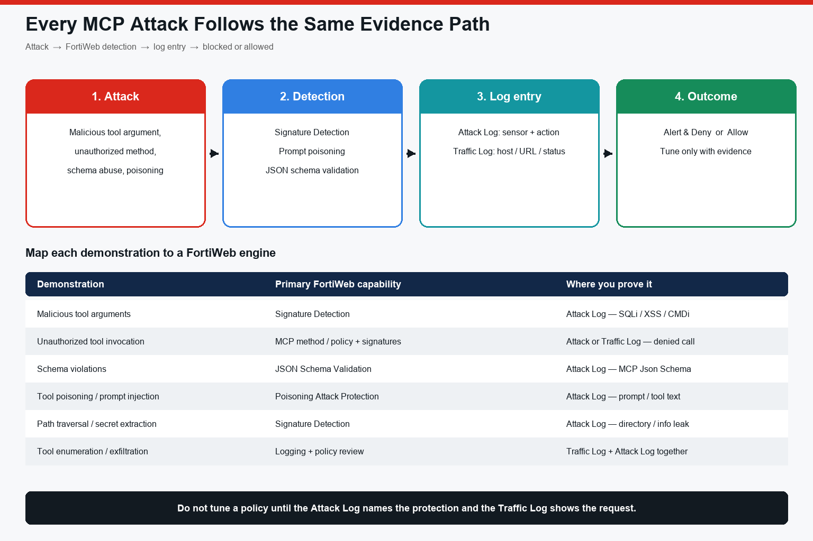
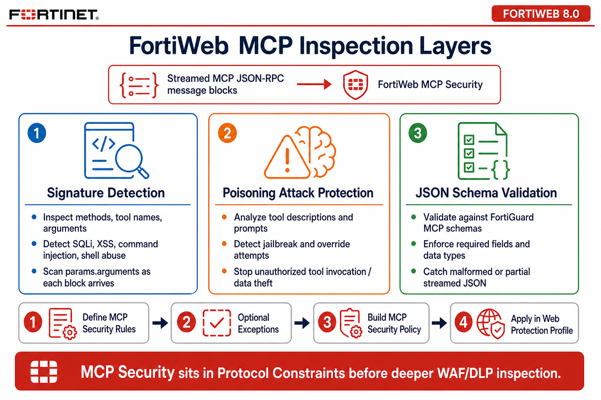

## Objective

Traditional applications expose APIs to users. MCP exposes enterprise tools to AI agents. FortiWeb protects the interactions between those agents and the tools they invoke.

In this chapter, you will treat the Model Context Protocol as an **AI control plane**. You will examine how an LLM discovers tools, interprets their descriptions and schemas, invokes them, and receives structured data from enterprise systems that were never designed for chatbot access. You will then configure FortiWeb MCP Security, explore the lab assistant’s available tools, generate legitimate enterprise traffic, launch targeted MCP attacks, and verify each detection in the Attack, Traffic, and FortiView MCP Analysis logs.

The class path is the **AcmeCorp Internal Assistant** at `http://127.0.0.1:3000` (Guacamole Desktop) talking **Streamable HTTP** through FortiWeb to the MCP headend on linux-docker-2 :8082.

{}
FortiWeb only classifies a request as MCP when it is Streamable HTTP / SSE: `Accept: text/event-stream` or `Content-Type: text/event-stream`, with JSON-RPC carried as SSE `data:` frames. A plain `application/json` POST to `/mcp` is treated as a normal HTTPS traffic. 
{}

### Learning Objectives

After completing this chapter, you will be able to:

* Explain the purpose and architecture of MCP, and why it changes the attack surface versus user-facing REST APIs
* Describe MCP as a broker in front of CRM, Git, databases, files, cloud, and admin tools
* Distinguish a **prompt attack** (what the AI thinks) from an **MCP attack** (what the AI does)
* Place FortiWeb MCP Security and FortiAIGate on the AI stack and explain what each inspects
* Configure FortiWeb MCP Security (rule, policy, Web Protection Profile, server policy)
* Generate legitimate MCP traffic and locate it in the Traffic Log and FortiView MCP Analysis
* Launch individual MCP attacks and map each one to a FortiWeb engine
* Use Attack Log, Traffic Log, and FortiView together to prove block versus allow

---

## Understanding the Model Context Protocol

Large Language Models (LLMs) understand and generate natural language, but they cannot independently query databases, access files, or call enterprise services. MCP is an open protocol that standardizes how AI applications connect to external data and tools.

An MCP deployment normally includes:

| Component | Role |
|-----------|------|
| MCP client | AI assistant or application that initiates requests |
| MCP server | Service that exposes resources and tools (a **broker**, not the system of record) |
| Tools | Functions such as looking up a customer, opening a ticket, or reading an approved file |

MCP carries structured JSON-RPC over **Streamable HTTP**. FortiWeb identifies those streams from `Accept: text/event-stream` or `Content-Type: text/event-stream`, then inspects each message block as it arrives.



For protocol detail, see [MCP Protocol](https://docs.fortinet.com/document/fortiweb/8.0.7/administration-guide/97697/mcp-protocol) in the FortiWeb 8.0.7 Administration Guide.

---

## The Central Message

```text
Traditional applications expose APIs to users.
MCP exposes enterprise tools to AI agents.
FortiWeb protects those AI-to-tool interactions.
```

A REST API is usually called by a person, a mobile app, or another service that already knows the URL, method, and parameters.

MCP adds a structured control plane so an AI agent can:

* **Discover** available tools (`tools/list`)
* **Read** tool names, descriptions, and JSON schemas
* **Select** which tool to invoke
* **Invoke** the tool with arguments (`tools/call`)
* **Receive** structured results and feed them back into the model

The MCP server does not *own* the crown jewels. It **brokers** access to them.

| Protected asset | Example tool the AI might invoke |
|-----------------|----------------------------------|
| Internal document repositories | `docs.read`, `files.get` |
| Corporate knowledge bases / wiki | `kb.search` |
| Source code (GitHub / GitLab) | `repo.search` |
| CRM systems | `crm.lookup` |
| Ticketing / ITSM | `tickets.create`, `tickets.get` |
| Databases | `db.query`, `pricing.get` |
| Cloud resources | `cloud.inventory` |
| Automation / admin platforms | `admin.exportDatabase`, `automation.run` |

If an attacker can influence tool choice, arguments, or returned data, they are no longer “hacking a chatbot.” They are steering an agent that can reach those systems.



---

## Why MCP Changes the Attack Surface

### Traditional applications

```text
User / app  →  REST API  →  business data
```

The caller chooses the endpoint and the parameters. The attack surface is “what humans and apps are allowed to call.”

### MCP-enabled assistants

A user types natural language. The **model** decides what happens next:

```text
User prompt
    ↓
LLM / AI agent     discovers, selects, invokes tools
    ↓
FortiWeb           inspects MCP JSON-RPC (this lab)
    ↓
MCP server         brokers the call
    ↓
Enterprise tools   CRM, Git, DB, files, cloud, admin
```

An attacker can try to influence **which tools** the AI chooses, **what parameters** are sent, **which data** is returned, and **whether secrets** appear in the result.

Relevant threats include:

* Prompt injection and prompt poisoning
* Unauthorized tool invocation and tool enumeration
* Malicious tool arguments (SQL injection, XSS, command injection, path traversal)
* Malformed JSON-RPC and schema violations
* Excessive tool requests and data-exfiltration attempts



{}
MCP aware inspection complements but does not replace, authorization, least-privilege tool design, input validation, and application side security controls.
{}

---

## Prompt Attack vs MCP Attack

Hold this distinction for the entire chapter.

| | Prompt attack | MCP attack |
|---|---|---|
| Goal | Manipulate what the AI **thinks** | Manipulate what the AI **does** |
| Typical content | “Ignore previous instructions…” | `crm.lookup(customer_id="' OR '1'='1")` |
| Layer | Model / conversation | Tool call, schema, metadata, JSON-RPC |
| Impact if it succeeds | Misleading answer, leaked system prompt | Query, file read, ticket create, export, admin action |
| FortiWeb role | Poisoning protection on prompt/tool text | Signatures, schema validation, method inspection, logs |

A prompt attack may still lead to an MCP attack. FortiWeb’s job on this path is to inspect the **tool interaction**, so a compromised prompt cannot silently become a privileged enterprise call.


---

## How FortiWeb Protects the AI to Tool Path

FortiWeb is a reverse proxy between the MCP client (the AI agent) and the MCP server (the tool broker). MCP Security sits in the **Protocol Constraints** layer.

{}
Unlike Machine Learning Anomaly Detection and ML-based API Protection, **MCP Security does not require a learning phase**. Protection starts as soon as the MCP Security Policy is applied to the Web Protection Profile on the MCP server policy.
{}

| FortiWeb capability | What it inspects on this path |
|---------------------|-------------------------------|
| Signature Detection | Methods, tool names, and `params.arguments` for SQLi, XSS, command injection, path traversal. In FortiWeb 8.0.7 this is enabled under **Signature Detection → MCP** on the Web Protection Profile. |
| Poisoning Attack Protection | Prompts, tool descriptions, and arguments for jailbreak / override / secret-harvesting text |
| JSON Schema Validation | Streamed JSON-RPC against FortiGuard MCP schemas (structure, types, required fields) |
| FortiView MCP Analysis | MCP sessions, methods, topology, and violations **after** Streamable HTTP is classified |
| Attack Log | Which engine fired, action, host, URL, matched pattern |
| Traffic Log | Whether `/mcp` reached FortiWeb and what status returned (HTTPS evidence, not MCP classification) |

Every demonstration in this chapter follows the same evidence path:

```text
Attack  →  FortiWeb detection  →  log entry  →  blocked or allowed
```





---

## FortiAIGate vs FortiWeb MCP Protection

This lab focuses on configuring **FortiWeb**. **FortiAIGate** is a separate Fortinet product and is not deployed in this environment. However, you should understand the role of each product so you can explain why a web application firewall (WAF) and an LLM gateway provide distinct security controls.

[FortiAIGate](https://www.fortinet.com/products/fortiaigate) is an **LLM / AI runtime security gateway**. FortAigate is deployed **between the application and the model**. It applies natural-language guardrails on prompts and completions, steers LLM traffic, tracks token cost, and can inspect MCP-related risks on that AI path (prompt injection, jailbreak, data leakage, excessive consumption, MCP tool scanning).

**FortiWeb MCP Security** is a **protocol inspection** control on the **agent-to-tool** hop. It sits in Protocol Constraints, identifies Streamable HTTP / SSE, and validates JSON-RPC tool discovery and tool calls before they reach CRM, Git, files, or admin APIs.

```text
User
  ↓  natural language
App / AI agent
  ↓  prompts and model output          ← FortiAIGate (LLM gateway; not in this lab)
LLM
  ↓
AI agent (tool client)
  ↓  Streamable HTTP MCP JSON-RPC      ← FortiWeb MCP Security (this lab)
FortiWeb
  ↓
MCP server (broker)
  ↓
Enterprise tools (CRM, Git, DB, files, cloud)
```

| | FortiWeb MCP Security (this lab) | FortiAIGate |
|---|---|---|
| Product type | Web application firewall / protocol inspection | LLM security gateway |
| Where it sits | Between the **MCP client** and the **MCP server** | Between the **app / agent** and the **model** |
| What it understands | Streamable HTTP, SSE, JSON-RPC, MCP methods and `params.arguments` | Natural-language prompts and responses, LLM traffic, token usage |
| Primary job | Stop malicious **tool calls** (injection, schema abuse, poisoned descriptions) from reaching enterprise systems | Stop **model manipulation** (prompt injection, jailbreak, PII leak, over-consumption) and govern LLM use |
| Typical evidence | Attack Log, Traffic Log, FortiView **MCP Analysis** | Prompt/response audit, LLM OWASP mapping, usage and cost |
| Learning phase | None | N/A (runtime guardrails) |
| In this lab? | Yes — policy **MCP** on `mcp.fortiweblab.local` | No |

They are complementary:

* FortiAIGate answers: “Is this a safe thing to **say to / hear from** the model?”
* FortiWeb MCP Security answers: “Is this a safe thing for the agent to **do** through MCP?”

A jailbroken model without access to tools poses a content risk. Give that same model access to tools such as `crm.lookup` or `admin.exportDatabase`, and it becomes a data-plane risk. This chapter focuses on the latter.
---

## Lab Flow

The assistant and MCP headend are already running on Guacamole Desktop and the application Server. In this lab, you will configure FortiWeb and then interact with the assistant.

| Exercise | Focus |
|----------|--------|
| [6.1 – Configure MCP Security](6.1_Configure_MCP_Security/) | Rule, policy, Web Protection Profile, server policy (8.0.7) |
| [6.2 – Open the assistant](6.2_Confirm_MCP_Path_and_Open_the_Assistant/) | Confirm FortiWeb is on the path |
| [6.3 – Explore enterprise tools](6.3_Explore_Enterprise_Tools/) | Tool name, description, schema, returned data |
| [6.4 – Generate legitimate enterprise MCP traffic](6.4_Generate_Legitimate_Enterprise_Traffic/) | Normal workflows, Traffic Log, FortiView |
| [6.5 – Launch individual MCP attacks](6.5_Launch_MCP_Attacks/) | Arguments, methods, schema, poisoning, injection, traversal |
| [6.6 – Review FortiWeb detection](6.6_Review_FortiWeb_Detection/) | Map each attack to a log entry |
| [6.7 – Compare prompt attacks vs MCP attacks](6.7_Prompt_Attacks_vs_MCP_Attacks/) | Thought vs action |

### Key Takeaways

* MCP is an AI control plane in front of enterprise resources, not “just JSON-RPC”
* The MCP server brokers tools; the protected assets are CRM, Git, files, databases, cloud, and admin systems
* Prompt attacks change what the model thinks; MCP attacks change what the model does
* FortiWeb inspects the agent-to-tool channel immediately—no ML learning window
* FortiAIGate inspects the agent-to-model channel; it is not a substitute for FortiWeb on `/mcp`
* A detection is not proven until Attack Log and FortiView MCP Analysis tell the same story as the tool call
