## Exercise 7.1 – Configure Bot Mitigation for Juice Shop

### Objective

Configure FortiWeb Bot Mitigation for Juice Shop: biometrics-based detection, threshold-based detection, known bots, a combined Bot Mitigation Policy, a dedicated Web Protection Profile, content-routing assignment on the `juiceshop-DVWA` server policy, and ML-based Bot Detection on that policy.

{}
Lab thresholds and timers are intentionally aggressive so detections appear during class. Production values must reflect normal traffic and capacity.
{}

---

### Step 1 – Create Biometrics-Based Detection

1. Navigate to:

   **Bot Mitigation → Biometrics Based Detection**

2. Click **+ Create New**.

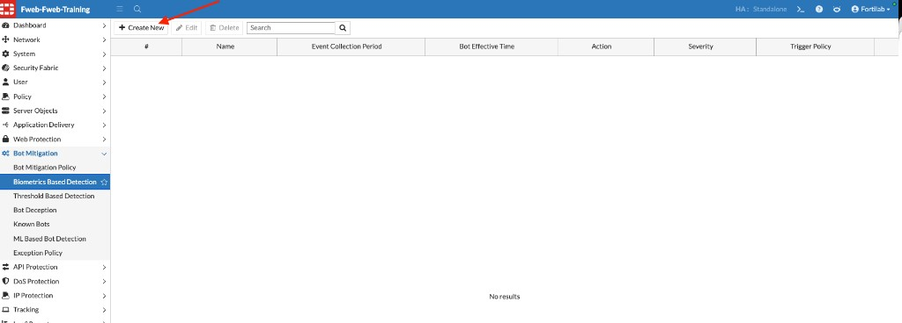

3. Configure the rule as follows:

| Setting | Value |
|---------|-------|
| Name | `juiceshop` |
| Mouse Movement | Enabled |
| Click | Enabled |
| Keyboard | Enabled |
| Page Focus / Screen Touch / Scroll | Leave disabled |
| Bot Trait Checking | Off |
| Event Collection Period | `15` Seconds |
| Report Waiting Time | `10` Seconds |
| Bot Effective Time | `5` Minutes |
| Action | `Alert & Deny` |
| Severity | `Low` |

Leave **Trigger Policy** and **Exception** empty unless your instructor provides values.

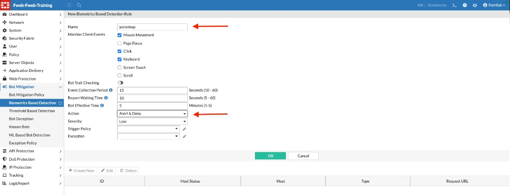

4. Click **OK**.

Biometric detection uses client-side interaction signals (mouse, click, keyboard) to help distinguish human browsing from automated tools.

---

### Step 2 – Create Threshold-Based Detection

1. Navigate to:

   **Bot Mitigation → Threshold Based Detection**

2. Click **+ Create New**.

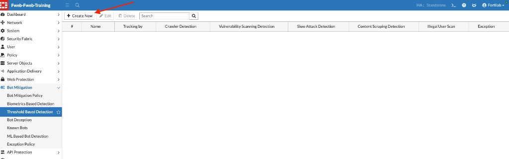

3. Configure:

| Setting | Value |
|---------|-------|
| Name | `juiceshop` |
| Tracking by | `Client ID` |

4. Enable the following detections:

| Detection | Occurrence / timing | Action | Severity |
|-----------|---------------------|--------|----------|
| Crawler Detection | `100` within `10` seconds | Alert & Deny | Medium |
| Vulnerability Scanning Detection | `100` within `10` seconds | Alert & Deny | Medium |
| Slow Attack Detection | HTTP Transaction Timeout `60`; Packet Interval Timeout `10`; `5` occurrences within `100` seconds | Alert & Deny | Medium |
| Content Scraping Detection | `100` within `30` seconds | Alert & Deny | Medium |

Leave **Illegal User Scan** and **Bot Confirmation** disabled for this lab.

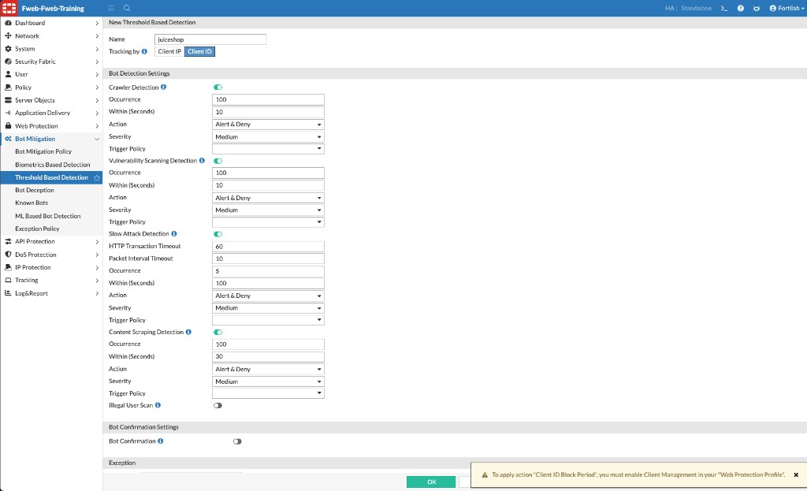

{}
If FortiWeb displays a warning about **Client ID Block Period**, Client Management must be enabled in the Web Protection Profile before that action type can be applied. This lab uses **Alert & Deny**.
{}

5. Click **OK**.

---

### Step 3 – Configure Known Bots

1. Navigate to:

   **Bot Mitigation → Known Bots**

2. Click **+ Create New**.

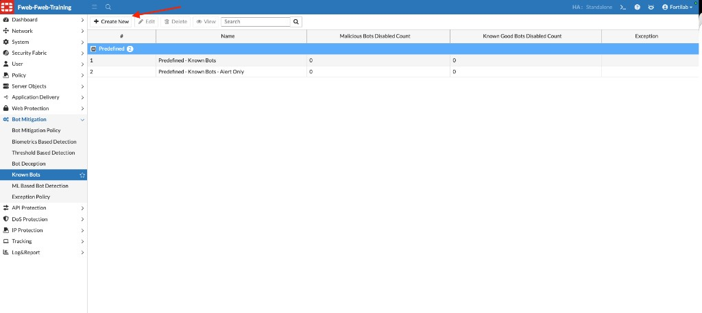

3. Set **Name** to `juiceshop`.

4. Under **Malicious Bots**, enable each category and set:

| Category | Action | Block Period | Severity |
|----------|--------|--------------|----------|
| DoS | Alert & Deny | `600` Seconds | High |
| Spam | Alert & Deny | `600` Seconds | High |
| Trojan | Alert & Deny | `600` Seconds | High |
| Scanner | Alert & Deny | `600` Seconds | High |
| Crawler | Alert & Deny | `600` Seconds | High |

5. Under **Known Good Bots**, enable each category and set **Action** to `Bypass` with **Severity** `Informative`:

* Known Search Engines
* Marketing
* Page Preview
* Monitor
* Feed Fetcher
* AI Crawler

6. Leave **Likely Good Bots** disabled.

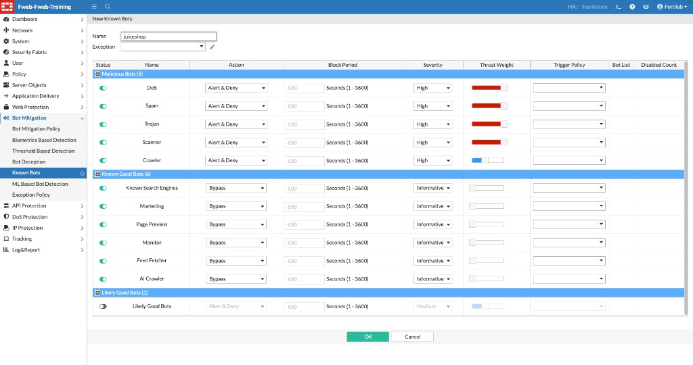

7. Click **OK**.

{}
Bypass trusted bots only when their identity can be validated and their access is appropriate for the application. Blocking known-good search engines can harm site ranking and visibility.
{}

---

### Step 4 – Create the Bot Mitigation Policy

1. Navigate to:

   **Bot Mitigation → Bot Mitigation Policy**

2. Click **+ Create New**.

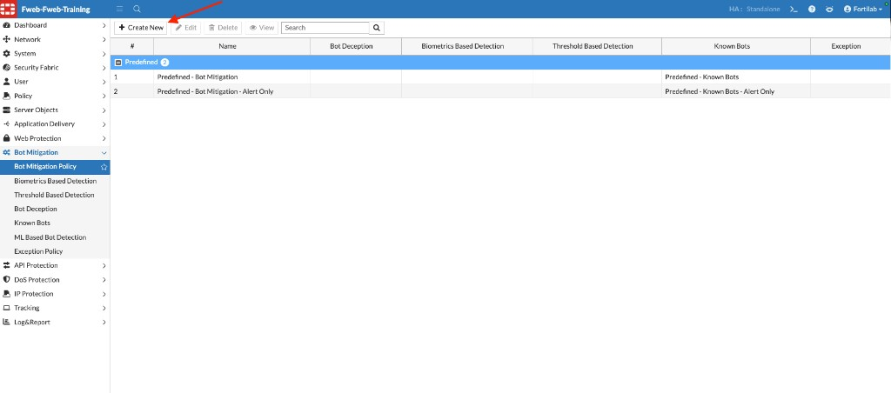

3. Configure:

| Setting | Value |
|---------|-------|
| Name | `juiceshop` |
| Bot Deception | Leave empty |
| Biometrics Based Detection | `juiceshop` |
| Threshold Based Detection | `juiceshop` |
| Known Bots | `juiceshop` |
| Exception | Leave empty |

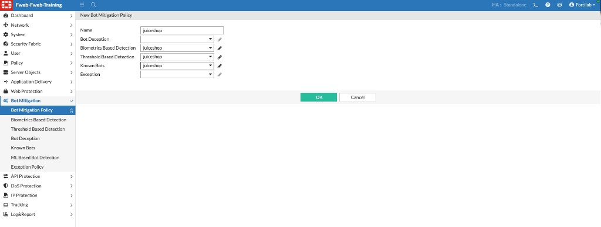

4. Click **OK**.

---

### Step 5 – Create a Web Protection Profile for Juice Shop

1. Navigate to:

   **Policy → Web Protection Profile**

2. Click **+ Create New**.

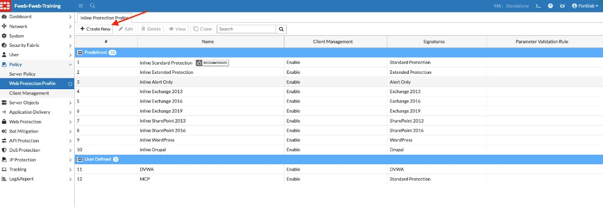

3. Configure at least:

| Setting | Value |
|---------|-------|
| Name | `juiceshop` |
| Client Management | Enabled |
| Bot Mitigation Policy | `juiceshop` |

Leave other profile sections at their defaults unless your instructor provides additional values.

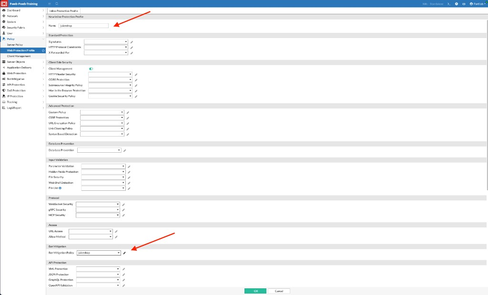

4. Click **OK**.

{}
**Client Management** should remain enabled. Threshold-Based Detection in this lab tracks by **Client ID**, which depends on client management in the Web Protection Profile.
{}

---

### Step 6 – Assign the Profile on the juiceshop Content Route

1. Navigate to:

   **Policy → Server Policy**

2. Select **juiceshop-DVWA** and click **Edit**.

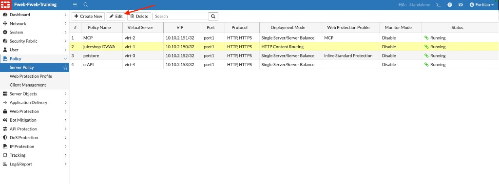

3. In **HTTP Content Routing**, select the **juiceshop** row and click **Edit**.

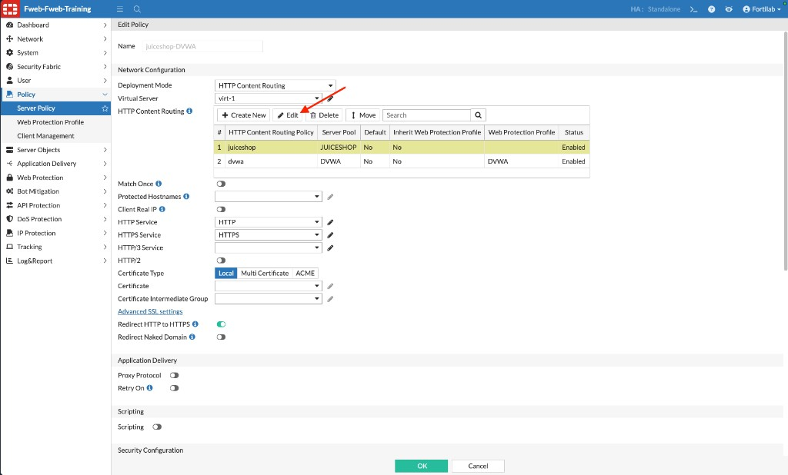

4. In **Edit HTTP Content Routing Policy**, set:

| Setting | Value |
|---------|-------|
| HTTP Content Routing Policy Name | `juiceshop` |
| Status | Enable |
| Server Pool | `JUICESHOP` |
| Inherit Web Protection Profile | Off |
| Web Protection Profile | `juiceshop` |

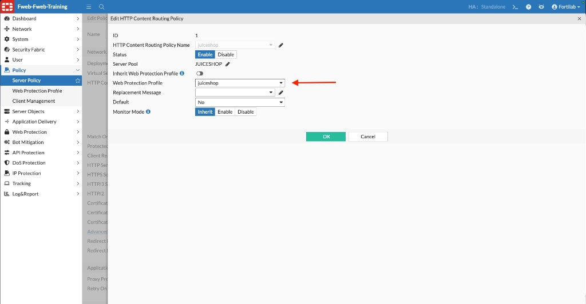

5. Click **OK** to close the content-routing dialog.

---

### Step 7 – Enable ML-Based Bot Detection on the Server Policy

Remain in the **juiceshop-DVWA** Edit Policy view (or reopen it if you closed it).

1. Scroll to **Machine Learning**.
2. Select the **Bot Detection** tab.
3. Click **+** (**Create**).

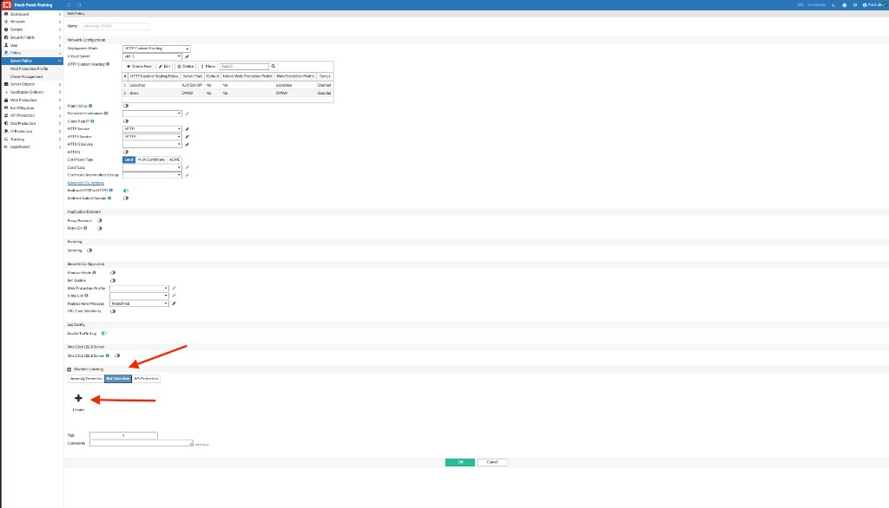

4. Review the **New Bot Detection** panel. Use it to add source addresses that FortiWeb should **Trust** (exempt) or **Block** for bot detection.

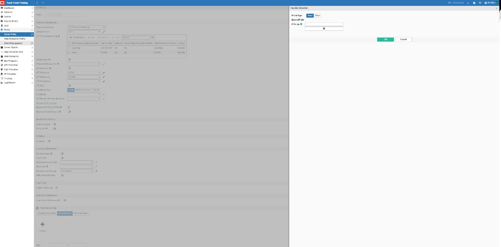

{}
If your instructor does not provide a Source IP List or IP Range for this lab, click **ok** and continue. ML Bot Detection can still run against general traffic without an explicit Trust/Block entry.
{}

5. On the **Bot Detection** tab, confirm the ML controls are available (**View**, **Start** / **Stop**, **Retrain**, **Discard**, **Export**, **Import**). Click **Start** if learning is not already running.

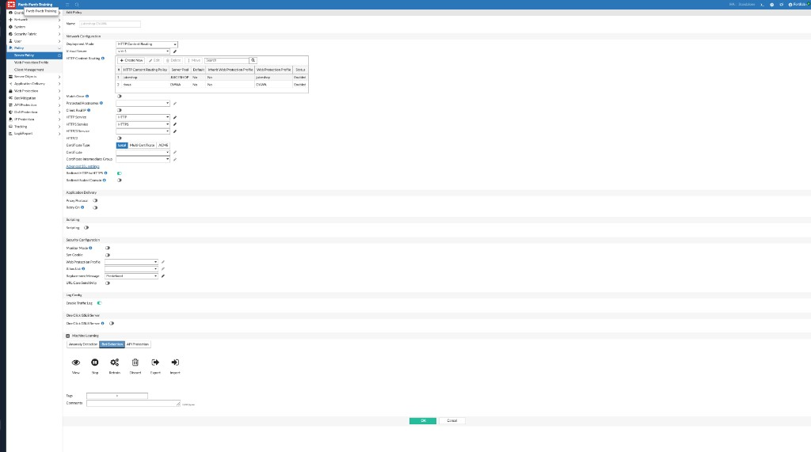

6. Click **OK** to save the server policy.

{}
ML-Based Bot Detection builds a model over time. Short lab runs may produce fewer ML events than biometric, threshold, or known-bot detections.
{}

---

### Verification Checklist

* Created Biometrics-Based Detection `juiceshop` (Alert & Deny)
* Created Threshold-Based Detection `juiceshop` (Client ID tracking)
* Created Known Bots `juiceshop` (malicious: Alert & Deny; known good: Bypass)
* Combined components into Bot Mitigation Policy `juiceshop`
* Created Web Protection Profile `juiceshop` with that Bot Mitigation Policy
* Assigned `juiceshop` WPP to the juiceshop content route on `juiceshop-DVWA`
* Reviewed / started ML Bot Detection on the `juiceshop-DVWA` server policy

---

### Next Exercise

In Exercise 7.2, you generate normal browsing traffic followed by automated bot traffic.
