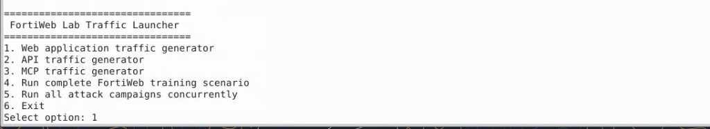
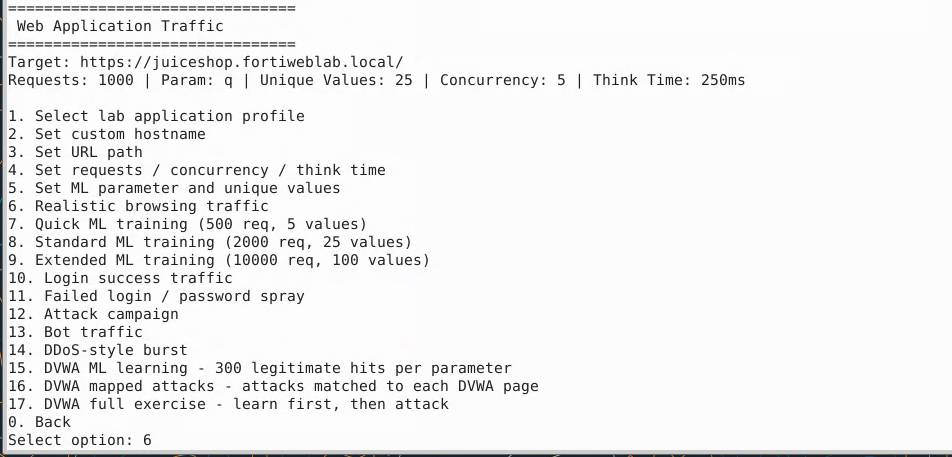
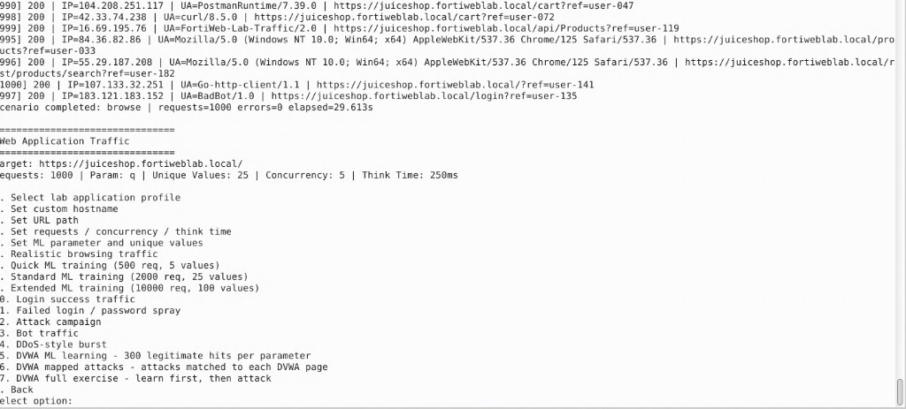
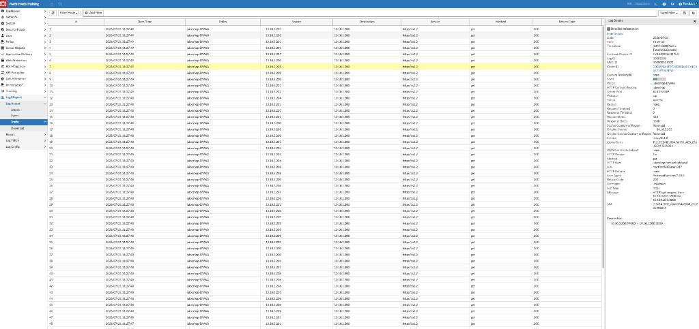
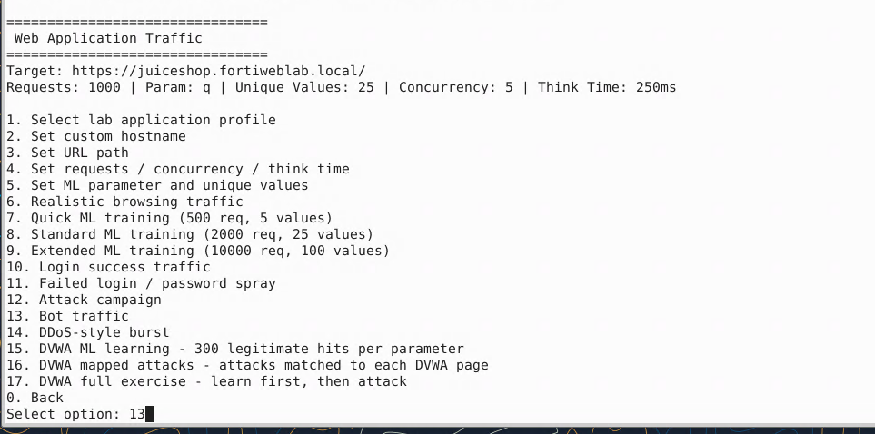
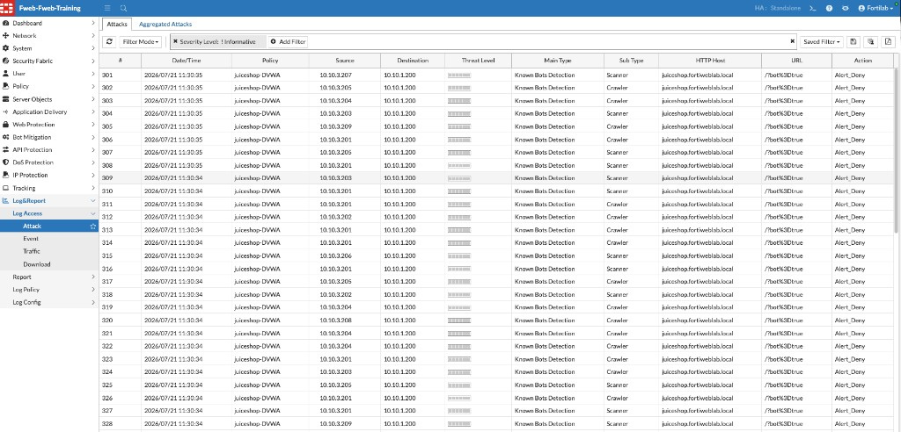
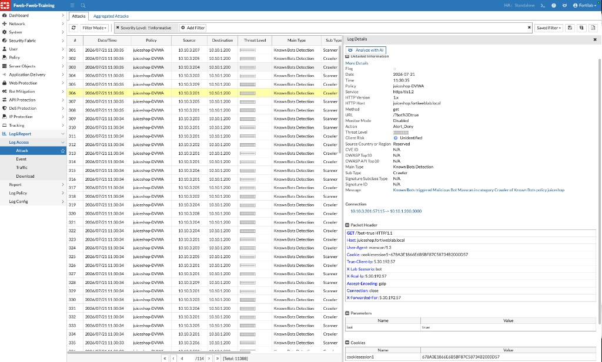
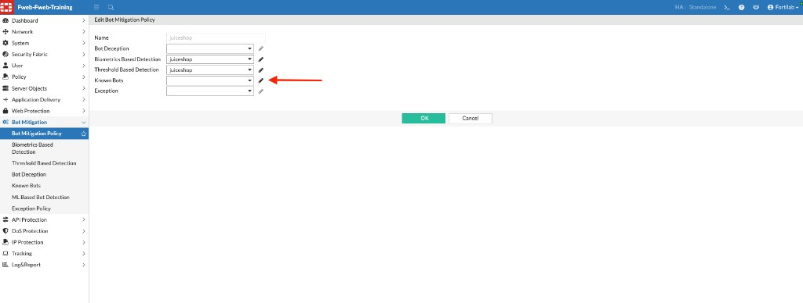
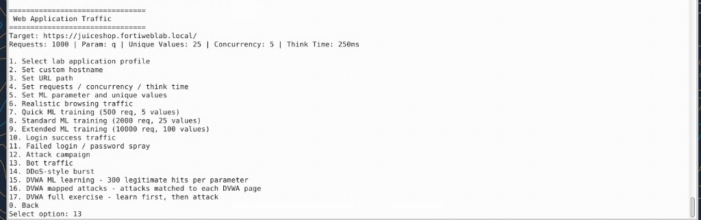
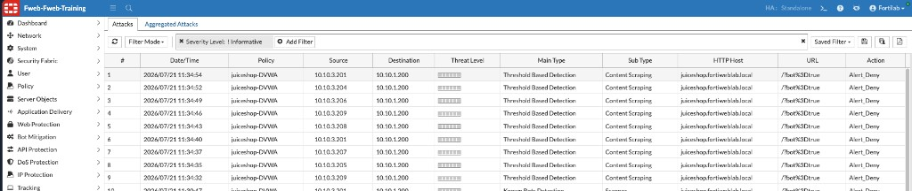

## Exercise 7.2 – Generate Legitimate and Bot Traffic

### Objective

Generate a normal browsing baseline against Juice Shop, then run the bot-traffic scenario and observe how FortiWeb Bot Mitigation records Known Bots and Threshold-Based Detection events.

{}
Use the supplied generator only in the controlled lab environment.
{}

---

### Step 1 – Launch the Web Application Traffic Generator

From the Guacamole desktop, open a terminal and run:

```bash
cd fortiweb-lab-traffic/
./fortiweb-lab-traffic
```

At the FortiWeb Lab Traffic Launcher menu, enter:

```text
1
```



Confirm the target is:

```text
https://juiceshop.fortiweblab.local/
```

---

### Step 2 – Generate Realistic Browsing Traffic

From the Web Application Traffic menu, enter:

```text
6
```

Option **6** is:

```text
Realistic browsing traffic
```



Allow the scenario to complete. You should see a message similar to:

```text
scenario completed: browse | requests=1000 errors=0 elapsed=...
```

Control returns to the Web Application Traffic menu.



---

### Step 3 – Verify Legitimate Traffic in the Traffic Log

In FortiWeb, navigate to:

**Log&Report → Log Access → Traffic**

Confirm recent entries for the **juiceshop-DVWA** policy and HTTP content routing **juiceshop**. Successful browsing typically shows return code `200`.



{}
Note the **User-Agent** and URL in Log Details. Legitimate browsing and lab automation can still use varied clients; compare this baseline with the bot scenario that follows.
{}

---

### Step 4 – Generate Bot Traffic

Return to the Web Application Traffic menu and enter:

```text
13
```

Option **13** is:

```text
Bot traffic
```



This scenario produces crawler/scanner-style requests (for example, URLs such as `/?bot=true` and malicious User-Agents) intended to exercise Bot Mitigation.

Allow the scenario to complete.

{}
Do not close the terminal while the scenario is running.
{}

---

### Step 5 – Review Known Bots Detections

1. Navigate to:

   **Log&Report → Log Access → Attack**

2. Optionally filter with **Severity Level: ! Informative**.
3. Confirm recent entries for policy **juiceshop-DVWA** and host `juiceshop.fortiweblab.local`.

You should see **Known Bots Detection** events with subtypes such as **Scanner** and **Crawler**, and action **Alert_Deny**.



4. Open a **Crawler** or **Scanner** entry and review Log Details. In this lab example, User-Agent `masscan/1.3` triggers Known Bots (**Malicious Bot Masscan** in category **Crawler**) on Known Bots policy `juiceshop`.



---

### Step 6 – Confirm the Bot Mitigation Policy Assignment

If Known Bots events do not appear, or to verify policy composition:

1. Navigate to **Bot Mitigation → Bot Mitigation Policy**.
2. Edit the `juiceshop` policy.
3. Confirm **Biometrics Based Detection** and **Threshold Based Detection** are set to `juiceshop`.
4. If **Known Bots** is empty, select `juiceshop` again (or use the edit icon beside the field to open the Known Bots policy).



5. Click **OK**.

---

### Step 7 – Re-run Bot Traffic and Review Threshold Detections

From the Web Application Traffic menu, enter **13** again to re-run **Bot traffic**.



Allow the scenario to finish, then refresh the Attack Log.

In addition to Known Bots events, look for **Threshold Based Detection** with subtype **Content Scraping** (and related findings such as Known Bots **Scrapers**). Action should again be **Alert_Deny**.



{}
Layered Bot Mitigation means the same campaign can produce both reputation-based Known Bots matches and behavior-based Threshold detections.
{}

---

### Verification Checklist

* Selected option **1** – Web application traffic generator
* Completed option **6** – Realistic browsing traffic
* Confirmed Juice Shop browsing in the Traffic Log
* Completed option **13** – Bot traffic
* Located **Known Bots Detection** events (for example, Masscan / Crawler) with `Alert_Deny`
* Confirmed the `juiceshop` Bot Mitigation Policy still references the expected components
* Located **Threshold Based Detection** / **Content Scraping** events with `Alert_Deny`

---

### Next Exercise

In Exercise 7.3, you compare legitimate versus bot outcomes and reflect on how the detection layers work together.
