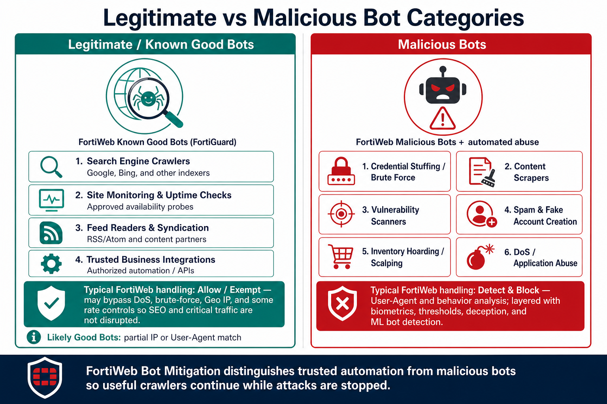

## Objective

Automated bots account for a significant portion of Internet traffic. Some provide useful services, while others automate credential attacks, scraping, scanning, account creation, and application abuse.

In this chapter, you configure FortiWeb Bot Mitigation for Juice Shop, generate legitimate and automated traffic, and review how multiple detection methods distinguish human users and trusted bots from malicious automation.

### Learning Objectives

After completing this chapter, you will be able to:

* Distinguish legitimate automation from malicious bot activity
* Explain FortiWeb’s layered bot-detection methods
* Configure biometric, threshold, known-bot, and ML-based controls
* Apply Bot Mitigation to Juice Shop
* Generate bot traffic and analyze the resulting detections

---

### Understanding Web Bots

Legitimate bots include search-engine crawlers, monitoring services, feed readers, and approved business integrations. Malicious bots automate activity such as:

* Credential stuffing and password spraying
* Account enumeration and fake-account creation
* Vulnerability scanning and directory brute forcing
* Content scraping and inventory hoarding
* API abuse and application-layer resource exhaustion

Sophisticated bots can rotate source addresses, spoof browser identifiers, and imitate human navigation. Reliable detection therefore requires more than a single signature.

### FortiWeb Bot Mitigation

FortiWeb combines several detection technologies:

| Detection method | Purpose |
|------------------|---------|
| Biometrics-Based Detection | Evaluates browser interaction such as mouse, keyboard, touch, focus, and scrolling events |
| Threshold-Based Detection | Identifies excessive rates, scanning, crawling, and scraping patterns |
| Known Bots | Uses FortiGuard intelligence to classify trusted and malicious automation |
| Bot Deception | Uses hidden client-side mechanisms to identify automated clients |
| ML-Based Bot Detection | Models normal client behavior and identifies anomalous automation |

No single method is sufficient for every bot. Layering these controls improves coverage while helping reduce false positives.

{}
Client-side biometric and browser-validation techniques apply to browser-capable clients. APIs and non-browser integrations may require different identification, rate, and access controls.
{}

### Hands-On Tasks

* [Exercise 7.1 – Configure Bot Detection](7.1_Configure_Bot_Detection/)
* [Exercise 7.2 – Create and Apply the Bot Mitigation Policy](7.2_Create_Bot_Mitigation_Policy/)
* [Exercise 7.3 – Generate Legitimate and Bot Traffic](7.3_Generate_Bot_Traffic/)
* [Exercise 7.4 – Review Bot Detections](7.4_Review_Bot_Detections/)

### Key Takeaways

* Bot protection combines client behavior, reputation, thresholds, and Machine Learning
* Trusted automation should be handled differently from malicious bots
* Logs are essential for validating detections and tuning thresholds safely
