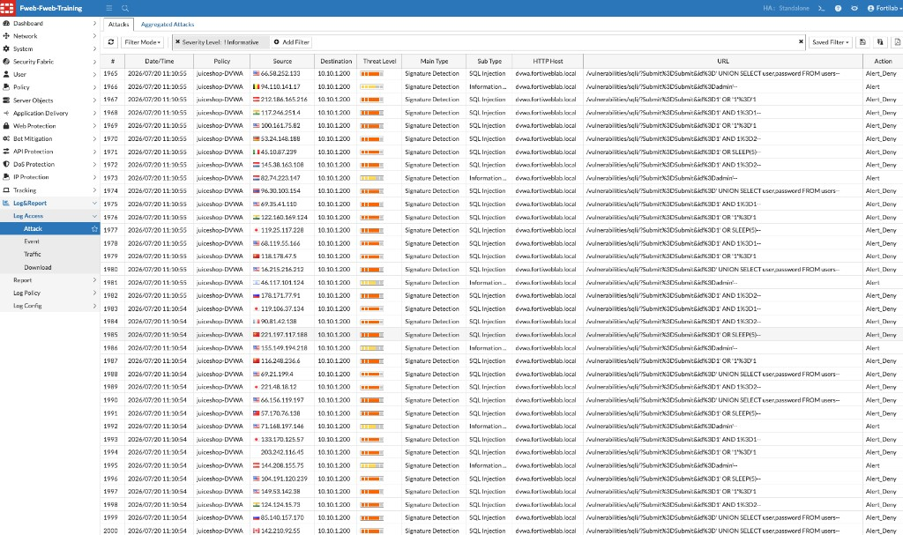
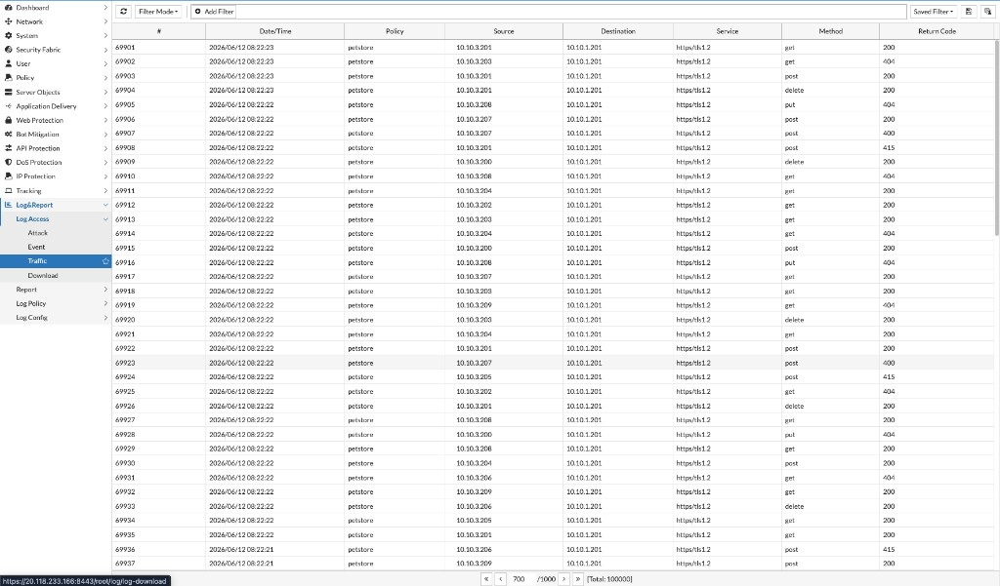
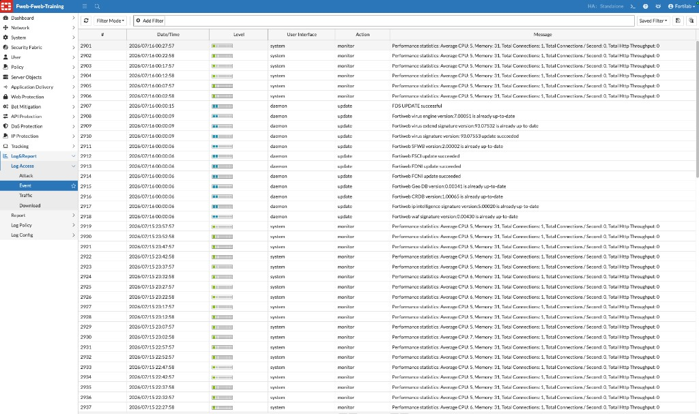

## Exercise 8.1 – Understand FortiWeb Logs

### Objective

Become familiar with FortiWeb’s major log categories using events generated throughout the previous chapters.

---

### Part A – Attack Logs

Navigate to:

**Log&Report → Log Access → Attack**

Review several events and identify:

* Source and destination
* Host and requested URL
* Attack category or matched protection (Main Type / Sub Type)
* Action taken
* Timestamp
* Server policy

Find examples from earlier exercises, such as SQL Injection, XSS, API violations, MCP violations, or bot activity.

In this lab example, Attack Logs for policy **juiceshop-DVWA** show **Signature Detection** events (for example, **SQL Injection**) against `dvwa.fortiweblab.local`, with actions such as `Alert_Deny` or `Alert`.

---

### Part B – Traffic Logs

Navigate to:

**Log&Report → Log Access → Traffic**

Use these logs to verify that requests reached FortiWeb, determine the HTTP method and return code, and correlate normal transactions with attack events.

In this lab example, Traffic Logs for the **petstore** policy show HTTPS requests with methods such as `GET`, `POST`, `PUT`, and `DELETE`, and return codes including `200`, `400`, `404`, and `415`.

---

### Part C – Event Logs

Navigate to:

**Log&Report → Log Access → Event**

Look for administrator activity, configuration-related messages, FortiGuard / signature updates, and system notifications such as performance statistics.

In this lab example, Event Logs include periodic performance statistics (`system` / `monitor`) and FortiGuard update messages (`daemon` / `update`).

{}
**Event** logs cover appliance and administrative activity. Use **Attack** for security detections and **Traffic** for request flow and HTTP status.
{}

---

### Verification Checklist

* Opened Attack, Traffic, and Event logs under **Log&Report → Log Access**
* Located at least one security event from an earlier chapter
* Identified the policy and action for an Attack Log entry
* Located normal application requests in the Traffic Log
* Located at least one update or system notification in the Event Log

---

### Next Exercise

In Exercise 8.2, you investigate individual web, API, and MCP events using a consistent workflow.
