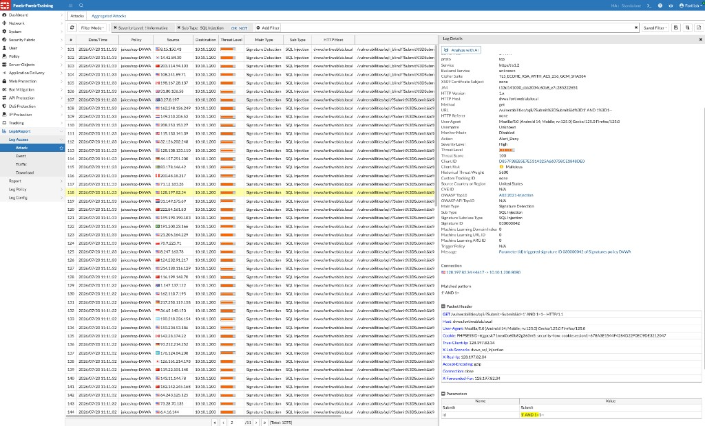
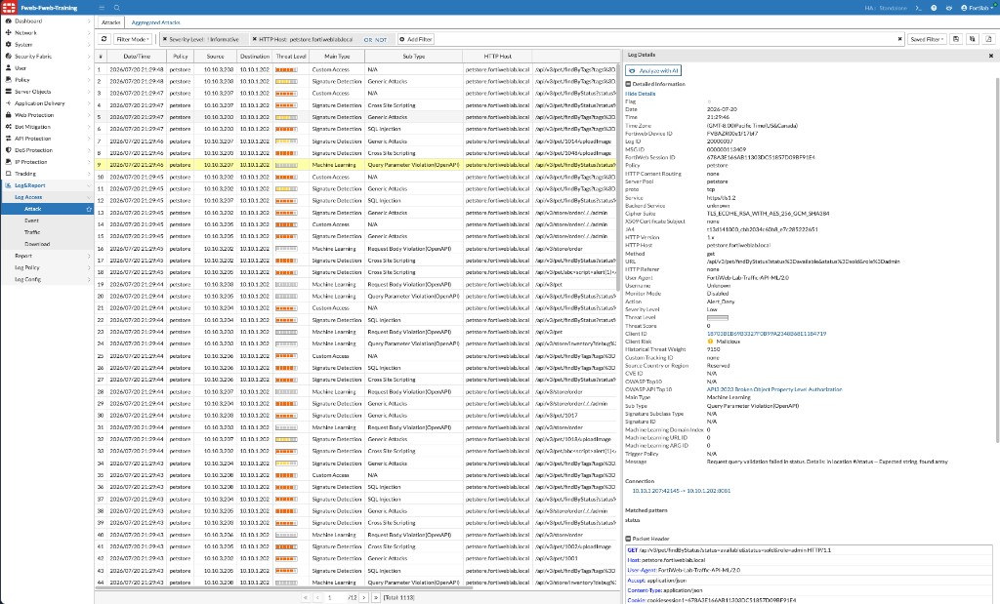
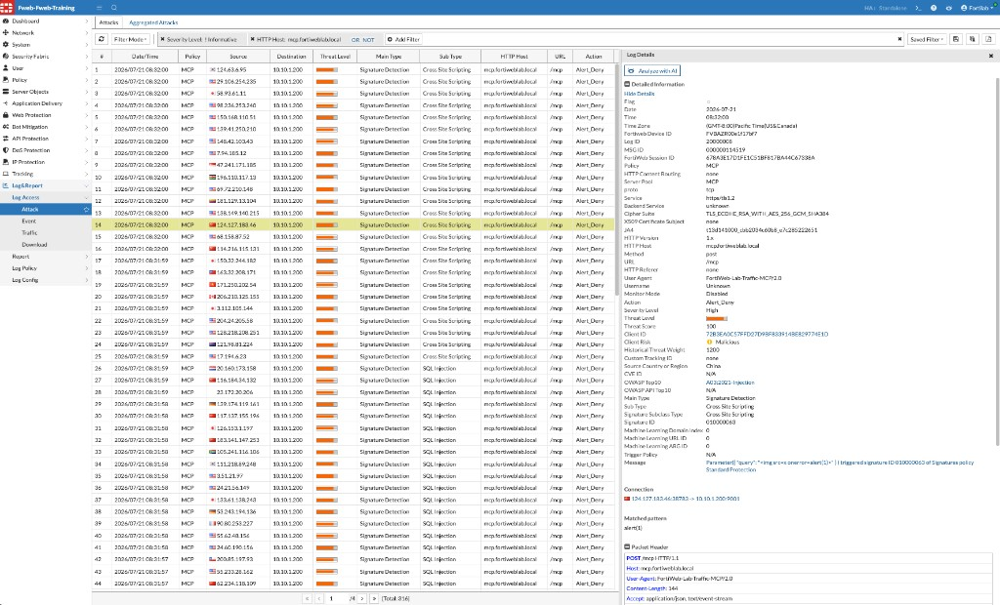

## Exercise 8.2 – Investigate Security Events

### Objective

Determine what FortiWeb detected, which control made the decision, and whether the request was denied—using Attack Log Details (connection info, packet headers, and matched patterns).

Navigate to:

**Log&Report → Log Access → Attack**

{}
Attack Log Details already include source/destination, method, URL, User-Agent, and packet headers. You do not need to open the Traffic Log for this exercise.
{}

---

### Step 1 – Investigate a DVWA Attack

Locate a SQL Injection event generated during Chapter 3 (filter by **Sub Type: SQL Injection** if helpful).

Review:

* Source and destination
* Requested URL and HTTP method
* Server policy
* Signature ID and detection reason
* Protection action
* Matched pattern and parameter values
* Timestamp

In this lab example, policy **juiceshop-DVWA** shows Signature ID `030000042` on parameter `id`, action `Alert_Deny`, for host `dvwa.fortiweblab.local`.

Answer:

1. Which protection detected the attack?
2. What action did FortiWeb take?
3. Would the request have reached the backend?
4. Do nearby events indicate a larger campaign?

---

### Step 2 – Investigate an API Event

Locate a PetStore API event from Chapter 5. Identify the endpoint, method, parameter or schema violation, and action.

In this lab example, a **Machine Learning** / **Query Parameter Violation (OpenAPI)** event for `petstore.fortiweblab.local` shows `Alert_Deny` with a message such as expected string, found array for `#/status`.

---

### Step 3 – Investigate an MCP Event

Locate an MCP event from Chapter 6. Determine whether it was caused by a signature, prompt protection, or JSON schema validation.

In this lab example, an XSS Signature Detection on `mcp.fortiweblab.local` (`POST /mcp`) shows Signature ID `010000063` with matched pattern `alert(1)` and action `Alert_Deny`.

---

### Verification Checklist

* Investigated one web (DVWA) attack in Attack Log Details
* Investigated one API (PetStore) event
* Investigated one MCP event
* Identified the detecting control and action for each event

---

### Next Exercise

In Exercise 8.3, you use the evidence from an event to choose the smallest safe policy adjustment.
