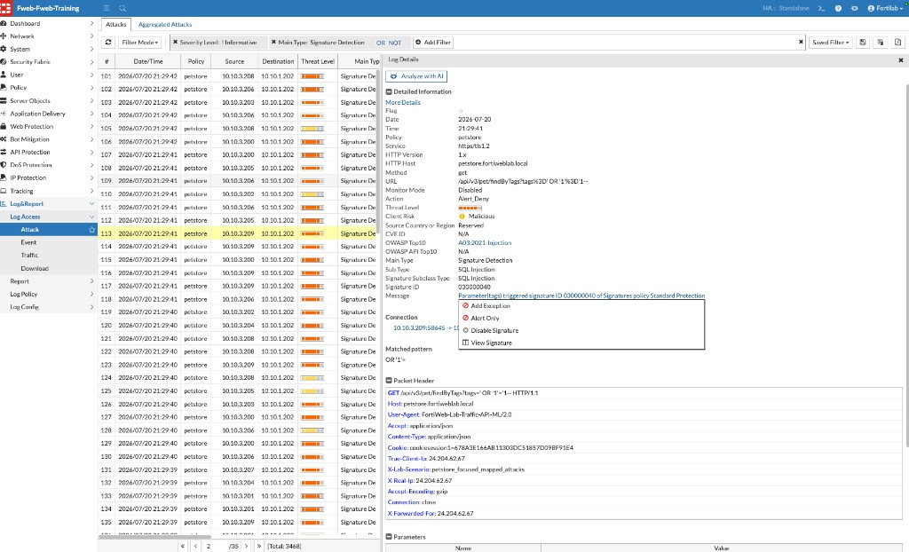

## Exercise 8.3 – Fine-Tune Security Policies

### Objective

Practice an evidence-based tuning workflow that preserves protection while resolving false positives or expected application changes.

{}
Do not weaken or change a shared lab policy unless your instructor explicitly asks you to. This exercise may be completed as a written analysis.

You do **not** need to find the exact signature shown in the screenshots (for example, Signature ID `030000040`). Choose any Attack Log event from your lab run, identify the signature or control that triggered it, and edit or scope **that** signature—or apply the smallest appropriate change for that event.
{}

---

### Step 1 – Review the Event

1. Navigate to:

   **Log&Report → Log Access → Attack**

2. Optionally filter (for example, **Severity Level: ! Informative** and **Main Type: Signature Detection**).
3. Select an event from an earlier chapter. In the example below, a **petstore** SQL Injection signature detection is highlighted.

4. Open **Log Details** and note:

* Policy, host, method, and URL
* Main Type / Sub Type
* Signature ID and message
* Action (`Alert_Deny`, `Alert`, and so on)
* Matched pattern

In the example, parameter `tags` triggered Signature ID `030000040` of **Standard Protection**.

From the action menu next to the message, FortiWeb may offer:

* **Add Exception**
* **Alert Only**
* **Disable Signature**
* **View Signature**

Prefer the narrowest option that still solves a confirmed false positive. Avoid **Disable Signature** globally unless your instructor directs it.

---

### Step 2 – Determine Whether the Request Is Legitimate

Consider:

* Is the payload an actual attack?
* Is this expected application behavior?
* Is the client an approved scanner or integration?
* Can application owners confirm the request?
* Is a legitimate user being blocked?

In the example screenshot, the URL contains a classic SQL Injection string (`' OR '1'='1'--`). That request is malicious—do **not** create an exception for it in production. Use it only to practice locating the signature and reviewing exception options. For a real tuning task, pick a blocked request your instructor identifies as a false positive (or analyze one in writing without applying changes).

Do not create an exception until the request and context have been investigated.

---

### Step 3 – Select the Smallest Appropriate Change

Depending on the evidence, possible responses include:

* Scope a signature exception to a specific host, URL, or parameter (edit the signature from **your** chosen event)
* Set the signature to **Alert Only** for a limited test window
* Adjust a Bot Mitigation threshold
* Update an API schema or learned model
* Retrain a Machine Learning model after significant application changes
* Correct the application when the request is genuinely unsafe

Avoid broad global exceptions or disabling entire protection engines.

If you add an exception, scope it tightly—for example, to a specific URL pattern. The dialog below shows Advance Mode with a sample path value (`\/test.htm`). Replace that with the URL or pattern that matches **your** legitimate workflow, not the example text.

{}
Only apply an exception when your instructor confirms the request is legitimate or when you are completing a written analysis without saving shared-lab changes.
{}

---

### Step 4 – Validate the Result

If a change was approved and applied, repeat the original legitimate request and verify that:

* The legitimate workflow succeeds
* Malicious test traffic is still detected
* No unrelated applications are affected
* Logs clearly show the new behavior

### Recommended Rollout Practice

For new controls, begin with **Alert** when risk and policy permit. Review representative traffic, tune carefully, then move to **Deny** after confirming acceptable behavior.

### Reflection Questions

1. Which field provided the strongest evidence for the tuning decision?
2. What is the narrowest possible exception?
3. How would you test for unintended side effects?
4. When is application remediation better than a WAF exception?

### Next Exercise

Exercise 8.4 applies the complete troubleshooting workflow from client connectivity through backend and appliance health.
