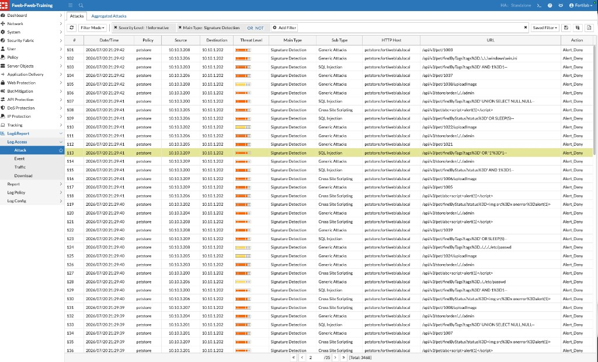
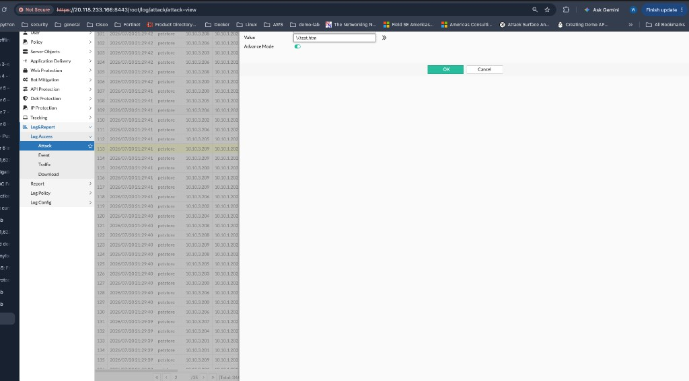

## Exercise 8.3 – Fine-Tune Security Policies

### Objective

Practice an evidence-based tuning workflow that preserves protection while resolving false positives or expected application changes.

{}
Do not weaken or change a shared lab policy unless your instructor explicitly asks you to. This exercise may be completed as a written analysis.
{}

### Step 1 – Review the Event

Choose an Attack Log event and determine exactly which control generated it.

### Step 2 – Determine Whether the Request Is Legitimate

Consider:

* Is the payload an actual attack?
* Is this expected application behavior?
* Is the client an approved scanner or integration?
* Can application owners confirm the request?
* Is a legitimate user being blocked?

Do not create an exception until the request and context have been investigated.

### Step 3 – Select the Smallest Appropriate Change

Depending on the evidence, possible responses include:

* Scope a signature exception to a specific host, URL, or parameter
* Adjust a Bot Mitigation threshold
* Update an API schema or learned model
* Retrain a Machine Learning model after significant application changes
* Correct the application when the request is genuinely unsafe

Avoid broad global exceptions or disabling entire protection engines.

### Step 4 – Validate the Result

Repeat the original legitimate request and verify that:

* The legitimate workflow succeeds
* Malicious test traffic is still detected
* No unrelated applications are affected
* Logs clearly show the new behavior

### Recommended Rollout Practice

For new controls, begin with **Alert** when risk and policy permit. Review representative traffic, tune carefully, then move to **Deny** after confirming acceptable behavior.

### Reflection Questions

1. Which field provided the strongest evidence for the tuning decision?
2. What is the narrowest possible exception?
3. How would you test for unintended side effects?
4. When is application remediation better than a WAF exception?

### Next Exercise

Exercise 8.4 applies the complete troubleshooting workflow from client connectivity through backend and appliance health.
