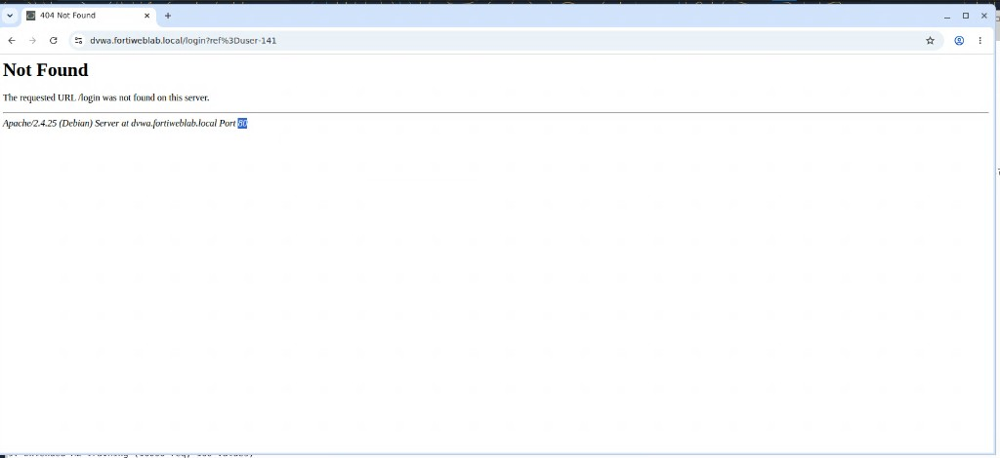
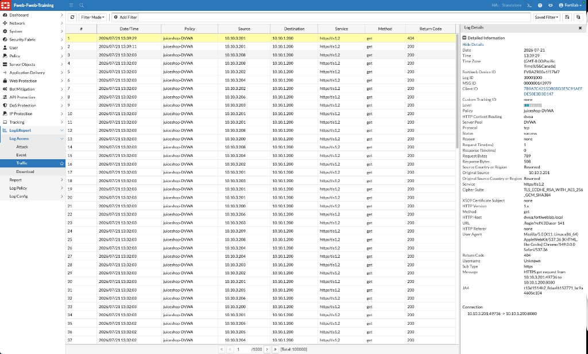
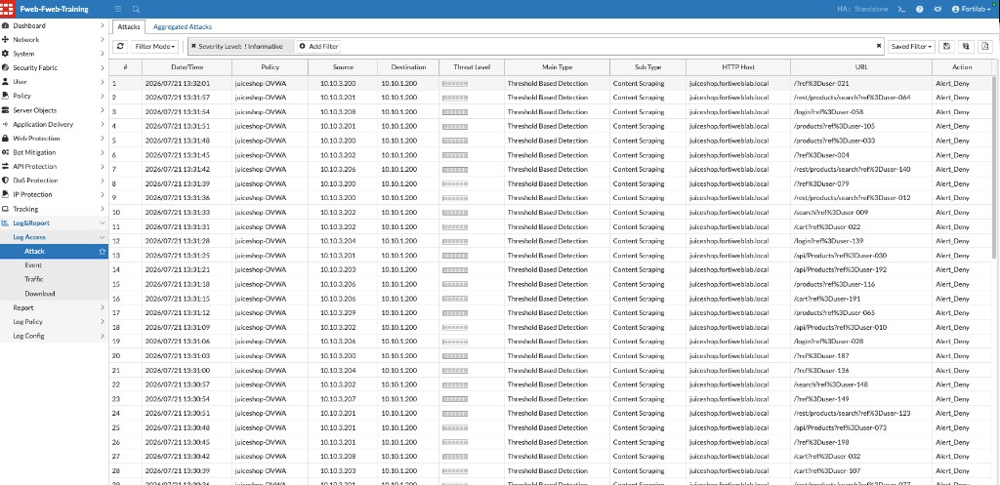
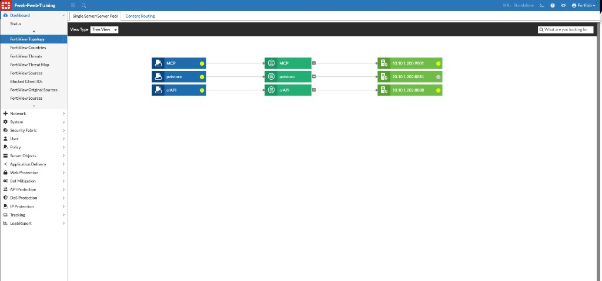
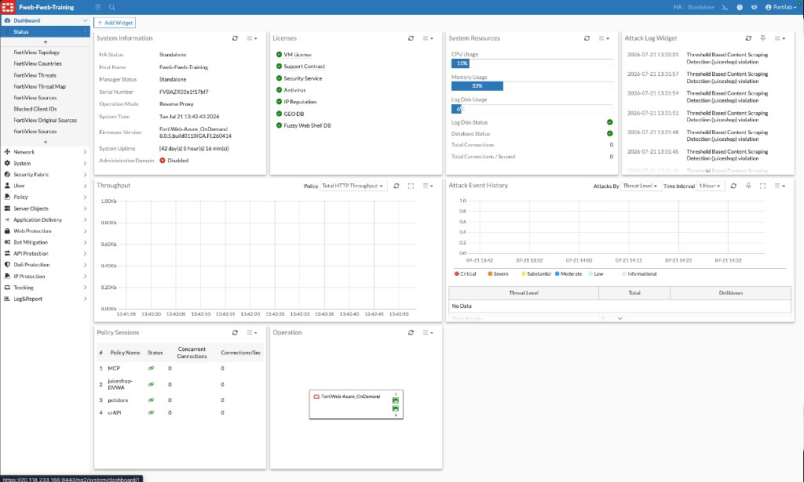

## Exercise 8.4 – Troubleshooting Challenge

### Objective

Use a structured methodology to investigate an application-access problem without assuming FortiWeb is the cause.

For additional FortiWeb troubleshooting guidance, see [Troubleshooting](https://docs.fortinet.com/document/fortiweb/8.0.5/administration-guide/738263/troubleshooting) in the FortiWeb 8.0.5 Administration Guide.

### Scenario

A user reports that a protected application is unavailable or that one workflow fails. In this lab example, a browser request to DVWA returns **404 Not Found**. Your task is to identify where the request stops and determine the next appropriate action.

---

### Step 1 – Verify Client and DNS Behavior

From the Guacamole desktop:

* Confirm the requested host name (for example, `dvwa.fortiweblab.local`)
* Verify DNS resolution
* Confirm the browser reaches the expected virtual server
* Record the approximate time and error or status code

In this example, the browser shows **Not Found** for `dvwa.fortiweblab.local/login?...`. The page footer identifies the backend as Apache and can help confirm that a response came from the application path—not only a client-side browser failure.

---

### Step 2 – Verify Traffic Reaches FortiWeb

Navigate to:

**Log&Report → Log Access → Traffic**

Search for the recorded host, source, URL, and time.

If no request appears, investigate client connectivity, DNS, routing, and virtual-server addressing before changing security policies.

In this example, a Traffic Log entry for policy **juiceshop-DVWA** shows:

* HTTP Content Routing: `dvwa`
* Server Pool: `DVWA`
* Host: `dvwa.fortiweblab.local`
* URL: `/login?ref%3Duser-141`
* Return Code: `404`

{}
A Traffic Log entry with return code `404` means FortiWeb received and forwarded the request (or returned the backend response). The failure is often an application path, content-routing, or backend content issue—not a missing virtual server.
{}

---

### Step 3 – Determine Whether FortiWeb Blocked It

Navigate to:

**Log&Report → Log Access → Attack**

Look for a matching event at the same time for the same host/URL.

* If a matching Attack Log entry exists, identify the triggered protection, reason, and action (`Alert_Deny`, `Alert`, and so on).
* If Traffic shows `404` but Attack has no matching deny for that URL, FortiWeb likely did **not** block the request as an attack—investigate application routing and backend content next.

Compare with other recent Attack Log activity. For example, **Threshold Based Detection / Content Scraping** events for `juiceshop.fortiweblab.local` with `Alert_Deny` show cases where FortiWeb **did** deny traffic.

---

### Step 4 – Verify Backend Health

Confirm:

* The server pool is healthy
* Health checks succeed
* Backend servers are reachable
* The application responds normally on the expected path

Open **Dashboard → FortiView Topology** (or **Server Objects → Server Pool**) and review pool members and status. In this example, topology shows pools such as **MCP**, **petstore**, and **crAPI** with member IPs and ports. Also verify the **DVWA** / Juice Shop pools used by `juiceshop-DVWA`.

Application outages and missing URLs are not always caused by the WAF.

---

### Step 5 – Review Appliance Health

Navigate to:

**Dashboard → Status**

Check CPU, memory, log disk utilization, FortiGuard / license state, High Availability status, and whether policies show unexpected resource pressure.

---

### Step 6 – Escalate With Evidence

If the issue remains unresolved, collect:

* Relevant Traffic, Attack, and Event Logs
* Exact timestamps and time zone
* Source, host, URL, and response code
* Packet captures or diagnostic output when appropriate
* Recent configuration or application changes

Use advanced diagnostics with your instructor, operational runbook, or Fortinet Support. See also [Troubleshooting](https://docs.fortinet.com/document/fortiweb/8.0.5/administration-guide/738263/troubleshooting).

---

### Challenge Questions

1. Did the request reach FortiWeb?
2. Did FortiWeb deny it, or did the backend return an error (for example, `404`)?
3. Was the backend / server pool healthy?
4. Was appliance capacity or licensing involved?
5. What evidence supports your root-cause conclusion?

### Chapter Summary

Effective FortiWeb operations depend on continuous monitoring, disciplined investigation, and narrowly scoped tuning. By correlating logs and checking each layer in order—client, Traffic Log, Attack Log, backend, and appliance health—administrators can resolve issues without unnecessarily weakening protection or disrupting legitimate users.
