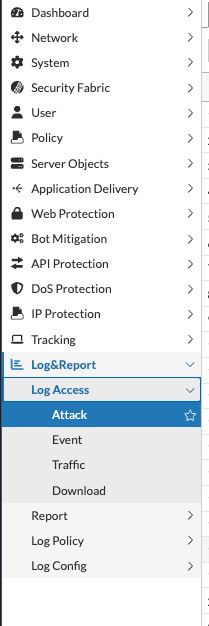

## Objective

{}
This chapter is optional. It uses events generated in the previous chapters and does not require a new traffic campaign.
{}

Deploying FortiWeb is only the beginning of protecting an application. Administrators must monitor events, investigate attacks, tune policies, and troubleshoot issues as applications evolve.

In this chapter, you use FortiWeb logs to validate policy behavior and follow a structured troubleshooting process.

For official troubleshooting procedures, diagnostics, and common issue guidance, see [Troubleshooting](https://docs.fortinet.com/document/fortiweb/8.0.5/administration-guide/738263/troubleshooting) in the FortiWeb 8.0.5 Administration Guide.

### Learning Objectives

After completing this chapter, you will be able to:

* Distinguish Attack, Traffic, and Event Logs
* Investigate events across web, API, MCP, and bot-protection scenarios
* Tune policies using evidence rather than broad exceptions
* Troubleshoot application access from client to backend
* Apply practical operational best practices

### Log Types

| Log | Primary use |
|-----|-------------|
| Attack | Understand which protection detected a request and what action was taken |
| Traffic | Verify request flow, response status, and backend forwarding |
| Event | Audit administrator activity, configuration changes, updates, and system notifications |

Open logs from:

**Log&Report → Log Access**

Then select **Attack**, **Event**, or **Traffic** as needed.

### Recommended Investigation Workflow

1. Confirm the time, user, host, URL, and symptoms.
2. Verify the request appears in the Traffic Log.
3. Check whether a corresponding Attack Log entry exists.
4. Identify the exact protection and action.
5. Verify backend pool and appliance health.
6. Make the smallest justified change.
7. Retest both legitimate and malicious traffic.

### Hands-On Tasks

* [Exercise 8.1 – Understand FortiWeb Logs](8.1_Understand_FortiWeb_Logs/)
* [Exercise 8.2 – Investigate Security Events](8.2_Investigate_Security_Events/)
* [Exercise 8.3 – Fine-Tune Security Policies](8.3_Fine_Tune_Security_Policies/)
* [Exercise 8.4 – Troubleshooting Challenge](8.4_Troubleshooting_Challenge/)

### Operational Best Practices

* Review security events and repeated attack trends regularly
* Keep firmware, FortiGuard signatures, and threat intelligence current
* Review policies after application changes
* Retrain or update learned models when behavior changes significantly
* Validate controls periodically with approved tests
* Back up the configuration before major policy or firmware changes
